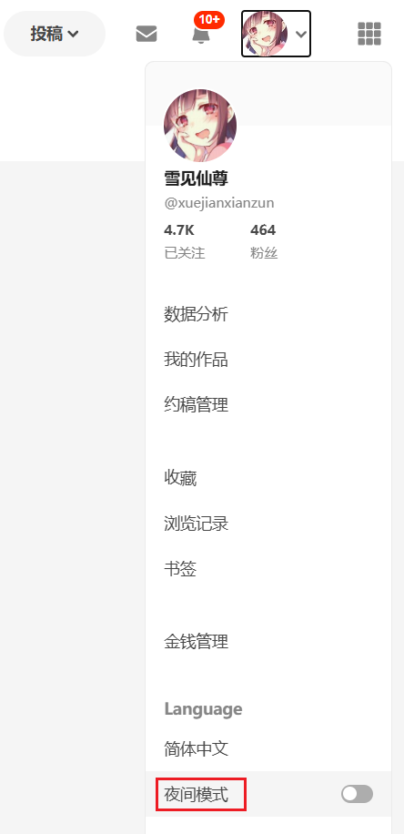
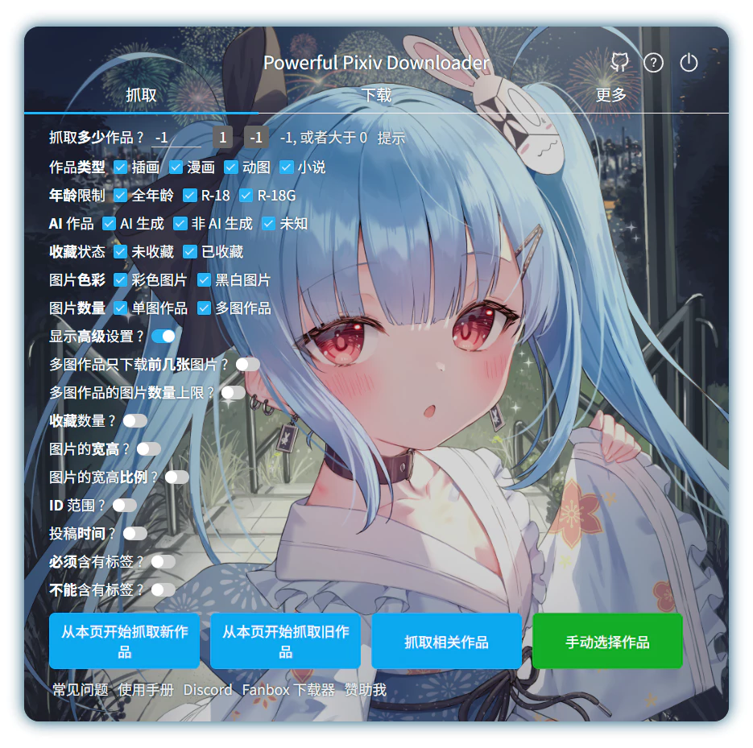
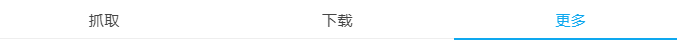
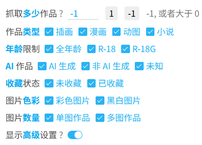
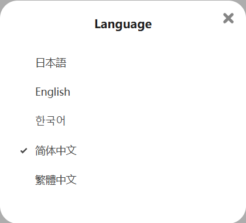

# 设置-更多-其他

## 日期和时间格式

    日期和时间格式
    <input type="text" name="dateFormat" class="setinput_style1 blue" style="width:250px;" value="YYYY-MM-DD">
    <button type="button" class="gray1 textButton showDateTip" data-xztext="_提示">提示</button>
    

下载器的命名规则里有一些标记会生成日期和时间字符串：
- `{date}`
- ` {upload_date}`
- `{task_date}`

它们的默认格式是 `YYYY-MM-DD`（例如 `2021-04-30`），只包含日期，不包含时间。

如果你想修改它们的格式，可以修改这个设置。

对于时间如 `2021-04-30T06:40:08`，可用的标记以及输出结果如下（**区分大小写**）:

- `YYYY` 2021
- `YY` 21
- `MM` 04
- `MMM` Apr
- `MMMM` April
- `DD` 30
- `hh` 06
- `mm` 40
- `ss` 08

## 导出日志

    导出日志
    <input type="checkbox" name="exportLog" class="need_beautify checkbox_switch">
    
    
    导出时机
    <input type="radio" name="exportLogTiming" id="exportLogTiming1" class="need_beautify radio" value="crawlComplete">
    
    <label for="exportLogTiming1" data-xztext="_抓取完毕2">抓取完毕</label>
    <input type="radio" name="exportLogTiming" id="exportLogTiming2" class="need_beautify radio" value="downloadComplete" checked="">
    
    <label for="exportLogTiming2" data-xztext="_下载完毕2" class="active">下载完毕</label>
    
    日志类型
    <input type="checkbox" name="exportLogNormal" id="exportLogNormal" class="need_beautify checkbox_common" checked="">
    
    <label for="exportLogNormal" data-xztext="_正常">正常</label>
    <input type="checkbox" name="exportLogError" id="exportLogError" class="need_beautify checkbox_common" checked="">
    
    <label for="exportLogError" data-xztext="_错误" class="active">错误</label>
    
    排除关键字&nbsp;
    <input type="text" name="exportLogExclude" class="setinput_style1 blue setinput_tag" value="404,429,500">
    
    

这个功能可以导出下载器在网页顶部显示的日志，保存到一个 HTML 文件里。

?> 使用 HTML 格式是因为它可以显示彩色文字，能够保持日志区域的显示效果。

?> 这个功能属于历史遗留。以前在一次任务里（从开始抓取到下载完毕），如果下载器输出的日志太多（例如超过 300 条），下载器会清空之前的日志。由于用户无法查看被清空的日志，所以我添加了这个功能。导出日志算是一个备份日志的方法，它会保留完整的日志。但是现在下载器在一次任务里不会再清空日志，所以这个功能也就没有太大必要了。

子选项：

### 导出时机

- `抓取完毕`：当下载器抓取完毕时导出日志。这只会包含抓取阶段的日志。
- `下载完毕`：当下载器下载完毕时导出日志。这是完整的日志。

### 日志类型

- `正常`：导出正常级别的日志（非红色的日志）。
- `错误`：导出错误级别的日志（红色的日志）。

这两个选项可以同时启用。

?>下载器有 4 种日志级别，它们会使用不同的颜色。只有红色的是错误日志。

### 排除关键字

你可以设置多个排除的关键字。

如果一条日志里包含**任意一个**关键字，下载器就不会导出它。所以你可以排除一些不需要的日志。

默认值 `404,429,500` 排除了一些错误信息。

## 颜色主题

    颜色主题
    <input type="radio" name="theme" id="theme1" class="need_beautify radio" value="auto" checked="">
    
    <label for="theme1" data-xztext="_自动检测" class="active">自动检测</label>
    <input type="radio" name="theme" id="theme2" class="need_beautify radio" value="white">
    
    <label for="theme2">White</label>
    <input type="radio" name="theme" id="theme3" class="need_beautify radio" value="dark">
    
    <label for="theme3" class="">Dark</label>
    

你可以选择下载器的颜色主题。

- `自动检测`：默认值，下载器会自动检测 pixiv 的颜色主题，并使用相同的颜色主题。
- `White`：浅色模式
- `Dark`：夜间模式。

?> 下载器默认会跟随 Pixiv 的颜色主题。

Pixiv 的页面默认是浅色模式。如果你想使用夜间模式，可以点击自己的 Pixiv 头像，并从弹出菜单里选择“夜间模式”，如图：

!> 有些用户可能安装了 [Dark Reader](https://chromewebstore.google.com/detail/dark-reader/eimadpbcbfnmbkopoojfekhnkhdbieeh)（一个可以把网站显示为夜间模式的扩展程序）。如果你想在 Pixiv 上使用夜间模式的话，请使用 Pixiv 自带的夜间模式。如果你让 Pixiv 保持默认的浅色主题，并使用 Dark Reader 把 Pixiv 显示为夜间模式的话，下载器的 `自动检测` 选项依然会使用浅色模式，这可能不符合你的预期。此时你也可以手动设置下载器的颜色主题为 `Dark`。

## 背景图片

    
    背景图片
     ? 
    
    <input type="checkbox" name="bgDisplay" class="need_beautify checkbox_switch">
    
    
    <button class="textButton gray1" type="button" id="selectBG" data-xztext="_选择文件">选择文件</button>
    <button class="textButton gray1" type="button" id="clearBG" data-xztext="_清除">清除</button>
    &nbsp;
    对齐方式&nbsp;
    <input type="radio" name="bgPositionY" id="bgPosition1" class="need_beautify radio" value="center" checked="">
    
    <label for="bgPosition1" data-xztext="_居中" class="active">居中</label>
    <input type="radio" name="bgPositionY" id="bgPosition2" class="need_beautify radio" value="top">
    
    <label for="bgPosition2" data-xztext="_顶部">顶部</label>
    不透明度&nbsp;
    <input name="bgOpacity" type="range">
    
    

你可以把自己喜欢的图片设置成下载器的背景图片，并且可以调节透明度、对齐方式。

效果如下：

?> 下载器没有自带背景图片，所以你需要自行选择一张图片。上图里使用的背景图片来自 [92215267](https://www.pixiv.net/artworks/92215267)。

?>建议使用颜色较暗的图片作为背景图片，因为背景颜色比较亮的话会导致文字不易阅读。

这个设置里有一些按钮和选项：

### 选择文件

点击这个按钮就会打开选择文件的对话框，你可以选择一张图片设置为背景图片。

?> 可以选择这些格式的图片：`.jpg,.jpeg,.png,.bmp,.webp`。

### 清除

点击这个按钮可以清除下载器的背景图片，使其恢复到没有背景图片的状态。

### 对齐方式

- `居中`：使背景图片的中间与设置面板的中间对齐。如果图片的高度大于设置面板的高度，这会导致图片的顶部和底部被裁剪。
- `顶部`：默认值。使背景图片的顶部与设置面板的顶部对齐。如果图片的高度大于设置面板的高度，这会导致图片的底部被裁剪。

你可以根据具体的图片来调整对齐方式，以获得更好的显示效果。

### 不透明度

你可以使用这个滑块来调整背景图片的不透明度。默认值是 `60%`。

?> 背景图片下方有一层黑色的背景颜色，并且背景图片默认是半透明的，所以背景图片会变暗。这个设计的目的是为了让设置面板上的文字更易阅读。调整不透明度的本质就是调整背景图片遮挡黑色背景的程度。

如果增加不透明度，图片看起来会更接近原图；如果减少不透明度，图片会变暗。

## 选项卡切换方式

    
    选项卡切换方式
     ? 
    
    <input type="radio" name="switchTabBar" id="switchTabBar1" class="need_beautify radio" value="over" checked="">
    
    <label for="switchTabBar1" data-xztext="_鼠标经过" class="active">鼠标经过</label>
    <input type="radio" name="switchTabBar" id="switchTabBar2" class="need_beautify radio" value="click">
    
    <label for="switchTabBar2" data-xztext="_鼠标点击">鼠标点击</label>
    

“选项卡”指的是下载器顶部的“抓取”、“下载”、“更多”这三个标签页：

- `鼠标经过`：默认值。把鼠标指针移动到标题上就会立即切换标签页，这样很便捷。
- `鼠标点击`：鼠标指针移动到标题上时不会切换标签页，需要点击标题才会切换。这是因为有些用户觉得鼠标经过的方式会导致误操作，所以想使用这种方式。

## 高亮显示关键字

    
    高亮显示关键字
     ? 
    
    <input type="checkbox" name="boldKeywords" class="need_beautify checkbox_switch">
    
    

下载器会把每个设置项里的关键字显示为蓝色和粗体，例如：

这是因为下载器的设置项太多了，用户想找到一个特定设置可能会花费比较多的时间，所以我添加了这个功能来提高效率。

## Language

    Language
    <input type="radio" name="userSetLang" id="userSetLang1" class="need_beautify radio" value="auto" checked="">
    
    <label for="userSetLang1" data-xztext="_自动检测" class="active">自动检测</label>
    <input type="radio" name="userSetLang" id="userSetLang2" class="need_beautify radio" value="zh-cn">
    
    <label for="userSetLang2">简体中文</label>
    <input type="radio" name="userSetLang" id="userSetLang3" class="need_beautify radio" value="zh-tw">
    
    <label for="userSetLang3">繁體中文</label>
    <input type="radio" name="userSetLang" id="userSetLang4" class="need_beautify radio" value="ja">
    
    <label for="userSetLang4">日本語</label>
    <input type="radio" name="userSetLang" id="userSetLang5" class="need_beautify radio" value="en">
    
    <label for="userSetLang5">English</label>
    <input type="radio" name="userSetLang" id="userSetLang6" class="need_beautify radio" value="ko">
    
    <label for="userSetLang6">한국어</label>
    <input type="radio" name="userSetLang" id="userSetLang7" class="need_beautify radio" value="ru">
    
    <label for="userSetLang7">Русский</label>
    

你可以选择下载器使用的语言。

默认为 `自动检测`，此时下载器会使用和 Pixiv 页面相同的语言。你也可以手动选择要使用的语言。

?> 你可以使用与 Pixiv 的页面不同的语言。这个设置只对下载器有效，不会影响 Pixiv 的页面。

--------

小提示：Pixiv 提供了多种语言选项，你可以点击自己的头像，并选择 Language 设置，以切换语言：

?> 以前 Pixiv 是有俄语选项的，但是现在没有了。如果你是俄语用户的话，可以在下载器的 Language 设置里手动选择 `Русский`，让下载器使用俄语。

## 管理设置

    
    管理设置
     ? 
    
    <button class="textButton gray1" type="button" id="exportSettings" data-xztext="_导出设置">导出设置</button>
    <button class="textButton gray1" type="button" id="importSettings" data-xztext="_导入设置">导入设置</button>
    <button class="textButton gray1" type="button" id="resetSettings" data-xztext="_重置设置">重置设置</button>
    <button class="textButton gray1" type="button" id="resetHelpTip" data-xztext="_重新显示帮助">重新显示帮助</button>
    

这个功能里有 4 个按钮：

- `导出设置`：导出下载器的设置。下载器会生成一个 JSON 文件，并保存到浏览器的下载目录里。
- `导入设置`：你可以选择之前导出的 JSON 文件，恢复设置。
- `重置设置`：把下载器的所有选项恢复为默认值。
- `重新显示帮助`：当用户使用某些功能时（例如预览图片时），下载器会显示一次性的帮助信息。如果你想重新查看这些帮助信息，可以点击这个按钮。

一些可能的使用场景：
- 你可以保存多套预设。如果你有时需要使用不同的设置，可以分别导出它们，并根据需要加载特定设置。
- 如果你要移除这个扩展程序并重新安装，可以先导出设置，以免丢失现在的设置。
- 你可以把导出的设置分享给别人使用。
- 在提交 issue 时，你可以导出设置，并添加到附件里。

?> 下载器的设置保存在 `browser.storage.local` 里。只有当你移除这个扩展程序时才会清除保存的设置。清除浏览器数据不会影响下载器的设置。