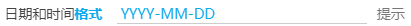
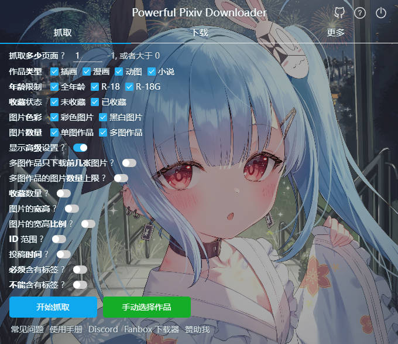
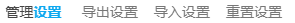

# 设置-更多-其他

## 日期和时间格式



下载器的命名规则里有两个标记会使用到时间（日期）字符串： `{date}` 和 `{task_date}`。

如果你使用这两个标记，可以在这里设置最终显示出来的日期和时间格式。

默认值是 `YYYY-MM-DD`，只显示年月日，不显示时分秒。但是如果你有需要，你可以自行设置。

对于时间如 `2021-04-30T06:40:08`，各个标记的结果如下（**区分大小写**）:

```
YYYY 2021
YY 21
MM 04
MMM Apr
MMMM April
DD 30
hh 06
mm 40
ss 08
```

## 颜色主题


设置下载器的颜色主题。

默认为自动检测。此时下载器会自动判断 pixiv 的主题，然后使用与之相同的主题。

你可以通过这个选项设置下载器的主题，使其可以不同于 pixiv 的主题。 

?>下载器的主题目前只有白色和黑色。

## 背景图片


你可以选择自己喜欢的图片作为下载器的背景图片，并且可以调节透明度、对齐方式。

效果如下：



?>建议使用颜色较暗的图片作为背景图片。

## 选项卡切换方式


用户可以选择使用哪种方式切换下载器的选项卡（也就是顶部的抓取、下载、更多这三个版块）。


默认方式是鼠标经过，这样更快捷。

一些用户担心鼠标经过的方式会误操作，此时可以选择鼠标点击的方式。

## 高亮显示关键字


默认开启。

开启之后，下载器的设置项的一些文字会以粗体显示，并且颜色变成蓝色。

下载器的设置项太多了，用户想要找到一个特定设置时可能会花费比较长的时间。高亮显示关键字可以提高查找设置的效率。

## Language


```
Language  自动检测    简体中文    繁體中文    日本語    English    한국어     Русский
```

你可以设置下载器使用的语言。这不会影响 Pixiv 的语言。

一般保持默认的“自动检测”即可，这样下载器会使用和 Pixiv 页面一致的语言。

你也可以根据需要选择使用的语言，这可以让下载器的语言与 Pixiv 不同。

## 管理设置



你可以点击对应的文字按钮进行操作：

1. 导出设置（导出一个 json 文件）
2. 导入设置（选择你之前导出的 json 文件，进行恢复）
3. 重置设置（将所有设置恢复为默认值）

?>使用此功能，你可以保存多套设置，并根据需要加载设置。
