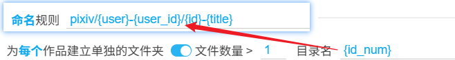
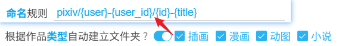
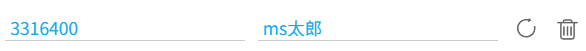

# 设置-更多-命名

## 为每个作品建立单独的文件夹

<p class="option" data-no="19" style="display: flex;">
    <span class="settingNameStyle1" data-xztext="_为作品建立单独的文件夹">为<span class="key">每个</span>作品建立单独的文件夹</span>
    <input type="checkbox" name="workDir" class="need_beautify checkbox_switch">
    <span class="beautify_switch" tabindex="0"></span>
    <span class="subOptionWrap" data-show="workDir" style="display: none;">
    <label for="workDirFileNumber" data-xztext="_文件数量大于">文件数量 &gt;</label>
    <input type="text" name="workDirFileNumber" id="workDirFileNumber" class="setinput_style1 blue" value="1" style="width:30px;min-width: 30px;">
    <span>&nbsp;</span>
    <label for="workDirNameRule" data-xztext="_目录名">目录名</label>
    <input class="has_tip setinput_style1 blue" type="text" data-xztip="_用idm_num代替id" name="workDirNameRule" id="workDirNameRule" value="{id_num}" data-tip="这里应该使用 {id_num} 代替 {id}">
    </span>
    </p>

下载器可以为每个作品创建单独的文件夹。

**子选项：**

- `文件数量`：当这个作品里的文件数量大于设置值时，下载器才会为其创建文件夹。默认是 1，效果就是只为多图作品创建单独的文件夹。你也可以设置为其他值。如果设置为 0，会为每个作品创建文件夹（不过这没什么意义，因为可以通过“命名规则”来实现这个效果）。
- `目录名`：为作品创建的文件夹的名称。可以使用命名规则里的标记，也可以使用 `/` 建立文件夹。默认值是 `{id_num}`，也就是使用作品 ID（不带序号）建立文件夹，把文件存放在里面。

如果作品里的文件数量符合条件，下载器会把目录名插入到文件名之前，创建一个文件夹：




!>这里不应该使用 `{id}` 标记，请使用 `{id_num}` 代替它。因为多图作品里的每张图片的 `{id}` 都不同，如果使用 `{id}` 会导致每个图片都会建立一个文件夹。

-----------

以作品 [79239641](https://www.pixiv.net/artworks/79239641 ':target=_blank') 为例，它有 3 张图片。

启用此功能后，下载器默认会把图片放进以作品的 id 命名的目录里，如下：

```
79239641/
  |---- 79239641_p0.jpg
  |---- 79239641_p1.jpg
  |---- 79239641_p2.jpg
```

## 根据作品类型自动建立文件夹

<p class="option" data-no="42" style="display: flex;">
    <span class="has_tip settingNameStyle1" data-xztip="_根据作品类型自动建立文件夹的说明" data-tip="插画的文件夹名字：Illustration&lt;br&gt;
漫画的文件夹名字：Manga&lt;br&gt;
动图的文件夹名字：Ugoira&lt;br&gt;
小说的文件夹名字：Novel">
    <span data-xztext="_根据作品类型自动建立文件夹">根据作品<span class="key">类型</span>自动建立文件夹</span>
    <span class="gray1"> ? </span>
    </span>
    <input type="checkbox" name="createFolderByType" class="need_beautify checkbox_switch">
    <span class="beautify_switch" tabindex="0"></span>
    <span class="subOptionWrap" data-show="createFolderByType" style="display: none;">
    <input type="checkbox" name="createFolderByTypeIllust" id="createFolderByTypeIllust" class="need_beautify checkbox_common">
    <span class="beautify_checkbox" tabindex="0"></span>
    <label for="createFolderByTypeIllust" class="has_tip" data-tip="Illustration">
    <span data-xztext="_插画">插画</span></label>
    <input type="checkbox" name="createFolderByTypeManga" id="createFolderByTypeManga" class="need_beautify checkbox_common">
    <span class="beautify_checkbox" tabindex="0"></span>
    <label for="createFolderByTypeManga" class="has_tip" data-tip="Manga">
    <span data-xztext="_漫画">漫画</span></label>
    <input type="checkbox" name="createFolderByTypeUgoira" id="createFolderByTypeUgoira" class="need_beautify checkbox_common">
    <span class="beautify_checkbox" tabindex="0"></span>
    <label for="createFolderByTypeUgoira" class="has_tip" data-tip="Ugoira">
    <span data-xztext="_动图">动图</span></label>
    <input type="checkbox" name="createFolderByTypeNovel" id="createFolderByTypeNovel" class="need_beautify checkbox_common">
    <span class="beautify_checkbox" tabindex="0"></span>
    <label for="createFolderByTypeNovel" class="has_tip" data-tip="Novel">
    <span data-xztext="_小说">小说</span></label>
    </span></p>

你可以选择其中**任意多个**选项，这样下载器会根据作品类型自动创建文件夹。

如果需要为作品创建文件夹，下载器会在文件名之前添加一个文件夹：



- 如果选择了`插画`，插画作品会被存入 `Illustration` 文件夹。
- 如果选择了`漫画`，漫画作品会被存入 `Manga` 文件夹。
- 如果选择了`动图`，动图作品会被存入 `Ugoira` 文件夹。
- 如果选择了`小说`，小说作品会被存入 `Novel` 文件夹。

?> 有一个类似的命名标记：`{type}`。它会输出作品类型，如果用它建立文件夹的话，效果等同于全选这个设置里的 4 个选项。但是 `{type}` 会为所有类型的作品创建文件夹，无法只选择其中某些类型。如果你只需要为某些类型的作品创建文件夹（例如只为“动图”创建文件夹），可以使用这个设置。

## 使用第一个匹配的标签建立文件夹 

<p class="option" data-no="43" style="display: flex;">
    <span class="has_tip settingNameStyle1" data-xztip="_使用匹配的tag建立文件夹的说明" data-tip="如果作品的标签列表里含有用户设置的标签，就会使用这个标签建立文件夹（仅限第一个匹配到的标签）">
    <span data-xztext="_使用第一个匹配的tag建立文件夹">使用第一个匹配的<span class="key">标签</span>建立文件夹</span>
    <span class="gray1"> ? </span>
    </span>
    <input type="checkbox" name="createFolderByTag" class="need_beautify checkbox_switch">
    <span class="beautify_switch" tabindex="0"></span>
    <span class="subOptionWrap" data-show="createFolderByTag" style="display: none;">
    <textarea class="centerPanelTextArea beautify_scrollbar" name="createFolderTagList" rows="1" placeholder="tag1,tag2,tag3"></textarea>
    </span>
    </p>

启用这个设置之后，用户可以输入标签列表。

在下载每个文件时，下载器都会查找作品的标签里是否含有这里设置的**任意一个**标签。一旦查找到含有这里的某个标签（也就是第一个匹配到的标签），就会使用这个标签建立一个文件夹。

使用这个设置，你可以对含有特定标签的文件进行单独的分类。

---------

例如作品 [94964157](https://www.pixiv.net/artworks/94964157 ':target=_blank') 含有“原创”标签：


如果你在这个设置里输入了 `原创`，下载器就会建立“原创”文件夹存放这个作品：


---------

另一个使用场景：下载器有一个命名设置：[把 R-18(G) 作品存入指定的文件夹里](/zh-cn/设置-下载?id=把-r-18g-作品存入指定的文件夹里)，它会把含有 `R-18` 和 `R-18G` 标签的作品放到**一个**单独的文件夹里。

有些用户想让 `R-18` 和 `R-18G` 作品分别保存到**两个**文件夹里，上面的设置做不到，此时可以使用这个设置。

在这个设置里输入 `R-18,R-18G` 这两个标签。当作品含有 `R-18` 标签时就会建立 `R-18` 文件夹；如果含有 `R-18G` 标签，就会建立 `R-18G` 文件夹。

## 第一张图不带序号

<p class="option" data-no="22" style="display: flex;">
    <span class="has_tip settingNameStyle1" data-xztip="_第一张图不带序号说明" data-tip="去掉每个作品第一张图的序号。例如 80036479_p0 变成 80036479">
    <span data-xztext="_第一张图不带序号">第一张图不带<span class="key">序号</span></span>
    <span class="gray1"> ? </span>
    </span>
    <input type="checkbox" name="noSerialNo" class="need_beautify checkbox_switch">
    <span class="beautify_switch" tabindex="0"></span>
    <span class="subOptionWrap" data-show="noSerialNo" style="display: none;">
      <input type="checkbox" name="noSerialNoForSingleImg" id="setNoSerialNoForSingleImg" class="need_beautify checkbox_common" checked="">
      <span class="beautify_checkbox" tabindex="0"></span>
      <label for="setNoSerialNoForSingleImg" data-xztext="_单图作品" class="active">单图作品</label>
      <input type="checkbox" name="noSerialNoForMultiImg" id="setNoSerialNoForMultiImg" class="need_beautify checkbox_common" checked="">
      <span class="beautify_checkbox" tabindex="0"></span>
      <label for="setNoSerialNoForMultiImg" data-xztext="_多图作品" class="active">多图作品</label>
    </span>
    </p>

什么是序号？如果你使用 `{id}` 命名，每个作品的 id 后面都会带序号，如：

```
80447108_p0
80447108_p1
80447108_p2
```

结尾的 `_p0`、`_p1`、`_p2` 就是序号。

如果你启用了这个选项，下载器会去掉**每个作品的第一张图片**的序号，变成这样：

```
// 第一张图片去掉了序号 0
80447108
80447108_p1
80447108_p2
```

**子选项：**
- `单图作品`：为单图作品去掉序号。
- `多图作品`：为多图作品的第一张图片去掉序号。

?> 命名标记 `{p_num}` 也会输出序号，不过它输出的是纯数字的 `0`、`1`、`2`。这个设置对 `{p_num}` 也会生效，即可以去掉 `{p_num}` 输出的 `0`。

## 在序号前面填充 0

<p class="option" data-no="46" style="display: flex;">
    <span class="has_tip settingNameStyle1" data-xztip="_在序号前面填充0的说明" data-tip="这可以解决一些软件不能正确的按照文件名来排序文件的问题。">
    <span data-xztext="_在序号前面填充0">在序号前面<span class="key">填充 0</span></span>
    <span class="gray1"> ? </span>
    </span>
    <input type="checkbox" name="zeroPadding" class="need_beautify checkbox_switch">
    <span class="beautify_switch" tabindex="0"></span>
    <span class="subOptionWrap" data-show="zeroPadding" style="display: none;">
    <span data-xztext="_序号总长度">序号总长度</span>
    <input type="text" name="zeroPaddingLength" class="setinput_style1 blue" value="3" style="width:30px;min-width: 30px;">
    </span>
    </p>

插画和漫画作品因为可能有多张图片，所以是有序号的。例如：

```
1
2
3
...
10
11
12
...
```

下载器默认不会在序号前添加 0，但是一些软件对于文件名排序不正确，在这种情况下需要添加 0。

!>注意：如果你没有遇到“按文件名排序时，因为序号而导致排序不正确”的问题，就不需要启用这个设置。（此问题经常出现在安卓系统上）

启用这个设置后，序号的形式如下：

```
001
002
003
...
010
011
012
...
```

你可以在子选项里设置填充后的序号长度，默认为 3。

?> pixiv 的单个插画或漫画作品最多可以有 200 张图片，所以把长度设置为 3 是最合适的。

## 文件名长度限制

<p class="option" data-no="29" style="display: flex;">
    <span class="has_tip settingNameStyle1" data-xztip="_文件名长度限制的说明" data-tip="如果文件名超长，浏览器可能会显示另存为窗口，让用户手动处理。&lt;br&gt;
    通常你不需要启用这个设置，因为 Windows 上的浏览器通常会自动截断超长的部分。&lt;br&gt;
    但是在其他操作系统里，或者把文件保存到网络驱动器时，浏览器可能不会自动截断文件名，从而出现另存为窗口。&lt;br&gt;
    如果你认为有必要，可以启用此设置，下载器会截断文件名里超长的部分。&lt;br&gt;
    建议设置小于 256 的数字。默认值是 200。">
    <span data-xztext="_文件名长度限制">文件名<span class="key">长度</span>限制</span>
    <span class="gray1"> ? </span>
    </span>
    <input type="checkbox" name="fileNameLengthLimitSwitch" class="need_beautify checkbox_switch">
    <span class="beautify_switch" tabindex="0"></span>
    <span class="subOptionWrap" data-show="fileNameLengthLimitSwitch" style="display: none;">
    <input type="text" name="fileNameLengthLimit" class="setinput_style1 blue" value="200">
    </span>
    </p>

你可以设置文件名的长度上限。这个长度不包括文件夹路径的长度，只包括文件名 + 后缀名。

以默认的命名规则 `pixiv/{user}-{user_id}/{id}-{title}` 为例，找到最后一个斜线 `/`，其后的 `{id}-{title}` 就是文件名。下载器还会加上后缀名，如 `.jpg` 或 `.png`。

如果你启用了这个设置，下载器会检查每个文件的名字。如果它的文件名 + 后缀名的长度大于这里设置里的数字，下载器会截断文件名，使其长度小于设置值。

?> 这个设置只会截断文件的名字，不会截断文件夹的名字。文件夹的名字总是完整的。

?> 为什么文件名可能超长？如果命名规则里的一些规则会输出很多文字，就有可能导致文件名的长度大于操作系统允许使用的长度。通常来说，有两种标记可能会导致此问题：一种是 `{title}`，因为某些小说的标题很长。另一种是标签列表，就是 `{tags}`、`{tags_translate}`、`{tags_transl_only}`，因为有些标签的字数很多。

**什么情况下需要启用这个设置？**

当浏览器可能会因为文件名超长而无法自动保存文件时，才需要启用这个设置。

具体来说，如果你使用 Windows 操作系统 + Chrome 浏览器，并且把文件保存到本地硬盘（而非网络位置），那么不需要启用这个设置。因为此时浏览器会自动截断超长的字符，不需要下载器进行处理。

在其他情况下，浏览器可能不会自动截断超长的部分。此时如果有些文件的名字超长，浏览器可能会显示另存为窗口，让用户手动处理。

此时你可以启用此设置，让下载器截断超长的部分。

建议设置小于 256 的数字。默认值是 200，但有时可能需要使用更小的值。

?> 文件是储存在文件夹里的，如果它前面的所有文件夹的名字加起来很长，那么文件名所能使用的字数就会减少。反之，如果文件夹的名字加起来比较少，文件名所能使用的字数就会比较多。


## 标签分隔符号

<p class="option" data-no="83" style="display: flex;">
    <span class="settingNameStyle1" data-xztext="_标签分隔符号">标签<span class="key">分隔</span>符号</span>
    <input type="text" name="tagsSeparator" class="setinput_style1 blue" value=",">
    <button type="button" class="gray1 textButton showTagsSeparatorTip" data-xztext="_提示">提示</button>
    </p>

只会影响这些命名标记的结果：`{tags}`, `{tags_translate}`, `{tags_transl_only}`。

下载器默认使用 `,` 分割标签，所以上面的标记的输出结果会像是这样：`tag1,tag2,tag3`。如果你想使用其他符号，可以在这里修改。

如果你设置为 `#`，标签列表的输出结果会是 `tag1#tag2#tag3`。

下面是一些可能比较常用的分隔符：

```
,
#
&
_
-
```

?>分隔符不仅可以使用单个字符，也可以设置为多个字符（如果你有需要的话）。

## 移除用户名中的 @ 和后续字符

<p class="option" data-no="67" style="display: flex;">
    <span class="has_tip settingNameStyle1" data-xztip="_移除用户名中的at和后续字符的说明" data-tip="例如：Anmi@画集発売中 → Anmi">
    <span data-xztext="_移除用户名中的at和后续字符">移除用户名中的 <span class="key">@</span> 和后续字符</span>
    <span class="gray1"> ? </span>
    </span>
    <input type="checkbox" name="removeAtFromUsername" class="need_beautify checkbox_switch">
    <span class="beautify_switch" tabindex="0"></span>
    </p>

有一些用户的用户名后面添加了 @ 后缀，例如：

- Anmi@画集発売中
- 奥馬@skeb募集中
- TonyG @__tony_g

而且有时 @ 后面的文字还会发生变化。

如果你想移除 @ 和后面的文字，可以启用这个选项。这样，**命名规则里的 `{user}` 标记**的结果会从 @ 处截断，变成：

- Anmi
- 奥馬
- TonyG

## 自定义用户名

<div class="option" data-no="66" style="display: flex;">
    <span class="has_tip settingNameStyle1" data-xztip="_自定义用户名的说明" data-tip="有些用户可能会改名，如果你想使用他原来的名字，你可以在这里手动设置他的名字。&lt;br&gt;
    你也可以为用户设置别名。&lt;br&gt;
    当你在命名规则中使用 {user} 标记时，下载器会优先使用你设置的名字。">
    <span data-xztext="_自定义用户名">自定义<span class="key">用户名</span></span>
    <span class="gray1"> ? </span>
    </span>
    <slot data-name="setUserNameSlot"><span class="setUserNameWrap">
    <span class="controlBar">
    <span class="total">0</span>
      <button type="button" class="textButton expand" data-xztext="_收起">收起</button>
      <button type="button" class="textButton showAdd" data-xztext="_添加">添加</button>
    </span>
    <div class="addWrap">
      <div class="settingItem addInputWrap">
        <div class="inputItem uid">
          <span class="label uidLabel" data-xztext="_用户id">用户 ID（数字）</span>
          <input type="text" class="setinput_style1 blue addUidInput" data-xzplaceholder="_必须是数字" placeholder="必须是数字">
        </div>
        <div class="inputItem name">
          <span class="label nameLabel" data-xztext="_命名标记user">用户名字</span>
          <input type="text" class="setinput_style1 blue addNameInput">
        </div>
      </div>
    </div>
  </span></slot>
    </div>

你可以在这里添加用户的 ID，并为其设置一个名字。这会影响 `{user}` 命名标记。

例如 https://www.pixiv.net/users/3316400 的用户名是 `MだSたろう`，如果我想为他设置一个自定义名字，可以输入用户 ID 为 `3316400`，用户名为自定义的 `ms太郎`，然后保存。

当我下载他的作品时，`{user}` 会忽略他原本的名字，输出我设置的名字 `ms太郎`。

当你添加一条规则之后，下载器会这样显示：



如果有需要，你可以在这里修改设置（例如修改用户名），然后点击右侧的刷新按钮来更新这条规则。你也可以删除这条规则。

-----------

**使用场景 1：**防止用户改名。

有些用户可能会经常改名，如果你想使用他原来的名字，可以在这里手动设置他的名字。

常见的情况是用户名后面有 @ 符号，例如：

- Anmi@画集発売中
- 奥馬@skeb募集中
- さしみなす@依頼募集中

虽然前面的 [移除用户名中的 @ 和后续字符](/zh-cn/设置-更多-命名?id=移除用户名中的-和后续字符) 功能可以解决此问题，但是有些用户的名字里可能不使用 @，例如：

- いの字/inoji
- 焔すばる★２日目 東C17a
- 送り萬都 🔞仕事募集中
- しりー＊C99木曜東A21b
- ショーンC99木東ユ40b
- オムレットマト西ぬ31b

你可以在这里为他们设置一个固定的名字。

-----------

**使用场景 2：**为用户设置别名，也就是昵称。

例如一个用户的名字是日语，但我不会输入日语，不方便在本机上搜索。如果我为他设置一个中文别名（或者我能够使用的其他语言），就可以方便的搜索了。

如果一个用户的名字很难记住，你也可以为他设置一个容易记住的别名。


