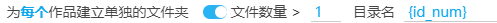
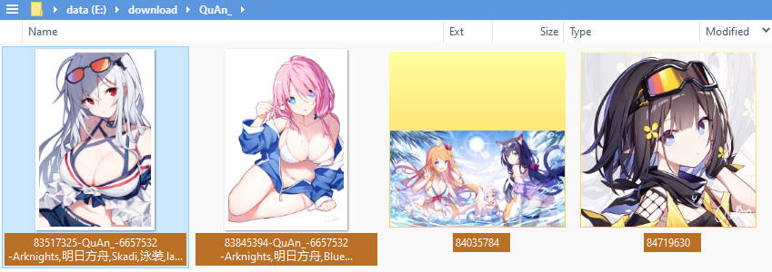
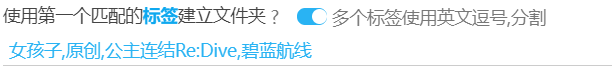
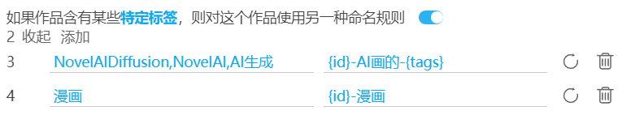
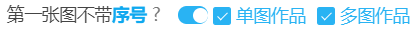
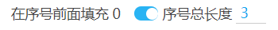
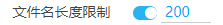
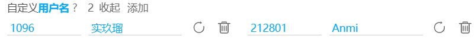

# 设置-更多-命名

## 根据作品类型自动建立文件夹

```
根据作品类型自动建立文件夹  ✓插画  ✓漫画  ✓动图  ✓小说
```

默认未启用。

你可以勾选其中**任意多个**选项，这样下载器会根据作品类型自动创建文件夹。

- 如果勾选了`插画`，插画作品会被存入 `Illustration` 文件夹
- 如果勾选了`漫画`，漫画作品会被存入 `Manga` 文件夹
- 如果勾选了`动图`，动图作品会被存入 `Ugoira` 文件夹
- 如果勾选了`小说`，小说作品会被存入 `Novel` 文件夹


这个设置可以代替命名标记 `{type}`。`{type}` 总是会为所有类型的作品创建文件夹。使用这个设置，你可以自由选择需要处理的作品类型。

## 为每个作品建立单独的文件夹



默认未启用。

下载器可以为每个作品创建单独的目录，把这个作品里的文件保存进去。

例如：



### 文件数量>

当作品里的图片数量大于设置值的时候，才会为这个作品创建单独的文件夹。

默认值为 1，也就是只会为多图作品建立文件夹。

如果设置为 0，那么对于单图作品也会创建文件夹。

### 目录名

你可以设置每个作品的文件夹名称。

**提示：** 

- 这里可以使用命名规则里的标记。
- 这里可以使用斜线 `/` 来建立子文件夹。

!>这里不应该使用 `{id}` 标记，请使用 `{id_num}` 代替它。因为多图作品里的每张图片的 `{id}` 都不同，如果使用 `{id}` 会导致每个图片都会建立一个文件夹。

-----------

以作品 [79239641](https://www.pixiv.net/artworks/79239641 ':target=_blank') 为例，它有 3 张图片。若命名规则为 `{id}`，在未开启此功能时，文件名结果如下：

```
79239641_p0.jpg
79239641_p1.jpg
79239641_p2.jpg
```

开启此功能后，默认会把图片放进以作品的 id 命名的目录里，如下：

```
79239641/
  |---- 79239641_p0.jpg
  |---- 79239641_p1.jpg
  |---- 79239641_p2.jpg
```

## 使用第一个匹配的标签建立文件夹 



默认未启用。

启用这个设置之后，用户可以输入标签列表。

在下载时，如果作品的标签列表中含有用户设置的标签，就会使用这个标签建立一个文件夹（仅限第一个匹配到的标签）。

例如：作品 [94964157](https://www.pixiv.net/artworks/94964157 ':target=_blank') 含有“原创”标签：


因为上面我设置的标签列表中含有“原创”，所以下载器会建立“原创”文件夹存放这个作品：


## 如果作品含有某些特定标签，则对这个作品使用另一种命名规则



默认未启用。

这是一个隐藏设置。

你可以添加规则，设置特定的标签和对应的文件名规则。

当作品含有指定的标签时，下载器会使用命名规则里的文件夹部分，再加上这里设置的文件名部分，组合为一个新的命名规则使用。

但是这个设置是为某个用户定制的，所以它有一些特殊的规则：

1. 在这个设置里，你只应该设置命名规则里的文件名部分，也就是不应该包含斜线 /（文件夹部分）。否则有时可能会出现预料之外的结果。
2. 这里设置的命名规则里的 `{id}` 会被忽略，然后下载器会在规则的开头添加 `{id}`。也就是说这里设置的规则总是会被修改成以 {id} 开头。

------------

如果你想看到这个设置，可以如下操作：

1. 打开下载器的“显示高级设置”，并查看下载器的“更多”选项卡
2. 按 F12 审查元素，在 html 里搜索 `data-no="80"` 找到这个设置的元素，它默认是 `display: none;` 的
3. 取消它的 `display: none;` 样式，它就会显示出来。此时你就可以对它进行操作了。


## 第一张图不带序号



```
第一张图不带序号 ?  ✓ 单图作品  ✓ 多图作品
```

默认未启用。

什么是序号？如果你使用 `{id}` 命名，每个作品的 id 后面都会带序号，如：

```
80447108_p0
80447108_p1
80447108_p2
```

如果你使用了 `{p_num}`，也会显示序号。`{p_num}` 不带 `_p` 字符，是单纯的数字序号。

如果你开启了这个选项，下载器会去掉**每个作品的第一张图片**的序号，变成这样：

```
// 第一张图片去掉了序号 0
80447108
80447108_p1
80447108_p2
```

在子选项中，你可以设置此功能的作用范围。例如你希望单图不带序号，多图保留序号，就可以只选中单图作品。

## 在序号前面填充 0



默认未启用。

插画和漫画作品因为可能有多张图片，所以是有序号的。例如：

```
1
2
3
...
10
11
12
...
```

下载器默认不会在序号前添加 0，但是一些软件对于文件名排序不正确，在这种情况下需要添加 0。

开启这个设置后，序号的形式可能如下：

```
001
002
003
...
010
011
012
...
```

你可以在子选项里设置填充后的长度，默认为 3。（因为插画和漫画最多可以有 200 p，所以长度应该设置为 3）。

!>注意：如果你没有遇到“文件因为序号而导致排序不正确”的问题，就不需要开启这个设置。（此问题经常出现在安卓系统上）

## 添加命名标记前缀


默认未启用。

当用户在命名规则里使用了多个标记时，文件名里储存了多种信息，它们之间可能难以区分开来。

如果启用了这个设置，本程序会在一些标记前面添加一些前缀。详细情况如下：

- `{title}` 生成结果时，前面加上了 `title_` 字符。
- `{tags}` 和 `{tags_translate}` 生成结果时，前面加上了 `tags_` 字符。
- `{user}` 生成结果时，前面加上了 `user_` 字符。
- `{userid}` 生成结果时，前面加上了 `uid_` 字符。
- `{bmk}` 生成结果时，前面加上了 `bmk_` 字符。

其他标记没有添加说明文字。

!>这是一个遗留设置，你没有太大的必要使用它。如果有需要，你可以在命名规则里手动输入你要使用的字符。

## 文件名长度限制



默认未启用。

设置文件名的长度上限。这个长度不包括文件夹路径的长度，只包括文件名 + 后缀名。

**一般不需要开启。**因为多数情况下，如果文件名太长的话，浏览器会自动截断超出的部分，不会导致保存失败。

!>在一些特殊情况下，浏览器可能不会自动截断文件名，而这有可能导致文件保存失败。例如：你使用的是 Linux 系统，或者你把下载位置设置到了 NAS 或云端硬盘。

当你确定是因为文件名太长导致了问题时，才需要启用这个设置。

开启这个设置之后，如果文件名超过了设置的长度，下载器会截断超长的部分。

## 除用户名中的 @ 和后续字符


默认未启用。

有一些用户的用户名后面添加了 @ 后缀，例如：

- Anmi@画集発売中
- 奥馬@skeb募集中
- TonyG @__tony_g

启用这个设置之后，**命名规则里的 `{user}` 标记**的结果会从 @ 处截断，变成：

- Anmi
- 奥馬
- TonyG

## 自定义用户名



有些用户可能会改名，如果你想使用他原来的名字，你可以在这里手动设置他的名字。

你也可以为用户设置别名。

这个功能主要是为了解决这个问题：

用画师的名字作为文件夹名字时(`{user}` 命名标记)，因为画师改名（之前的名字和现在的名字不一样）而导致产生多个文件夹的问题。

下面是一些加了后缀的画师名字：

```
藤ちょこ（藤原）
Lyrae(星雲白夜)
いの字/inoji
Anmi@画集発売中
奥馬@skeb募集中
さしみなす@依頼募集中
つね@FANBOX始めました
ひさまくまこ＠連載中
大嘘＠冬コミ欠席／新刊書店委託
ブラック（リクエスト受付中）
送り萬都 🔞仕事募集中
焔すばる★２日目 東C17a
しりー＊C99木曜東A21b
つる12/31東地区メ-28a
ショーンC99木東ユ40b
オムレットマト西ぬ31b
豆塚隆“サークル双尾無双”
```

虽然在名字中使用 `@` 作为分隔符是很常见的，但是也有很多其他的分隔符，有些根本没有分隔符。所以下载器无法自动识别和处理这种情况。你可以在这个设置里手动处理。

例如 https://www.pixiv.net/users/212801 的用户名是 `Anmi`，但是他加了后缀，现在是 `Anmi@画集発売中`。

你可以在这个设置里添加一条规则，设置用户 ID `212801` 对应的名字为 `Anmi`。


之后当你进行下载时，如果你在命名规则中使用了 `{user}` 标记，下载器会优先使用你设置的名字。

?>这个设置只会影响命名规则中的 `{user}` 标记。pixiv 网页上显示的用户名不会改变。
