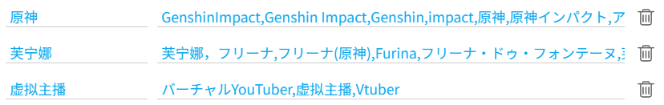

# 设置-更多-命名

## 为多图作品添加一层文件夹

<div class="option new" data-no="19" style="display: flex;"><button type="button" class="pinButton" data-title="_置顶">📌</button>
      <a href="https://xuejianxianzun.github.io/PBDWiki/#/zh-cn/设置-更多-命名?flag=19" target="_blank" class="settingNameStyle" data-xztext="_为多图作品添加一层文件夹">为<span class="key">多图</span>作品添加一层文件夹</a>
      <input type="checkbox" name="folderForMultiImageWorksSwitch" class="need_beautify checkbox_switch">
      <span class="beautify_switch" tabindex="0"></span>
      <button type="button" class="gray1 textButton showMsgBtn" data-title="_为多图作品添加一层文件夹" data-msg="为多图作品添加一层文件夹的帮助" data-xztext="_帮助">帮助</button>
      <span class="subOptionWrap" data-show="folderForMultiImageWorksSwitch" style="display: none;">
        <label for="folderForMultiImageWorksImageNumber" data-xztext="_图片数量2">图片数量</label>
        &gt;
        <input class="setinput_style1 blue w150 noGrow" type="text" name="folderForMultiImageWorksImageNumber" id="folderForMultiImageWorksImageNumber" value="1">
        <label for="folderForMultiImageWorksRule" data-xztext="_文件夹规则">文件夹规则</label>
        <input class="setinput_style1 blue w150 grow" type="text" name="folderForMultiImageWorksRule" id="folderForMultiImageWorksRule" value="{pid}">
      </span>
    </div>

下载器可以为多图作品添加一层单独的文件夹。在下载器面板上点击该设置的“帮助”按钮可以查看详细说明。

例如以作品 [79239641](https://www.pixiv.net/artworks/79239641 ':target=_blank') 有 3 张图片，启用此功能可以把图片放进以作品 ID 命名的目录里，如下：

```
79239641/
  |---- 79239641_p0.jpg
  |---- 79239641_p1.jpg
  |---- 79239641_p2.jpg
```

**子选项：**

- `图片数量`：当这个作品里的图片数量大于设置值时，下载器才会为其添加这里设置的文件夹。默认是 1，会对所有多图作品生效。你也可以设置为其他值。
- `文件夹规则`：为多图作品添加的文件夹的名称。你可以像设置命名规则一样使用各种标记和自定义文字，也可以使用 `/` 来建立文件夹。默认值是 `{pid}`，也就是使用作品 ID（不带序号）建立文件夹，把文件存放在里面。

之后你还需要修改“图像作品的命名规则”设置，在你需要的地方插入 `/{multi_image_folder}/` 来添加一层文件夹。示例：`pixiv/{user}-{user_id}/{multi_image_folder}/{id}-{title}`

之所以需要手动插入这个标记，是为了让用户可以自行决定这层文件夹的位置。虽然通常它会添加到文件名前面，但有些用户可能需要把它放到其他位置，例如更上层的文件夹，或者文件名里。

**提示：**

- 如果你要在文件夹名字里使用作品 ID，那么不应该使用 `{id}` 标记，而是应该使用 `{pid}`。因为多图作品里的每张图片的 `{id}` 都不同，如果使用 `{id}` 会导致每个图片都会建立一个文件夹。
- 虽然设置名字写着“添加一层文件夹”，但你其实可以在这里设置多层文件夹。
- `{multi_image_folder}` 本身不会创建文件夹（除非你设置的文件夹规则里已经以斜线 `/` 结尾），所以需要在它后面添加斜线 `/` 来建立文件夹。不过有时这也是个可以利用的特性：如果你不想建立文件夹，而是想在文件名里把它标注为多图作品，就可以利用这个特性。例如我把文件夹规则设置为 `多图`，并把它添加到文件名里：`pixiv/{user}-{user_id}/{id}-{multi_image_folder}`，那么文件名里就会有“多图”标记：`pixiv/はまけん-3779820/144008705_p0-多图.jpg`

## 为 R-18(G) 作品添加一层文件夹

<div class="option pinned" data-no="38" style="display: flex;"><button type="button" class="pinButton" data-title="_置顶">📌</button>
      <a href="https://xuejianxianzun.github.io/PBDWiki/#/zh-cn/设置-更多-命名?flag=38" target="_blank" class="settingNameStyle" data-xztext="_为r18作品添加一层文件夹">为 <span class="key">R-18(G)</span> 作品添加一层文件夹</a>
      <input type="checkbox" name="r18Folder" class="need_beautify checkbox_switch">
      <span class="beautify_switch" tabindex="0"></span>
      <span class="subOptionWrap" data-show="r18Folder" style="display: none;">
        <span data-xztext="_文件夹规则">文件夹规则</span>
        <input type="text" name="r18FolderName" class="setinput_style1 blue grow" value="[R-18&amp;R-18G]">
      </span>
      <button type="button" class="gray1 textButton showMsgBtn" data-title="_为r18作品添加一层文件夹" data-msg="_为r18作品添加一层文件夹的帮助" data-xztext="_帮助">帮助</button>
    </div>

如果你想为 R-18(G) 作品单独建立一层文件夹，可以启用这个设置。在下载器面板上点击该设置的“帮助”按钮可以查看详细说明。

为了使该设置生效，你还需要修改命名规则，使用 `{r18_g_folder}` 代表这里设置的文件夹规则。当下载器下载 R-18(G) 作品时，会把 `{r18_g_folder}` 替换为这里设置的文件夹规则。

## 使用第一个匹配的标签建立文件夹 

<div class="option" data-no="43" style="display: flex;"><button type="button" class="pinButton" data-title="_置顶">📌</button>
      <a href="https://xuejianxianzun.github.io/PBDWiki/#/zh-cn/设置-更多-命名?flag=43" target="_blank" class="settingNameStyle">
        <span data-xztext="_使用第一个匹配的标签建立文件夹">使用第一个匹配的<span class="key">标签</span>建立文件夹</span>
      </a>
      <input type="checkbox" name="createFolderByTag" class="need_beautify checkbox_switch">
      <span class="beautify_switch" tabindex="0"></span>
      <button type="button" class="gray1 textButton showMsgBtn" data-title="_使用第一个匹配的标签建立文件夹" data-msg="_使用第一个匹配的标签建立文件夹的说明" data-xztext="_帮助">帮助</button>
      <span class="subOptionWrap namingTipArea flexBasis100" data-show="createFolderByTag" style="display:none;">
        <span class="name" data-bind-copy="true">{match_tag_folder1}</span>
        <textarea class="centerPanelTextArea beautify_scrollbar" name="createFolderTagList" rows="1" placeholder="tag1,tag2,tag3"></textarea>
        <span class="name" data-bind-copy="true">{match_tag_folder2}</span>
        <textarea class="centerPanelTextArea beautify_scrollbar" name="createFolderTagList2" rows="1" placeholder="tag1,tag2,tag3"></textarea>
      </span>
    </div>

如果你想在作品里含有特定标签时建立一层特殊文件夹，可以启用这个设置。在下载器面板上点击该设置的“帮助”按钮可以查看详细说明。

例如：作品 [94964157](https://www.pixiv.net/artworks/94964157 ':target=_blank') 含有“原创”标签：


如果你在这个设置里输入了 `原创`，下载器就会建立“原创”文件夹存放这个作品：


启用这个设置之后，你可以设置两个标签列表。

在下载每个文件时，下载器都会查找作品的标签里是否含有这里设置的**任意一个**标签。一旦查找到含有这里的某个标签，就会使用这个标签建立一个文件夹。

使用这个设置，你可以对含有特定标签的文件进行单独的分类。


## 标签别名

<div class="option pinned new" data-no="107" style="display: flex;"><button type="button" class="pinButton" data-title="_置顶">📌</button>
      <a href="https://xuejianxianzun.github.io/PBDWiki/#/zh-cn/设置-更多-命名?flag=107" target="_blank" class="settingNameStyle">
        <span data-xztext="_标签别名">标签<span class="key">别名</span></span>
      </a>
      <label for="useTagAliasForTagsNamingRule" data-xztext="_应用到文件名里的tags系列标记" class="">应用到文件名里的 {tags} 系列标记</label>
      <input type="checkbox" name="useTagAliasForTagsNamingRule" id="useTagAliasForTagsNamingRule" class="need_beautify checkbox_switch">
      <span class="beautify_switch" tabindex="0"></span>
      <button type="button" class="gray1 textButton showMsgBtn" data-title="_标签别名" data-msg="_标签别名的帮助" data-xztext="_帮助">帮助</button>
    </div>

如果一个标签有多种变体，你可以为它们设置一个自定义的别名，示例：



这个别名可以用于“使用第一个匹配的标签建立文件夹”和命名规则里的 `{tags}` 系列标签里。

该设置右侧有个帮助按钮，点击它可以查看具体使用说明（在 Wiki 里点击没有效果）。

## 序号的起始值

<div class="option new" data-no="98" style="display: flex;"><button type="button" class="pinButton" data-title="_置顶">📌</button>
      <a href="https://xuejianxianzun.github.io/PBDWiki/#/zh-cn/设置-更多-命名?flag=98" target="_blank" class="has_tip settingNameStyle" data-xztip="_序号起始值的说明" data-tip="设置图片的序号从 0 开始还是从 1 开始">
        <span data-xztext="_序号起始值"><span class="key">序号</span>的起始值</span>
        <span class="gray1"> ? </span>
      </a>
      <input type="radio" name="serialNoStart" id="serialNoStart0" class="need_beautify radio" value="0" checked="">
      <span class="beautify_radio" tabindex="0"></span>
      <label for="serialNoStart0" class="active"> 0 </label>
      <input type="radio" name="serialNoStart" id="serialNoStart1" class="need_beautify radio" value="1">
      <span class="beautify_radio" tabindex="0"></span>
      <label for="serialNoStart1"> 1 </label>
    </div>

你可以设置图片的序号从 `0` 开始还是从 `1` 开始。

下载器默认会从 `0` 开始，因为 Pixiv 图片的文件名就是从 `p0` 开始的。如果你想改为从 `1` 开始，可以修改此设置。

这个设置会影响含有序号的命名标记：`{id}`、`{p}`。

**注意：**如果你把序号设置为从 `1` 开始，并且启用了“不下载重复文件”功能，那么需要注意：对同一个文件，之前的下载记录里保存的序号是 `0`，当以后再次下载时，由于新的文件名里序号是 `1`，会导致文件名不同，所以“严格”策略会再次下载这个文件。使用“宽松”策略则不会再次下载它。

## 第一张图不带序号

<p class="option" data-no="22" style="display: flex;">
  <a href="https://xuejianxianzun.github.io/PBDWiki/#/zh-cn/设置-更多-命名?flag=22" target="_blank" class="has_tip settingNameStyle" data-xztip="_第一张图不带序号说明" data-tip="去掉每个作品第一张图的序号。例如 80036479_p0 变成 80036479">
    <span data-xztext="_第一张图不带序号">第一张图不带<span class="key">序号</span></span>
    <span class="gray1"> ? </span>
  </a>
  <input type="checkbox" name="noSerialNo" class="need_beautify checkbox_switch">
  <span class="beautify_switch" tabindex="0"></span>
  <span class="subOptionWrap" data-show="noSerialNo" style="display: inline-flex;">
    <input type="checkbox" name="noSerialNoForSingleImg" id="setNoSerialNoForSingleImg" class="need_beautify checkbox_common" checked="">
    <span class="beautify_checkbox" tabindex="0"></span>
    <label for="setNoSerialNoForSingleImg" data-xztext="_单图作品">单图作品</label>
    <input type="checkbox" name="noSerialNoForMultiImg" id="setNoSerialNoForMultiImg" class="need_beautify checkbox_common" checked="">
    <span class="beautify_checkbox" tabindex="0"></span>
    <label for="setNoSerialNoForMultiImg" data-xztext="_多图作品">多图作品</label>
    <input type="checkbox" name="noSerialNoForUgoira" id="setNoSerialNoForUgoira" class="need_beautify checkbox_common" checked="">
    <span class="beautify_checkbox" tabindex="0"></span>
    <label for="setNoSerialNoForUgoira" data-xztext="_动图" class="active">动图</label>
  </span>
</p>

什么是序号？如果你使用 `{id}` 命名，每个作品的 id 后面都会带序号，如：

```
80447108_p0
80447108_p1
80447108_p2
```

结尾的 `_p0`、`_p1`、`_p2` 就是序号。

如果你启用了这个选项，下载器会去掉**每个作品的第一张图片**的序号，变成这样：

```
// 第一张图片去掉了序号 0
80447108
80447108_p1
80447108_p2
```

**子选项：**
- `单图作品`：为单图作品去掉序号。
- `多图作品`：为多图作品的第一张图片去掉序号。
- `动图`：为动图作品去掉序号。

?> 命名标记 `{p}` 也会输出序号，它输出的是纯数字的 `0`、`1`、`2`。这个设置对 `{p}` 也会生效，即可以去掉 `{p}` 输出的 `0`。

## 在序号前面填充 0

<p class="option" data-no="46" style="display: flex;">
    <span class="has_tip settingNameStyle1" data-xztip="_在序号前面填充0的说明" data-tip="这可以解决一些软件不能正确的按照文件名来排序文件的问题。">
    <span data-xztext="_在序号前面填充0">在序号前面<span class="key">填充 0</span></span>
    <span class="gray1"> ? </span>
    </span>
    <input type="checkbox" name="zeroPadding" class="need_beautify checkbox_switch">
    <span class="beautify_switch" tabindex="0"></span>
    <span class="subOptionWrap" data-show="zeroPadding" style="display: none;">
    <span data-xztext="_序号总长度">序号总长度</span>
    <input type="text" name="zeroPaddingLength" class="setinput_style1 blue" value="3" style="width:30px;min-width: 30px;">
    </span>
    </p>

插画和漫画作品因为可能有多张图片，所以文件名里是有序号的。例如：

```
0
1
2
3
...
10
11
12
...
```

下载器默认不会在序号前添加 0，但是一些软件对于文件名排序不正确，在这种情况下需要添加 0。

**注意：**如果你没有遇到“按文件名排序时，因为序号而导致排序不正确”的问题，就不需要启用这个设置。

此问题经常出现在 Android 系统上，很多文件管理器可能会把文件错误的排序，像是这样：


```
0
1
11
12
...
2
20
21
...
3
30
...
```

原因是这些文件管理器把文件名作为字符串进行排序，所以导致了这个问题。

此时你可以启用这个功能，下载器会在序号前面填充 0：

```
001
002
003
...
010
011
012
...
```

这样就解决了排序错误的问题。

你可以在子选项里设置填充后的序号长度，默认为 3。

?> pixiv 的单个插画或漫画作品最多可以有 200 张图片，所以把长度设置为 3 是最合适的。

## 文件名长度限制

<p class="option" data-no="29" style="display: flex;">
      <a href="https://xuejianxianzun.github.io/PBDWiki/#/zh-cn/设置-更多-命名?flag=29" target="_blank" class="settingNameStyle">
        <span data-xztext="_文件名长度限制">文件名<span class="key">长度</span>限制</span>
      </a>
      <input type="checkbox" name="fullNameLengthLimitSwitch" class="need_beautify checkbox_switch" checked="">
      <span class="beautify_switch" tabindex="0"></span>
      <span class="subOptionWrap" data-show="fullNameLengthLimitSwitch" style="display: inline-flex;">
        <input type="text" name="fullNameLengthLimit" class="setinput_style1 blue" value="210">
      </span>
    </p>

你可以设置完整文件名的字符数量限制。完整的文件名包括：文件夹的名字、路径符号、文件名、扩展名。

默认值是 `210`，如果完整的文件名的字符数量超过设置值，下载器会优先截断文件名，使字符数量小于设置值。如果有必要，也会截断文件夹的名字。

**为什么文件名可能会超长？**

命名规则里的一些标签可能会输出很多文字，可能会导致文件名的长度超过操作系统允许的长度（通常不超过 256 个字符）。

有两种标签容易导致此问题：一种是标题，包括 `{title}`、`{page_title}`，因为某些小说的标题很长。另一种是标签列表，包括 `{tags}`、`{tags_translate}`、`{tags_transl_only}`、`{page_tag}`，因为有些标签的字数很多。

### 下载器的处理机制

对于完整的文件路径如 `A/B/C.jpg`，下载器会计算它的字符总数量，如果超过设置值则倒序处理，即优先截断文件名，其次才会截断文件夹的名字。具体处理如下：
1. 如果文件名 `C` 较长则截断它以减少字符数量，但必定会保留 `{id}` 生成的结果，以避免文件名重复。
2. 如果截断 `C` 之后整体长度依然超长，则截断文件夹 `B`。对于每层文件夹，如果它不超过 25 个字符，则不截断它。如果超过 25 个字符才会截断它。另外，每层文件夹在截断之后保留的字符数量会是 25 的倍数。
3. 如果截断 `B` 之后整体长度依然超长，则截断文件夹 `A`。以此类推。
4. 下载器会在被截断的文件夹或文件名的末尾添加一个省略号 `…` 以提醒用户这里发生了截断。

**补充说明：**
- 每个文字或符号都视为 1 个字符。例如，一个英语字母是 1 个字符，一个汉字也是 1 个字符。
- 你可以修改长度限制。默认值 `210` 可能适用于多数用户，不过有些用户可以使用更多的字符数量，有些用户则可能需要使用更小的值。
- 浏览器的下载目录的路径会影响下载器可用的文件名长度。如果下载目录的全路径长度为 30 个字符，那么下载器只能使用 220 个左右的字符。如果下载目录的路径长度比较短，那么下载器就可以使用更多的字符。
- 当文件名超长时，下载器截断之后保留的字符数量通常会小于设置值，而非等于设置值。
- 如果你启用了这个设置（默认启用），那么下载器会先处理一遍文件名，然后再交给浏览器处理。

-----------

**Chrome 浏览器的处理机制：**

Chrome 会先检查每一层文件夹的名字并创建文件夹。如果有任意一层文件夹超长，Chrome 就不会创建它，并且会显示另存为窗口让用户手动保存文件。

如果文件夹的名字没有超长，则检查文件名是否超长。Chrome 可能会自动截断文件名来保存文件，也可能不会。常见的情况如下：
- 在 Windows 系统上，如果文件保存在本地硬盘上，Chrome 通常会自动截断文件名（此时不会显示另存为窗口）。
- 在 Linux 系统上，Chrome 可能始终不会自动截断文件名（总是会显示另存为窗口）。
- 不管在什么系统上，如果浏览器的下载目录是网络位置（而非本地硬盘），Chrome 可能始终不会自动截断文件名（总是会显示另存为窗口）。

如果浏览器不符合预期的显示了另存为窗口，说明你可能遇到了文件名超长的问题（但也可能是其他原因）。此时你可以暂停下载，然后减小这个设置的值，再开始下载。

## 标签分隔符号

<p class="option" data-no="83" style="display: flex;">
    <span class="settingNameStyle1" data-xztext="_标签分隔符号">标签<span class="key">分隔</span>符号</span>
    <input type="text" name="tagsSeparator" class="setinput_style1 blue" value=",">
    <button type="button" class="gray1 textButton showTagsSeparatorTip" data-xztext="_提示">提示</button>
    </p>

只会影响这些命名标记的结果：`{tags}`, `{tags_translate}`, `{tags_transl_only}`。

下载器默认使用 `,` 分割标签，所以上面的标记的输出结果会像是这样：`tag1,tag2,tag3`。如果你想使用其他符号，可以在这里修改。

如果你设置为 `#`，标签列表的输出结果会是 `tag1#tag2#tag3`。

下面是一些可能比较常用的分隔符：

```
,
#
&
_
-
```

?>分隔符不仅可以使用单个字符，也可以设置为多个字符（如果你有需要的话）。

## 移除文件名里的 Emoji

<div class="option new" data-no="97" style="display: flex;"><button type="button" class="pinButton" data-title="_置顶">📌</button>
      <a href="https://xuejianxianzun.github.io/PBDWiki/#/zh-cn/设置-更多-命名?flag=97" target="_blank" class="settingNameStyle">
        <span data-xztext="_移除文件名里的emoji">移除文件名里的 <span class="key">Emoji</span></span>
      </a>
      <input type="checkbox" name="removeEmoji" class="need_beautify checkbox_switch">
      <span class="beautify_switch" tabindex="0"></span>
    </div>

用户名或作品标题里经常会带有 Emoji 表情。如果你不希望文件名里有 Emoji 表情，可以启用这个设置。

## 移除用户名中的 @ 和后续字符

<p class="option" data-no="67" style="display: flex;">
    <span class="has_tip settingNameStyle1" data-xztip="_移除用户名中的at和后续字符的说明" data-tip="例如：Anmi@画集発売中 → Anmi">
    <span data-xztext="_移除用户名中的at和后续字符">移除用户名中的 <span class="key">@</span> 和后续字符</span>
    <span class="gray1"> ? </span>
    </span>
    <input type="checkbox" name="removeAtFromUsername" class="need_beautify checkbox_switch">
    <span class="beautify_switch" tabindex="0"></span>
    </p>

有一些用户的用户名后面添加了 @ 后缀，例如：

- Anmi@画集発売中
- 奥馬@skeb募集中
- TonyG @__tony_g

而且有时 @ 后面的文字还会发生变化。

如果你想移除 @ 和后面的文字，可以启用这个选项。这样，**命名规则里的 `{user}` 标记**的结果会从 @ 处截断，变成：

- Anmi
- 奥馬
- TonyG

## 自定义用户名

<div class="option" data-no="66" style="display: flex;">
    <span class="has_tip settingNameStyle1" data-xztip="_自定义用户名的说明" data-tip="有些用户可能会改名，如果你想使用他原来的名字，你可以在这里手动设置他的名字。&lt;br&gt;
    你也可以为用户设置别名。&lt;br&gt;
    当你在命名规则中使用 {user} 标记时，下载器会优先使用你设置的名字。">
    <span data-xztext="_自定义用户名">自定义<span class="key">用户名</span></span>
    <span class="gray1"> ? </span>
    </span>
    <slot data-name="setUserNameSlot"><span class="setUserNameWrap">
    <span class="controlBar">
    <span class="total">0</span>
      <button type="button" class="textButton expand" data-xztext="_收起">收起</button>
      <button type="button" class="textButton showAdd" data-xztext="_添加">添加</button>
    </span>
    <div class="addWrap">
      <div class="settingItem addInputWrap">
        <div class="inputItem uid">
          <span class="label uidLabel" data-xztext="_用户id">用户 ID（数字）</span>
          <input type="text" class="setinput_style1 blue addUidInput" data-xzplaceholder="_必须是数字" placeholder="必须是数字">
        </div>
        <div class="inputItem name">
          <span class="label nameLabel" data-xztext="_命名标记user">用户名字</span>
          <input type="text" class="setinput_style1 blue addNameInput">
        </div>
      </div>
    </div>
  </span></slot>
    </div>

你可以在这里添加用户的 ID，并为其设置一个名字。这会影响 `{user}` 命名标记。

例如 https://www.pixiv.net/users/3316400 的用户名是 `MだSたろう`，如果我想为他设置一个自定义名字，可以输入用户 ID 为 `3316400`，用户名为自定义的 `ms太郎`，然后保存。

当我下载他的作品时，`{user}` 会忽略他原本的名字，输出我设置的名字 `ms太郎`。

当你添加一条规则之后，下载器会这样显示：


如果有需要，你可以在这里修改设置（例如修改用户名），然后点击右侧的刷新按钮来更新这条规则。你也可以删除这条规则。

-----------

**使用场景 1：**防止用户改名。

有些用户可能会经常改名，如果你想使用他原来的名字，可以在这里手动设置他的名字。

常见的情况是用户名后面有 @ 符号，例如：

- Anmi@画集発売中
- 奥馬@skeb募集中
- さしみなす@依頼募集中

虽然前面的 [移除用户名中的 @ 和后续字符](/zh-cn/设置-更多-命名?id=移除用户名中的-和后续字符) 功能可以解决此问题，但是有些用户的名字里可能不使用 @，例如：

- いの字/inoji
- 焔すばる★２日目 東C17a
- 送り萬都 🔞仕事募集中
- しりー＊C99木曜東A21b
- ショーンC99木東ユ40b
- オムレットマト西ぬ31b

你可以在这里为他们设置一个固定的名字。

-----------

**使用场景 2：**为用户设置别名，也就是昵称。

例如一个用户的名字是日语，但我不会输入日语，不方便在本机上搜索。如果我为他设置一个中文别名（或者我能够使用的其他语言），就可以方便的搜索了。

如果一个用户的名字很难记住，你也可以为他设置一个容易记住的别名。

## 日期和时间格式

<p class="option" data-no="31" style="display: flex;">
    <span class="settingNameStyle1" data-xztext="_日期格式">日期和时间<span class="key">格式</span></span>
    <input type="text" name="dateFormat" class="setinput_style1 blue" style="width:250px;" value="YYYY-MM-DD">
    <button type="button" class="gray1 textButton showDateTip" data-xztext="_提示">提示</button>
    </p>

下载器的命名规则里有一些标记会生成日期和时间字符串：
- `{date}`
- ` {upload_date}`
- `{task_date}`

它们的默认格式是 `YYYY-MM-DD`（例如 `2021-04-30`），只包含日期，不包含时间。

如果你想修改它们的格式，可以修改这个设置。

对于时间如 `2021-04-30T06:40:08`，可用的标记以及输出结果如下（**区分大小写**）:


- `YYYY` 2021
- `YY` 21
- `MM` 04
- `MMM` Apr
- `MMMM` April
- `DD` 30
- `hh` 06
- `mm` 40
- `ss` 08

## 合并系列小说时的命名规则

<div class="option" data-no="91" style="display: flex;"><button type="button" class="pinButton" data-title="_置顶">📌</button>
      <a href="https://xuejianxianzun.github.io/PBDWiki/#/zh-cn/设置-更多-命名?flag=91" target="_blank" class="settingNameStyle" data-xztext="_合并系列小说时的命名规则">合并系列小说时的<span class="key">命名</span>规则</a>
      <span class="rowWrap">
        <textarea class="centerPanelTextArea beautify_scrollbar" name="seriesNovelNameRule" rows="1">novel series/{page_tag}/{series_title}-{series_id}-{user}-{part}-{tags}.{ext}</textarea>
        <button type="button" class="showFileNameTip textButton toggleArea" data-toggle-target="#seriesNovelNameTip" data-for-no="91" data-xztext="_提示">提示</button>
      </span>
    </div>

你可以设置下载器合并系列小说时生成的合集文件的名字。

你可以在下载器面板里点击该设置的“提示”按钮查看详细说明，此处不再重复。

**注意：**
- 这个设置只会影响合集文件的名字，不会影响单篇小说的文件名。
- 如果这个合集有图片，那么图片的名字也会使用这个设置，使图片的名字与合集文件的名字保持一致。

例如：如果合集文件的名字是 `abcd.epub`，并且单独保存了封面图片，那么图片的名字可能是 `abcd.png`。
