# 设置-更多-增强

## 显示更大的缩略图


默认未启用。

Pixiv 的作品缩略图显示的比较小，比如这是默认情况下的截图：

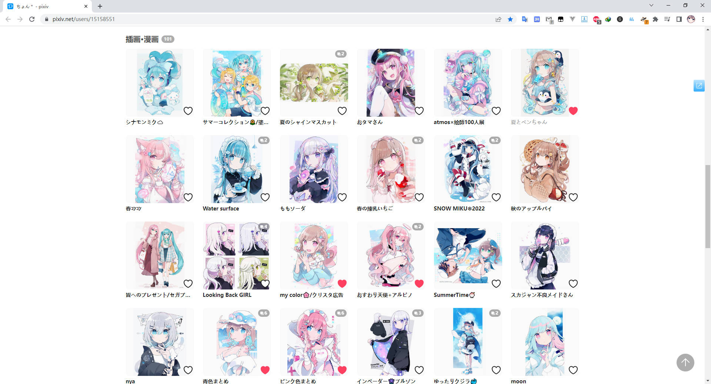

开启此设置之后，下载器会修改页面样式，并把缩略图替换为更大的图片。效果如下：

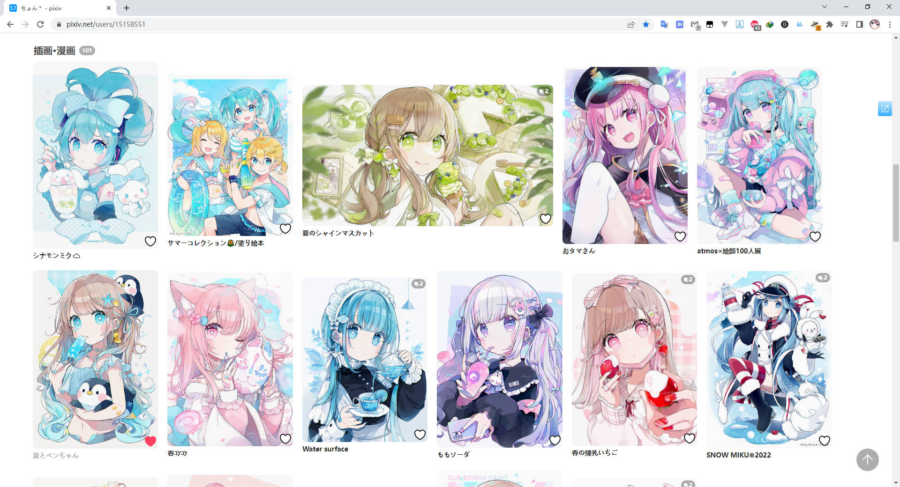

保持了一排显示 6 个缩略图，但是图片的尺寸更大，宽高最大为 540 px。

### 横图占用二倍宽度

使横图占据 2 倍宽度，这样在视觉上更为平衡一些。

上图第一排中间的图片就是横图，如果不让它显示的更宽，那么它看起来会比其他缩略图小。

**注意：** 必须开启“替换方形缩略图以显示图片比例”，这样“横图占用二倍宽度”才能生效。

## 替换方形缩略图以显示图片比例


pixiv 新版页面的缩略图都是正方形，不像旧版那样可以看到图片的全貌，也看不出来图片的比例（横图还是竖图）。例如：


启用这个设置之后，下载器会把方形缩略图替换为 540px 尺寸的缩略图，这样用户可以看到图片的全貌和原始比例。


## 预览作品


默认启用。

当鼠标停留在作品的缩略图上时，下载器会显示更大尺寸的预览图。

效果如下图：

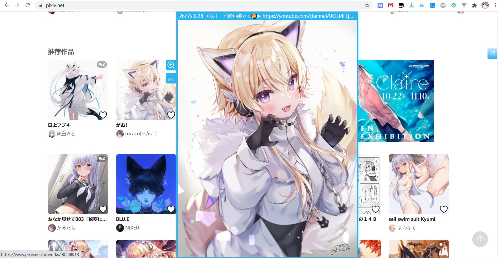

等待时间：设置鼠标在作品缩略图上停留指定时间后，才会显示预览图。

?>预览作品时，可以按快捷键 `D` 下载这个作品。

提示：
- 预览区域会自适应可用区域，不会超出屏幕外。
- 预览区域的顶部会显示作品的尺寸、标题、简介。
- 预览图默认加载“普通”（1200px）尺寸的图片。这对于大多数用户来说已经够用，而且加载速度快。
- 如果你的屏幕非常大，预览图显示完之后四周还有多余的空间，那么你可以选择“原图”。但是这会导致预览图的加载速度变慢。
- 当鼠标移出作品缩略图时，预览区域会自动隐藏。
- 在预览区域上点击鼠标左键，也可以使它隐藏。
- 你可以使用快捷键 Alt+P 来切换开启/关闭此功能。

### 使用鼠标滚轮切换多图作品里的图片 

如果一个作品有多张图片，在它的缩略图上滚动鼠标滚轮就可以切换显示所有图片。

此时滚动鼠标时，页面不会向下滚动，而是切换预览的图片。

### 等待时间  

设置当鼠标放到缩略图上之后，经过多长时间显示预览区域。

默认 300 ms。

### 显示摘要信息 

如果此设置启用，那么下载器会在预览区域顶部会显示一些文本信息。例如：

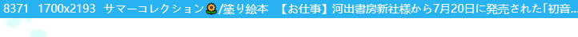

从左到右显示的分别是：

- 作品的收藏数量
- 作品里第一张图片的宽高
- 作品标题
- 作品简介

### 图片尺寸

```
图片尺寸  原图  普通
```

你可以选择预览作品时，在预览区域加载的图片的尺寸。

一般使用普通就可以了，这是宽高最大为 1200 px 的图片。

如果选择原图的话，因为原图一般体积比较大，所以图片加载会更慢。

### 按 D 进行下载

预览作品时（包括长按右键查看大图时），按快捷键 `D` 可以直接下载这个作品。

## 预览动图


默认启用。

这个选项控制着当你预览作品、以及右键查看的作品是一个动图时，是否显示动态效果。

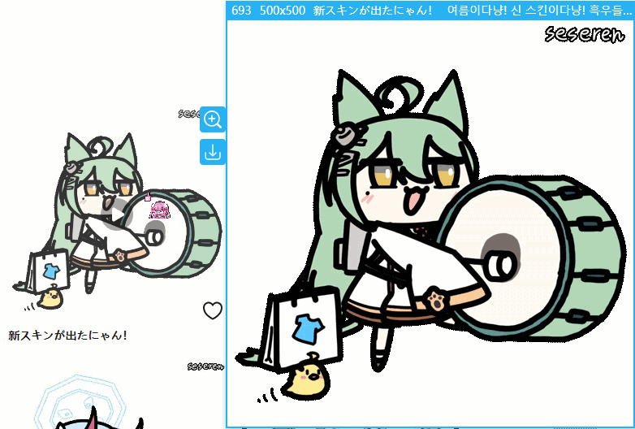

如果关闭它，那么只会显示静态图片。

如果启用它，则可以显示动态效果。

## 在缩略图上长按鼠标右键时查看大图

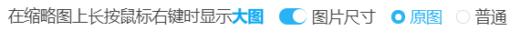

默认启用。

当用户在作品的缩略图上长按鼠标右键时，下载器会显示大图。

默认显示原图。默认以原始尺寸（1:1）显示图片。

你可以使用鼠标滚轮放大或者缩小图片，也可以移动鼠标查看图片被隐藏的区域。

### 图片尺寸

```
图片尺寸  原图  普通
```

你可以选择显示大图时，加载的图片的尺寸。默认为原图。

## 在作品缩略图上显示放大按钮

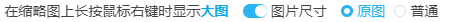

当你的鼠标经过 Pixiv 页面上的作品缩略图时，缩略图上面会显示一个放大镜图标。


点击放大镜图标可以打开图片查看器，查看这个作品里的每一张图片。

默认开启。图片查看器的效果如下：

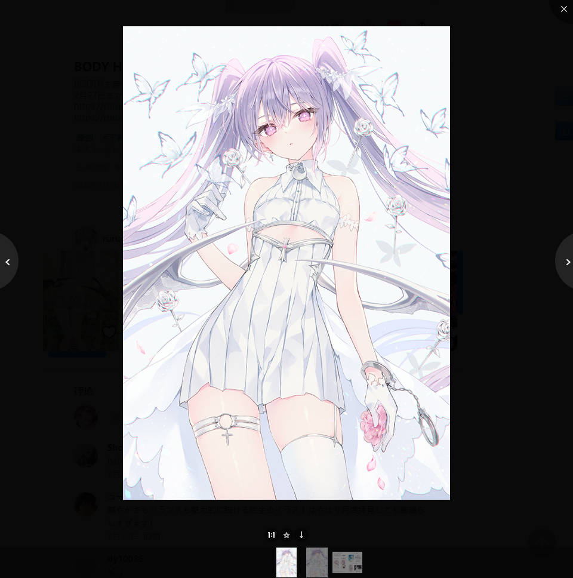

在查看图片时，你可以点击图片查看器下方的按钮，收藏或者下载这个作品。

### 位置

- 左：放大镜图标显示在缩略图的左上角。
- 右：放大镜图标显示在缩略图的右上角。

### 图片尺寸

- 原图：点击放大镜图标后，在图片查看器里加载原始尺寸的图片。
- 普通：点击放大镜图标后，在图片查看器里加载普通尺寸的图片（最大 1200px * 1200px）。

默认值是“原图”。

?>这个设置只影响在图片查看器里显示的图片的尺寸，不会影响下载按钮所下载的图片的尺寸。

## 在图片作品的缩略图上显示下载按钮


默认开启。

启用此设置后，当用户把鼠标放在图片缩略图上的时候，下载器会在缩略图上显示一个下载按钮。

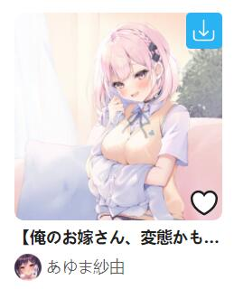

点击下载按钮就可以直接下载这个作品。这样可以提高下载效率。

## 在搜索页面添加快捷搜索区域


下载器会在搜索页的顶部添加一些快捷搜索的按钮，例如：

```
100users入り 500users入り 1000users入り 5000users入り 10000users入り 20000users入り 30000users入り 50000users入り  100000users入り
```
这个设置项控制是否显示这些按钮。默认开启。

启用之后的效果：


点击这些按钮，下载器就会在当前标签后面附加收藏数量的标签，一起搜索。

例如在搜索 `バーチャルYouTuber` 的页面点击 `10000users入り` 按钮，就会自动搜索 `バーチャルYouTuber 10000users入り`。

?>此功能对于非 Pixiv 高级会员（premium）用户比较有用。如果你是 Pixiv 高级会员，可以考虑关闭这个功能。

## 预览搜索页面的筛选结果


默认启用。

启用之后，当用户在图片搜索页面进行抓取时，下载器会把抓取到的作品显示在当前页面里，并且按照收藏数量从高到低排序。

示例：

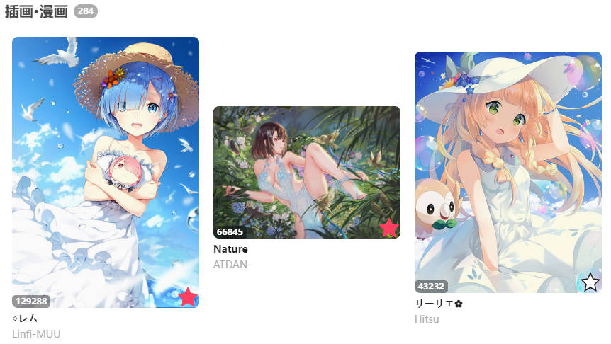

这是为了方便用户预览搜索结果，并且可以进行多次筛选，提供所见即所得的下载体验。

**提醒：**

1. 此设置只在图片搜索页面生效。
2. 当此设置启用时，“自动开始下载”设置不会生效。也就是不会自动开始下载。这是为了让用户在下载前有机会多次筛选结果，然后再下载。如果你不想筛选，而是想直接自动下载，可以考虑关闭这个设置。

### 上限

有时候下载器抓取到的作品的数量可能有很多（例如有数万个作品），如果把作品全部显示到页面上，那么页面占用的资源会比较多，可能会导致浏览器崩溃。

所以你可以设置“上限”来限制最多显示多少个作品。

默认最多显示 3000 个作品，你可以加大显示的数量，但是如果设置的过大，可能导致页面崩溃。

## 下载器的收藏按钮 (✩)

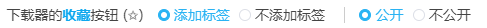

下载器在某些地方会添加五角星形状的收藏按钮 (✩)，点击按钮就可以收藏这个作品。


通过这个选项，你可以控制 ✩ 按钮以及下载器内部收藏作品时的行为。

**受此设置影响的地方：**

- 作品页面里的快速收藏（☆）按钮
- 搜索页面的快速收藏（☆）按钮
- 收藏本页面所有作品的功能
- 下载后收藏作品的功能

**不受此设置影响的地方：**

在收藏页面里的“给未分类的作品添加标签”按钮不受影响。因为这个功能必定会附带标签。并且会根据这个作品之前的收藏状态，自动设置公开或者不公开。

**注意：**

!>Pixiv 本身的收藏按钮（心形）不受此设置影响。

### 子选项

当下载器把作品添加到收藏时，你可以选择：

1. 是否添加作品的标签
2. 添加为公开或是非公开收藏
