# 设置-更多-增强

下载器有一些增强功能，用于改善 Pixiv 的使用体验。有些功能是默认启用的。

**注意：**在 Android 系统的浏览器里，有些增强功能是不会生效的，而且下载器也会隐藏这些功能。在这种情况下，你可能看不到某些设置，这是正常的。

## 高亮关注的用户

<p class="option" data-no="84" style="display: flex;">
    <span class="has_tip settingNameStyle1" data-xztip="_高亮关注的用户的说明" data-tip="你关注（Following）的用户的名字会具有黄色背景，或者显示为黄色。&lt;br&gt;这便于你确认自己是否关注了某个用户。">
    <span data-xztext="_高亮关注的用户"><span class="key">高亮</span>关注的用户</span>
    <span class="gray1"> ? </span>
    </span>
    <input type="checkbox" name="highlightFollowingUsers" class="need_beautify checkbox_switch" checked="">
    <span class="beautify_switch" tabindex="0"></span>
    </p>

你关注（Following）的用户的名字会被高亮显示，这可以让你一眼就看出是否关注了某个用户。

其视觉效果会根据 Pixiv 页面的颜色模式而有所不同。

在默认（浅色）模式时，用户名会具有黄色背景：


在夜间模式时，用户名会显示为黄色：


## 显示更大的缩略图

<p class="option" data-no="68" style="display: flex;">
    <span class="has_tip settingNameStyle1" data-xztip="_显示更大的缩略图的说明" data-tip="Pixiv 默认的缩略图比较小，下载器可以显示更大的缩略图以方便预览。&lt;br&gt;这个功能不太稳定，因为 Pixiv 的代码更新可能会导致此功能部分失效。">
    <span data-xztext="_显示更大的缩略图">显示<span class="key">更大</span>的缩略图</span>
    <span class="gray1"> ? </span>
    </span>
    <input type="checkbox" name="showLargerThumbnails" class="need_beautify checkbox_switch" checked="">
    <span class="beautify_switch" tabindex="0"></span>
    </p>

Pixiv 的作品缩略图比较小，大部分缩略图的尺寸都是 184 px。这是默认情况下的截图：


因为缩略图很小，看不清细节，所以我经常需要点进去查看大图才能知道自己喜不喜欢这张图片。

启用这个功能之后，下载器会加宽页面显示区域，并把缩略图的尺寸加大到 250 px。

如果启用了下面的“替换方形缩略图以显示图片比例”功能，缩略图的尺寸会增大到 540px，效果如下：


这样就能看得更清楚了，并且眼睛也会更轻松，不容易累。

?>根据屏幕分辨率和 DPI 缩放不同，一排显示的图片数量也会有所不同。

## 替换方形缩略图以显示图片比例

<p class="option" data-no="63" style="display: flex;">
    <span class="has_tip settingNameStyle1" data-xztip="_替换方形缩略图以显示图片比例的说明" data-tip="Pixiv 的缩略图是正方形的，不能看到图片的全貌，也看不出是横图还是竖图。&lt;br&gt;下载器可以显示完整的缩略图，以显示图片比例。">
    <span data-xztext="_替换方形缩略图以显示图片比例">替换方形<span class="key">缩略图</span>以显示图片比例</span>
    <span class="gray1"> ? </span>
    </span>
    <input type="checkbox" name="replaceSquareThumb" class="need_beautify checkbox_switch" checked="">
    <span class="beautify_switch" tabindex="0"></span>
    </p>

pixiv 的缩略图是 250 px 的正方形图片，看不出来图片的比例（横图还是竖图），而且还会裁剪掉边缘区域。例如：


启用这个功能之后，下载器会把方形缩略图替换为 540 px 的缩略图，这样用户可以看到图片的原始比例和全貌。例如：


## 预览作品

<p class="option" data-no="55" style="display: flex;">
    <span class="has_tip settingNameStyle1" data-xztip="_预览作品的说明" data-tip="当鼠标放在图片的缩略图上时，下载器可以显示更大的图片。">
    <span data-xztext="_预览作品"><span class="key">预览</span>作品</span>
    <span class="gray1"> ? </span>
    </span>
    <input type="checkbox" name="PreviewWork" class="need_beautify checkbox_switch" checked="">
    <span class="beautify_switch" tabindex="0"></span>
    <span class="subOptionWrap" data-show="PreviewWork" style="display: inline-flex;">
    <label for="wheelScrollSwitchImageOnPreviewWork" class="has_tip active" data-xztext="_使用鼠标滚轮切换作品里的图片" data-xztip="_这可能会阻止页面滚动" data-tip="这可能会阻止页面滚动">使用鼠标滚轮切换多图作品里的图片</label>
    <input type="checkbox" name="wheelScrollSwitchImageOnPreviewWork" id="wheelScrollSwitchImageOnPreviewWork" class="need_beautify checkbox_switch" checked="">
    <span class="beautify_switch" tabindex="0"></span>
    <span class="verticalSplit"></span>
    <label for="swicthImageByKeyboard" class="has_tip active" data-xztext="_使用方向键和空格键切换图片" data-xztip="_使用方向键和空格键切换图片的提示" data-tip="← ↑ 上一张图片&lt;br&gt;→ ↓ 下一张图片&lt;br&gt;空格键 下一张图片">使用方向键和空格键切换图片</label>
    <input type="checkbox" name="swicthImageByKeyboard" id="swicthImageByKeyboard" class="need_beautify checkbox_switch" checked="">
    <span class="beautify_switch" tabindex="0"></span>
    <span class="verticalSplit"></span>
    <span data-xztext="_等待时间">等待时间</span>&nbsp;
    <input type="text" name="previewWorkWait" class="setinput_style1 blue" value="400" style="width:40px;min-width: 40px;">
    <span>&nbsp;ms</span>
    <span class="verticalSplit"></span>
    <label for="showPreviewWorkTip" data-xztext="_显示摘要信息" class="active">显示摘要信息</label>
    <input type="checkbox" name="showPreviewWorkTip" id="showPreviewWorkTip" class="need_beautify checkbox_switch" checked="">
    <span class="beautify_switch" tabindex="0"></span>
    <span class="verticalSplit"></span>
    <span class="settingNameStyle1" data-xztext="_图片尺寸2">图片尺寸</span>
    <input type="radio" name="prevWorkSize" id="prevWorkSize1" class="need_beautify radio" value="original">
    <span class="beautify_radio" tabindex="0"></span>
    <label for="prevWorkSize1" data-xztext="_原图">原图</label>
    <input type="radio" name="prevWorkSize" id="prevWorkSize2" class="need_beautify radio" value="regular" checked="">
    <span class="beautify_radio" tabindex="0"></span>
    <label for="prevWorkSize2" data-xztext="_普通" class="active">普通</label>
    <span class="verticalSplit"></span>
    <button type="button" class="gray1 textButton showPreviewWorkTip" data-xztext="_快捷键列表">快捷键列表</button>
    </span>
    </p>

当鼠标光标停留在作品的缩略图上时，下载器会显示更大尺寸的预览图。

效果如图所示：

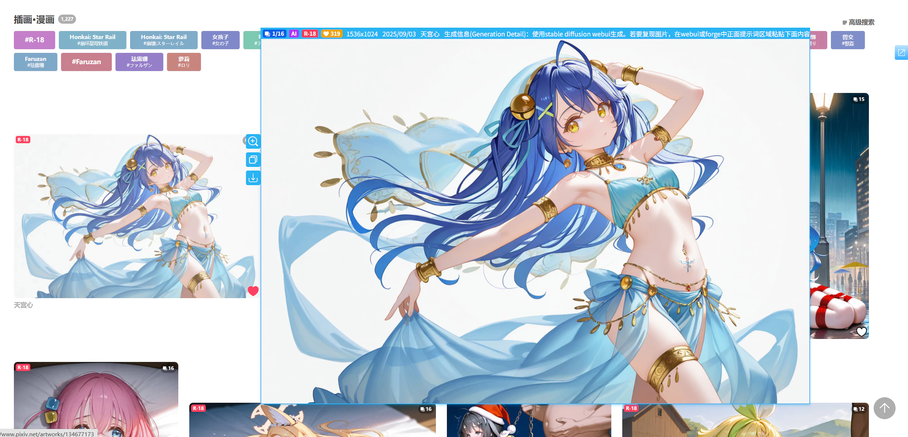
<!-- https://www.pixiv.net/artworks/134677173 -->

?>预览图会自适应可用区域，不会超出屏幕。

要**关闭预览图**的话，可以使用这些方法之一：
- 将鼠标光标移出缩略图区域
- 点击预览图
- 按下 `Esc` 键

### 快捷键列表

使用快捷键 `Alt` + `P` 可以关闭/启用预览作品的功能。

当你查看预览图时，可以使用如下快捷键：
- `B`ookmark 收藏预览的作品
- `C`urrent 下载当前预览的图片（如果这个作品里有多张图片，只会下载当前显示的这一张）
- `D`ownload 下载当前预览的作品（如果这个作品里有多张图片，会全部下载）
- `Alt` + `C` 复制当前预览的图片和作品信息
- `Esc` 关闭预览图
- `←` `↑` 上一张图片
- `→` `↓` 下一张图片
- `Space` 下一张图片

### 使用鼠标滚轮切换多图作品里的图片 

该功能默认启用。

预览作品时，如果这个作品**含有多张图片**，你可以滚动鼠标滚轮来切换显示的图片。

- 鼠标向下滚动会显示下一张图片
- 鼠标向上滚动会显示上一张图片。

?> 如果鼠标滚动时需要切换图片，下载器会阻止页面滚动。因为页面滚动的话会导致鼠标离开作品缩略图区域，从而导致预览区域消失。

### 使用方向键和空格键切换图片

该功能默认启用。

它会使这些快捷键生效：

- `←` `↑` 上一张图片
- `→` `↓` 下一张图片
- `Space` 下一张图片

当下载器显示了预览区域，并且启用了此功能时，下载器会阻止这些按键的默认行为，所以它们不会使页面滚动。

如果你希望这些按键始终可以使页面滚动，可以关闭此功能。

### 等待时间  

当鼠标进入作品缩略图区域之后，如果在一定时间内没有移出缩略图区域，下载器就会准备显示预览图。

默认的等待时间是 `400` 毫秒，你可以根据需要修改。

### 显示摘要信息 

该功能默认启用。

下载器可以在预览图顶部会显示一些信息。以下图为例：

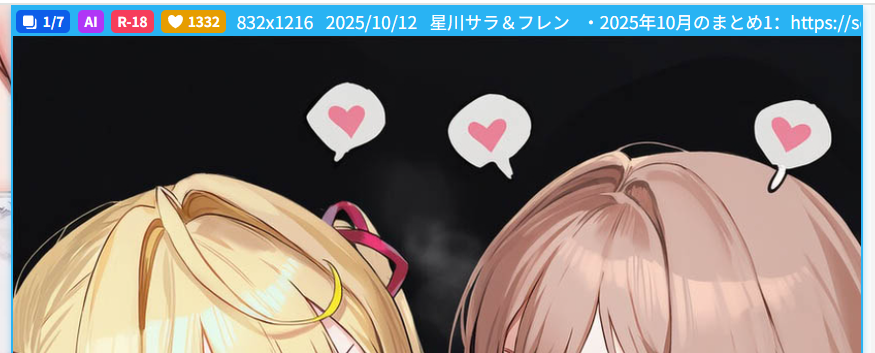

从左到右显示的信息依次是：

- 当前查看的图片编号和图片总数量，如 `1/7`。只有当作品里有多张图片时，才会显示此信息。
- `AI` 标记。只有当作品是由 AI 生成的时候，才会显示这个标记。
- `R-18` 或 `R-18G` 标记。全年龄的作品不会显示这个标记。
- 作品的收藏数量。
- 图片的宽高（总是显示第一张图片的宽高）
- 作品的发布日期
- 作品的标题
- 作品的简介（如果有）

### 图片尺寸

你可以选择查看预览作品时，下载器加载哪种图片尺寸。

- `原图`：让下载器加载图片的原图。有些原图的体积可能比较大，所以加载速度会比较慢。
- `普通`：默认值，加载普通尺寸的图片。它的体积比较小，所以加载速度很快。

?> 这个选项只会影响预览时的图片尺寸，不会影响下载时的图片尺寸。

**不同尺寸的区别：**

- 如果原图的宽高大于 1200 px，那么普通尺寸的图片会是 1200 px。
- 如果原图的尺寸小于 1200 px，那么普通图片的尺寸会与之相同。例如原图是 500 x 500 px，那么缩略图的尺寸也是 500 x 500 px。

**显示区域的区别：**

当你选择“原图”时，如果它的尺寸大于 1200 px，并且其周围有足够的可用区域，那么下载器会显示更大的预览图。

下面是一个示例。这个作品的普通图片的宽度是 1200 px：


它的原图的宽度是 4093 px，所以显示区域更大：


?> 虽然原图有时可以显示的更大，并不总是如此。这是因为有时候缩略图周围的可用区域不够大，普通图片就差不多可以占满了，此时原图并不会显示的更大。

## 预览动图

<p class="option" data-no="71" style="display: flex;">
    <span class="settingNameStyle1" data-xztext="_预览动图"><span class="key">预览</span>动图</span>
    <input type="checkbox" name="previewUgoira" class="need_beautify checkbox_switch" checked="">
    <span class="beautify_switch" tabindex="0"></span>
    </p>

当你把鼠标光标停留在动图的缩略图上时，下载器会显示动图的预览图，并且具有动画效果。例如：


如果关闭此功能，那么下载器不会显示动图的预览图（连静态图片也不会显示）。

?> 该功能不依赖“预览作品”功能。即使关闭“预览作品”功能，也依然可以预览动图。

## 在缩略图上长按鼠标右键时查看大图

<p class="option" data-no="62" style="display: flex;">
    <span class="settingNameStyle1" data-xztext="_长按右键显示大图">在缩略图上长按鼠标右键时显示<span class="key">大图</span></span>
    <input type="checkbox" name="showOriginImage" class="need_beautify checkbox_switch" checked="">
    <span class="beautify_switch" tabindex="0"></span>
    <span class="subOptionWrap" data-show="showOriginImage" style="display: inline-flex;">
    <span class="settingNameStyle1" data-xztext="_图片尺寸2">图片尺寸</span>
    <input type="radio" name="showOriginImageSize" id="showOriginImageSize1" class="need_beautify radio" value="original">
    <span class="beautify_radio" tabindex="0"></span>
    <label for="showOriginImageSize1" data-xztext="_原图" class="active">原图</label>
    <input type="radio" name="showOriginImageSize" id="showOriginImageSize2" class="need_beautify radio" value="regular" checked="">
    <span class="beautify_radio" tabindex="0"></span>
    <label for="showOriginImageSize2" data-xztext="_普通">普通</label>
    </span></p>

当用户预览作品时，如果在缩略图上长按鼠标右键，下载器就会显示大图。

下载器默认会加载原图，并以原始尺寸（1:1）显示。如果原图的尺寸比较大，它可能会超出屏幕（这不是 BUG）。

例如在查看这个作品的原图时，它只显示了上半部分：


**提示：**

- 如果图片有超出屏幕的部分，你可以通过移动鼠标光标来查看全图。
- 你可以使用鼠标滚轮来缩放图片。
- 当你预览多图作品时，预览图显示的是哪张图片（如 `3/10`），此功能也会显示那张图片。

如果你想**关闭大图**，可以使用下面的方法之一：
- 点击鼠标左键。
- 按下 `Esc` 键。

?> 目前该功能依赖于“预览作品”功能。如果你关闭了“预览作品”功能，那么这个功能不会生效。以后我也许会使其不再依赖“预览作品”功能。

### 快捷键列表

当下载器显示大图时，你可以使用如下快捷键：
- `C`urrent 下载当前显示的这张图片
- `D`ownload 下载这张图片所属的作品（如果这个作品里有多张图片，会全部下载）
- `Alt` + `C` 复制当前预览的图片和作品信息

### 图片尺寸

你可以决定当下载器显示大图时，加载原图还是普通图片。默认是原图。

普通图片的宽高最大是 1200 px，原图的尺寸可能比它更大，所以 1:1 显示时也可能会更大。

## 在作品缩略图上显示放大按钮

<p class="option" data-no="40" style="display: flex;">
    <span class="settingNameStyle1" data-xztext="_在作品缩略图上显示放大按钮">在作品缩略图上显示<span class="key">放大</span>按钮</span>
    <input type="checkbox" name="magnifier" class="need_beautify checkbox_switch" checked>
    <span class="beautify_switch" tabindex="0"></span>
    <span class="subOptionWrap" data-show="magnifier" style="display: inline-flex;">
    <span class="settingNameStyle1" data-xztext="_位置">位置</span>
    <input type="radio" name="magnifierPosition" id="magnifierPosition1" class="need_beautify radio" value="left">
    <span class="beautify_radio" tabindex="0"></span>
    <label for="magnifierPosition1" data-xztext="_左">左</label>
    <input type="radio" name="magnifierPosition" id="magnifierPosition2" class="need_beautify radio" value="right" checked="">
    <span class="beautify_radio" tabindex="0"></span>
    <label for="magnifierPosition2" data-xztext="_右" class="active">右</label>
    <span class="verticalSplit"></span>
    <span class="settingNameStyle1" data-xztext="_图片尺寸2">图片尺寸</span>
    <input type="radio" name="magnifierSize" id="magnifierSize1" class="need_beautify radio" value="original">
    <span class="beautify_radio" tabindex="0"></span>
    <label for="magnifierSize1" data-xztext="_原图" class="active">原图</label>
    <input type="radio" name="magnifierSize" id="magnifierSize2" class="need_beautify radio" value="regular" checked="">
    <span class="beautify_radio" tabindex="0"></span>
    <label for="magnifierSize2" data-xztext="_普通">普通</label>
    </span>
    </p>

当鼠标经过作品缩略图时，下载器会在缩略图上显示一个放大镜图标，如下图所示：


点击放大镜图标可以打开图片查看器，查看这个作品里的每一张图片。效果如下图所示：

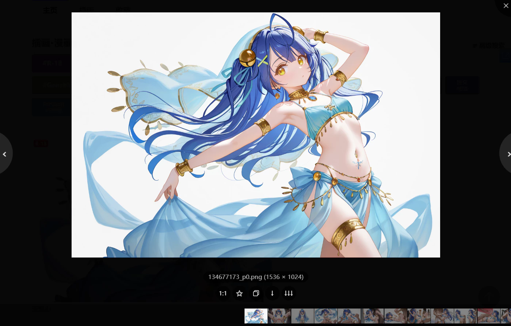

你可以在这里查看图片查看器的详细说明：[图片查看器](/zh-cn/便捷功能?id=图片查看器)。

这个功能有两个子选项：

### 位置

- `左`：使放大镜图标显示在缩略图的左上角。
- `右`：使放大镜图标显示在缩略图的右上角。

### 图片尺寸

- `原图`：点击放大镜图标后，在图片查看器里加载原始尺寸的图片。
- `普通`：点击放大镜图标后，在图片查看器里加载普通尺寸的图片（最大尺寸为 1200 px）。

默认是原图。

?>这个设置只会影响图片查看器里**显示**的图片的尺寸。当你点击图片查看器底部的下载按钮时，下载的图片尺寸遵从“设置-更多-下载”里的 [图片尺寸](/zh-cn/设置-更多-下载?id=图片尺寸) 设置。默认是“原图”。

## 在作品缩略图上显示下载按钮

<p class="option" data-no="56" style="display: flex;">
    <span class="settingNameStyle1" data-xztext="_在作品缩略图上显示下载按钮">在作品缩略图上显示<span class="key">下载</span>按钮</span>
    <input type="checkbox" name="showDownloadBtnOnThumb" class="need_beautify checkbox_switch" checked="">
    <span class="beautify_switch" tabindex="0"></span>
    </p>

当鼠标经过作品缩略图时，下载器会在缩略图上显示一个下载按钮，点击下载按钮就可以下载这个作品。这个功能使下载作品变得更加便捷了。

### 对于图像作品

如下图所示：


?> 下载的图片尺寸遵从“设置-更多-下载”里的 [图片尺寸](/zh-cn/设置-更多-下载?id=图片尺寸) 设置。默认是“原图”。

?> 这个下载按钮的位置是与“在作品缩略图上显示放大按钮”保持一致的。而且这两个按钮可以同时显示。

### 对于小说作品

从 18.3.0 版本开始，小说作品的右上角也会显示下载按钮，例如：


点击它就可以下载这篇小说。此外，如果这个区域里只有小说系列的链接（没有单篇小说的链接），那么下载器会下载这个系列小说。

---------

下面是三种小说缩略图的截图示例：

1. 单篇完结小说：


2. 同时含有单篇小说和其系列：


3. 只有系列链接：


下载器会优先下载单篇小说，所以前两种情况都会下载单篇小说，第 3 种情况才会下载这个系列（此时下载器会自动合并这个系列小说）。

如果你想在第 2 种情况（同时含有单篇小说和其系列）时下载系列小说，可以启用 更多 - 下载 里的 [自动合并系列小说](/zh-cn/设置-更多-下载?id=自动合并系列小说) 功能。

## 复制按钮

<p class="option" data-no="14" style="display: flex;">
  <a href="https://xuejianxianzun.github.io/PBDWiki/#/zh-cn/设置-更多-增强?flag=14" target="_blank" class="has_tip settingNameStyle" data-xztip="_显示复制按钮的提示" data-tip="下载器会在作品缩略图上和作品页面内显示一个复制按钮，点击它就可以复制作品的图片和一些数据。
&lt;br&gt;
你可以自定义要复制的数据和格式。
&lt;br&gt;
在作品页面里，以及预览作品时，你可以按快捷键 &lt;span class=&quot;blue&quot;&gt;Alt + C&lt;/span&gt; 进行复制。">
    <span data-xztext="_复制按钮"><span class="key">复制</span>按钮</span>
    <span class="gray1"> ? </span>
  </a>
  <label for="showCopyBtnOnThumb" data-xztext="_在缩略图上显示" class="active">在缩略图上显示</label>
  <input type="checkbox" name="showCopyBtnOnThumb" id="showCopyBtnOnThumb" class="need_beautify checkbox_switch" checked>
  <span class="beautify_switch" tabindex="0"></span>
  <span class="verticalSplit"></span>
  <span data-xztext="_复制内容">复制内容</span>:&nbsp;
  <input type="checkbox" name="copyFormatImage" id="setCopyFormatImage" class="need_beautify checkbox_common">
  <span class="beautify_checkbox" tabindex="0"></span>
  <label for="setCopyFormatImage">image/png</label>
  <input type="checkbox" name="copyFormatText" id="setCopyFormatText" class="need_beautify checkbox_common" checked>
  <span class="beautify_checkbox" tabindex="0"></span>
  <label for="setCopyFormatText" class="active">text/plain</label>
  <input type="checkbox" name="copyFormatHtml" id="setCopyFormatHtml" class="need_beautify checkbox_common" checked>
  <span class="beautify_checkbox" tabindex="0"></span>
  <label for="setCopyFormatHtml" class="active">text/html</label>
  <span class="verticalSplit"></span>
  <span class="settingNameStyle" data-xztext="_图片尺寸2">图片尺寸</span>
  <input type="radio" name="copyImageSize" id="copyImageSize1" class="need_beautify radio" value="original">
  <span class="beautify_radio" tabindex="0"></span>
  <label for="copyImageSize1" data-xztext="_原图">原图</label>
  <input type="radio" name="copyImageSize" id="copyImageSize2" class="need_beautify radio" value="regular" checked="">
  <span class="beautify_radio" tabindex="0"></span>
  <label for="copyImageSize2" data-xztext="_普通">普通</label>
  <span class="verticalSplit"></span>
  <span data-xztext="_文本格式">文本格式</span>:&nbsp;
  <input type="text" name="copyWorkInfoFormat" class="setinput_style1 blue" style="width:100%;max-width:350px;" value="id: {id}{n}title: {title}{n}tags: {tags}{n}url: {url}{n}user: {user}">
</p>

下载器会在作品缩略图上和作品页面内显示一个复制按钮，点击就可以复制作品的图片和一些数据。你可以粘贴到其他软件里保存，也可以分享给其他人。例如：


### 可以使用的场景

总体来说，有两种方式：
- 在有些场景里，下载器会显示复制按钮，点击它就可以进行复制。
- 有些场景里没有复制按钮，需要使用快捷键 `Alt` + `C`。

下面是详细说明：

#### 缩略图上的复制按钮


点击复制按钮即可复制。

此时下载器只会复制作品的第一张图片。

#### 作品页面里，图片下方的复制按钮

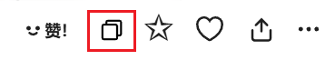

点击复制按钮即可复制。

此时下载器只会复制作品的第一张图片。

?>在作品页面里，可以按快捷键 `Alt` + `C` 来使用复制功能。

#### 预览作品的详细信息时

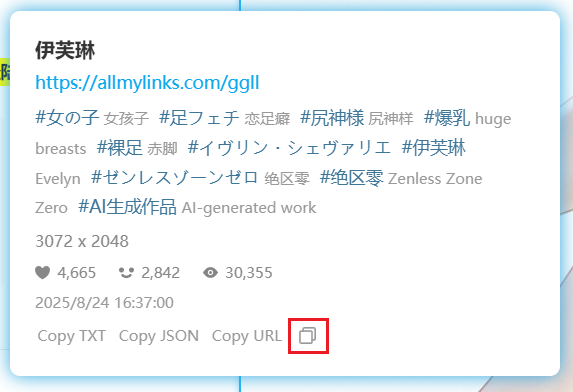

点击复制按钮即可复制。

此时下载器只会复制作品的第一张图片。

-----------

在下面的几种使用场景里，下载器都会复制当前查看的那张图片，而非固定为第一张。

#### 作品页面里，缩略图列表上的复制按钮


下载器会在多图作品页面里添加缩略图列表。点击复制按钮即可复制。

下载器会复制这张缩略图对应的图片，而非固定为第一张。

#### 预览作品时

按快捷键 `Alt` + `C` 即可复制当前查看的图片。

#### 在作品的缩略图上长按鼠标右键查看大图时

按快捷键 `Alt` + `C` 即可复制当前查看的图片。

#### 在图片查看器里

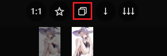

点击复制按钮，或者使用快捷键 `Alt` + `C` 即可复制当前查看的图片。

### 复制内容

你可以根据自己的需要选择复制的内容。

**每种格式的说明：**
- `image/png` 复制作品的图片。默认未选择，因为它在某些社交软件里的优先级太高，会导致 `text/html` 格式的内容被忽略。
你可以选择复制原图还是缩略图。
- `text/plain` 复制作品的文字信息。几乎所有应用程序都支持粘贴纯文本内容。
- `text/html` 同时复制作品的图片和文字信息。这是富文本格式，同时包含了上面两种内容。在 html 格式的文字内容里，下载器会为作品 ID、URL、作者名字添加超链接，但在粘贴时很多软件会移除超链接，只保留文字，所以粘贴后可能没有超链接。

**提示：**
- 这个功能在设计时的重点是同时复制图片和文字内容（`text/html`），以便于分享或存档，但实际效果取决于目标应用。有些应用可能不支持此格式，或者无法正确显示图片。
- 你可以同时选择多种格式，也就是同时复制多种内容。但是当你在应用程序里粘贴时，应用程序只会使用其中一种内容，也就是优先级最高的格式。其他格式的内容会被忽略。
- 在不同的应用程序里，优先级可能会不同。这与下载器无关。
- 例如：如果你同时复制了 `image/png` 和 `text/html` 内容，某些应用程序会使用前者，但某些应用程序可能会使用后者。如果粘贴的内容不符合你的预期，你可以取消选择其中一种格式。

### 图片尺寸

你可以选择复制的图片的尺寸：
- `原图`：下载器会复制图片的原图。
- `普通`：默认值，下载器会复制图片的缩略图（最大尺寸为 1200px）。

**复制图片时的行为：**

- 下载器默认会复制缩略图，而非原图。如果你想复制原图的话，需要修改“图片尺寸”选项为 `原图`。但是需要注意极端情况：有些图片的原图可能很大（例如超过 30 MiB），在某些应用程序里可能无法粘贴。
- 对于插画、漫画作品，下载器会根据使用场景复制它的第一张图片，或者你查看的那张图片。
- 对于动图作品，下载器总是会复制它的静态缩略图。
- 对于小说作品，下载器总是会复制它的封面图。

### 文本格式

你可以设置下载器复制文字内容时的格式，这会影响 `text/plain` 和 `text/html` 生成的内容。

你可以使用命名规则里的所有标签，也可以输入自定义字符，例如空格、下划线、每个标签的名称。

另外，你还可以使用这些标签：

- `{url}` 这个作品的网址
- `{n}` 换行

-----------

默认的文本格式规则是 `id: {id}{n}title: {title}{n}tags: {tags}{n}url: {url}{n}user: {user}`，生成的文字内容示例如下：

id: [https://www.pixiv.net/i/134304155](134304155)

title: 黑塔

tags: #女の子,#崩壊スターレイル,#尻神様,#おっぱい,#裸足,#ヘルタ,#黑塔,#網タイツ,#AI生成作品,#崩坏星穹铁道

url: [https://www.pixiv.net/i/134304155](https://www.pixiv.net/i/134304155)

user: [光怪陆离](https://www.pixiv.net/users/95485582)

### 一些截图

我测试了粘贴的效果，PC 上的很多软件表现良好，但是在 Android 应用程序里效果不佳，所以我只建议你在 PC 上使用这个功能。

#### 浏览器

网页上的输入区域默认只能粘贴纯文本内容，也就是 `text/plain`。

某些网页应用程序可能有针对性优化，例如在 Discord 里你可以粘贴图片 `image/png`。

在 Gmail 里你可以同时粘贴图片和文字，也就是 `text/html`，例如：

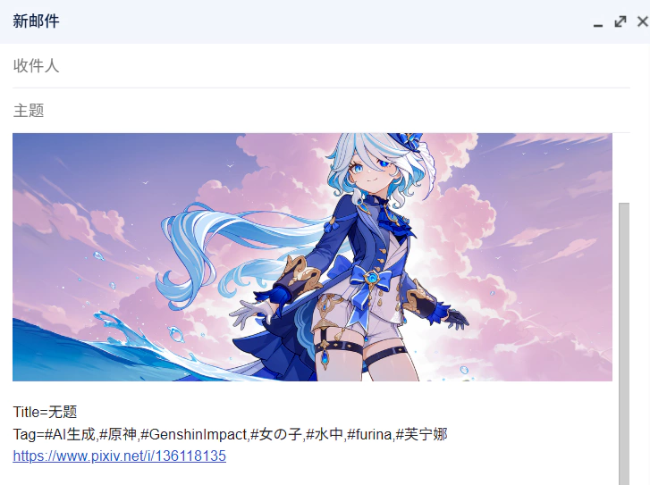

#### Microsoft Word

Word 会优先采用 `text/html` 格式的内容，其次是 `image/png`，最后是 `text/plain`。例如：

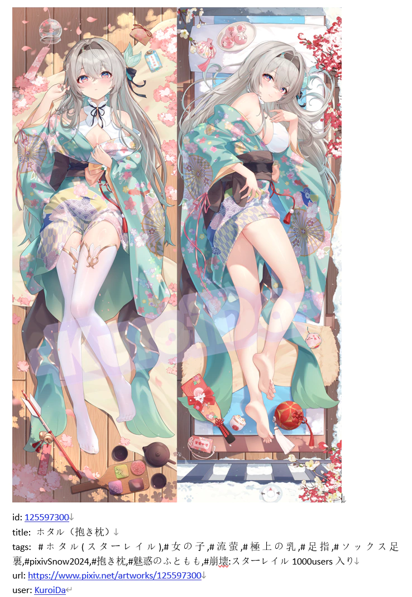

#### Telegram

Telegram 不支持 `text/html` 格式，所以你无法在 Telegram 里同时粘贴图片和文字。

其他格式的优先级是：`image/png`、`text/plain`。

如果你想在 Telegram 里粘贴图片，需要选择 `image/png` 格式，这样就可以在 Telegram 里粘贴图片了：

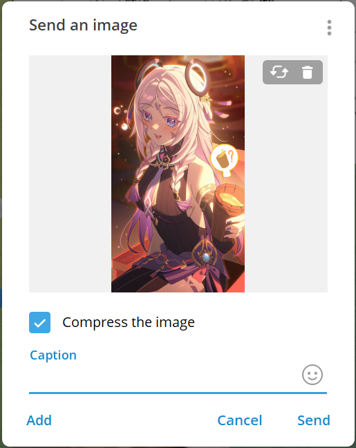

#### QQ

QQ 的优先级是：`image/png`、`text/html`、`text/plain`。

如果你想在 QQ 里同时粘贴图片和文字，应该选择 `text/html`，并且取消勾选 `image/png`，否则它们只会粘贴图片。


#### 微信

微信的优先级和 QQ 相同。你可以同时粘贴图片和文字，不过微信在发送时会把它们拆分开。例如：

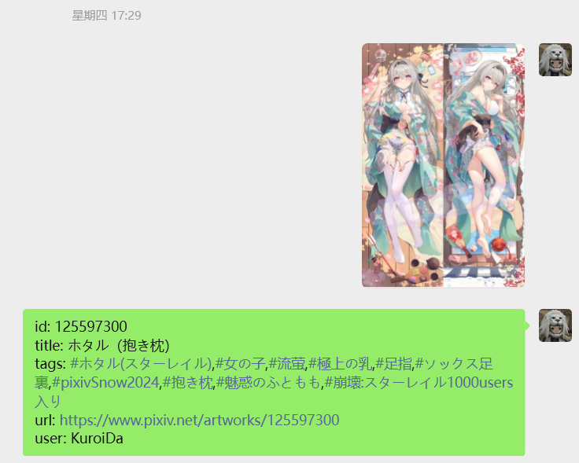

#### Android 应用

Android 上的某些应用虽然可以粘贴 `text/html` 内容，但图片可能无法显示：


如果你想发送图片，需要选择 `image/png` 格式，并且取消选择其他格式。这样下载器只会复制图片，可以在一些应用里粘贴。

一些 Android 应用程序可以粘贴下载器复制的图片，例如 Telegram 和微信。但是在某些应用程序里无法粘贴图片，例如 QQ。

## 在多图作品页面里显示缩略图列表

<p class="option" data-no="86" style="display: flex;">
    <span class="has_tip settingNameStyle1" data-xztip="_在多图作品页面里显示缩略图列表的说明" data-tip="在多图作品页面里（/artworks/)，下载器可以显示每一张图片的预览图。">
    <span data-xztext="_在多图作品页面里显示缩略图列表">在多图作品页面里显示<span class="key">缩略图</span>列表</span>
    <span class="gray1"> ? </span>
    </span>
    <input type="checkbox" name="displayThumbnailListOnMultiImageWorkPage" class="need_beautify checkbox_switch" checked="">
    <span class="beautify_switch" tabindex="0"></span>
    </p>

当你位于**多图作品**页面里时（例如 [121525173](https://www.pixiv.net/artworks/121525173)），下载器可以显示每一张图片的缩略图。例如：


你可以预览、下载每张图片。

当你把鼠标放在缩略图上时，可以使用一些增强功能，例如：


这些功能包括：
- 预览作品（此时你依然可以使用快捷键 `C` 下载单张图片，使用 `D` 下载这个作品）
- 长按鼠标右键时查看大图
- 在作品缩略图上显示下载按钮（此时点击这个按钮只会下载它所在的这一张图片）
- 点击缩略图会打开图片查看器，例如：


## 预览作品的详细信息

<p class="option" data-no="87" style="display: flex;">
    <span class="has_tip settingNameStyle1" data-xztip="_预览作品的详细信息的说明" data-tip="鼠标放在作品缩略图上即可查看作品数据">
    <span data-xztext="_预览作品的详细信息">预览作品的<span class="key">详细</span>信息</span>
    <span class="gray1"> ? </span>
    </span>
    <input type="checkbox" name="PreviewWorkDetailInfo" class="need_beautify checkbox_switch">
    <span class="beautify_switch" tabindex="0"></span>
    <span class="subOptionWrap" data-show="PreviewWorkDetailInfo" style="display: none;">
    <span data-xztext="_显示区域宽度">显示区域宽度</span>&nbsp;
    <input type="text" name="PreviewDetailInfoWidth" class="setinput_style1 blue" value="400" style="width:40px;min-width: 40px;">
    <span>&nbsp;px</span>
    </span>
    </p>

原本我们只能在作品页面里查看详细信息，例如作品的简介、标签列表、浏览数量、点赞数量、收藏数量等。

如果你想不进入作品页面就能查看详细信息，可以启用这个功能。当你把鼠标放在缩略图上时，下载器会显示详细信息，例如：

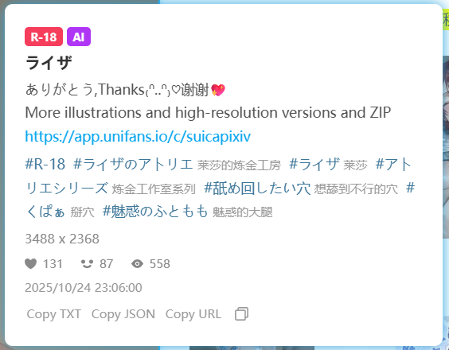

这个面板上的链接是可以点击的，比如简介里的网址、标签的链接。

如果你想关闭详细信息面板，可以点击它，或者将鼠标移出其边界。

**底部按钮：**

面板的底部有一些按钮：

- `Copy TXT` 点击它，下载器会把一些元数据复制到剪贴板，内容与 [保存作品的元数据](/zh-cn/设置-更多-下载?id=保存作品的元数据) 功能生成的 TXT 文件相同。
- `Copy JSON` 点击它，下载器会复制作品的 JSON 数据（未经处理的原始数据）。
- `Copy URL` 点击它，下载器会复制作品的网址。
- `复制按钮` 点击它，下载器会复制作品的第一张图片和文字摘要。

?> 这个功能依赖 [预览作品](/zh-cn/设置-更多-增强?id=预览作品) 功能。如果你关闭了“预览作品”功能，那么这个功能也不会生效。这主要是为了简化代码，以及避免在没有缓存时多次请求作品数据。

## 在搜索页面添加快捷搜索区域

<p class="option" data-no="48" style="display: flex;">
    <span class="has_tip settingNameStyle1" data-xztip="_在搜索页面添加快捷搜索区域的说明" data-tip="在搜索页面（/tags/）的顶部，下载器可以显示一些收藏数量标签，例如“10000users入り”，点击就可以把它添加到搜索的标签的后面。">
    <span data-xztext="_在搜索页面添加快捷搜索区域">在搜索页面添加快捷<span class="key">搜索</span>区域</span>
    <span class="gray1"> ? </span>
    </span>
    <input type="checkbox" name="showFastSearchArea" class="need_beautify checkbox_switch" checked="">
    <span class="beautify_switch" tabindex="0"></span>
    </p>

下载器会在搜索页面的顶部添加一些特定收藏数量的按钮，例如：


点击这些按钮时，下载器会在当前标签后面添加这个收藏数量的标签，并进行搜索。

例如在 `バーチャルYouTuber` 的页面里点击 `10000users入り` 按钮，下载器会自动搜索 `バーチャルYouTuber 10000users入り`。

?>这个功能对于非 Pixiv 高级会员（premium）的用户比较有用。

?> 这个功能不能保证准确。有些用户会在投稿时为作品添加 `10000users入り` 标签（实际上他的作品收藏数量很低），这是欺诈行为。

下载器添加的收藏数量按钮如下：

```
100users入り 500users入り 1000users入り 5000users入り 10000users入り 20000users入り 30000users入り 50000users入り  100000users入り
```

## 在搜索页面里移除已关注用户的作品

<p class="option" data-no="88" style="display: flex;">
    <span class="has_tip settingNameStyle1" data-xztip="_在搜索页面里移除已关注用户的作品的说明" data-tip="这样只会显示未关注用户的作品，便于你发现新的喜欢的用户。&lt;br&gt;只在搜索页面（/tags/）里生效。">
    <span data-xztext="_在搜索页面里移除已关注用户的作品">在搜索页面里<span class="key">移除</span>已关注用户的作品</span>
    <span class="gray1"> ? </span>
    </span>
    <input type="checkbox" name="removeWorksOfFollowedUsersOnSearchPage" class="need_beautify checkbox_switch">
    <span class="beautify_switch" tabindex="0"></span>
    </p>

如果你启用了这个功能，那么当你处于搜索页面时，下载器会移除已关注的用户的作品。

当你想要发掘感兴趣的用户时，此功能可以让你只看到未关注的用户的作品，降低干扰，提高效率。

?> 这个功能不会影响抓取结果。即使你移除了已关注的用户的作品，下载器也依然会抓取它们。

## 预览搜索页面的筛选结果

<p class="option" data-no="18" style="display: flex;">
    <span class="has_tip settingNameStyle1" data-xztip="_预览搜索结果说明" data-tip="在搜索页面（/tags/）里抓取时，下载器可以把抓取到的作品显示在当前页面上，并且按照收藏数量从高到低排序。&lt;br&gt;
    启用预览功能时，下载器不会自动开始下载，这是为了让用户可以对抓取结果再次进行筛选。&lt;br&gt;
    你可以设置最多显示多少个预览。如果预览的数量太多，可能会导致页面崩溃。">
    <span data-xztext="_预览搜索结果"><span class="key">预览</span>搜索页面的筛选结果</span>
    <span class="gray1"> ? </span>
    </span>
    <input type="checkbox" name="previewResult" class="need_beautify checkbox_switch" checked="">
    <span class="beautify_switch" tabindex="0"></span>
    <span class="subOptionWrap" data-show="previewResult" style="display: inline-flex;">
    <span class="settingNameStyle1" data-xztext="_上限">上限</span>
    <input type="text" name="previewResultLimit" class="setinput_style1 blue" value="3000" style="width:80px;min-width: 80px;">
    </span>
    </p>

当用户在插画、漫画、动图的搜索页面抓取时，下载器会把抓取到的作品显示在当前页面里，并按照收藏数量从高到低排序。

示例：


这个功能是为了提供所见即所得的体验。你可以预览抓取结果，并且可以对抓取结果进行筛选，最后再下载。

?>在抓取完成后，你可以使用下载器的“抓取”标签页里的一些按钮对抓取结果进行筛选。

**注意：**启用这个功能时，“自动开始下载”设置不会生效。这是为了让用户在下载前有机会筛选结果，然后再下载。如果你想在抓取后自动开始下载，可以关闭这个功能。

?> 这个功能在小说的搜索页面里不会生效。

### 上限

有时候下载器抓取到的作品数量很多（例如几千个或更多），如果把它们全部显示到页面上，会使这个页面的内存使用量增加。在极端情况下，可能会导致该页面崩溃。

你可以设置“上限”来控制最多显示多少个作品，默认值是 `3000`。

## 下载器的收藏按钮 (✩)

<p class="option" data-no="34" style="display: flex;">
    <span class="has_tip settingNameStyle1" data-xztip="_收藏设置的说明" data-tip="有时你会看到下载器添加的收藏按钮 (✩)，点击这个按钮可以收藏作品。&lt;br&gt;
    你可以选择是否附带作品的 tags，以及是否公开。&lt;br&gt;
    另外，使用下载器批量收藏作品时也会使用此设置。">
    <span data-xztext="_收藏设置">下载器的<span class="key">收藏</span>功能 (✩)</span>
    <span class="gray1"> ? </span>
    </span>
    <input type="radio" name="widthTag" id="widthTag1" class="need_beautify radio" value="yes" checked="">
    <span class="beautify_radio" tabindex="0"></span>
    <label for="widthTag1" data-xztext="_添加tag" class="active">添加标签</label>
    <input type="radio" name="widthTag" id="widthTag2" class="need_beautify radio" value="no">
    <span class="beautify_radio" tabindex="0"></span>
    <label for="widthTag2" data-xztext="_不添加tag">不添加标签</label>
    <span class="verticalSplit"></span>
    <input type="radio" name="restrict" id="restrict1" class="need_beautify radio" value="no" checked="">
    <span class="beautify_radio" tabindex="0"></span>
    <label for="restrict1" data-xztext="_公开" class="active">公开</label>
    <input type="radio" name="restrict" id="restrict2" class="need_beautify radio" value="yes">
    <span class="beautify_radio" tabindex="0"></span>
    <label for="restrict2" data-xztext="_不公开">不公开</label>
    </p>

你可以使用这个设置来控制下载器收藏作品时的行为。

?>Pixiv 原本的收藏按钮（心形）不受此设置影响。

**受此设置影响的功能：**

1. 作品页面里的快速收藏按钮（☆）：


2. 搜索页面里，预览搜索结果时的快速收藏按钮（☆）：


3. 预览作品时，使用快捷键 `B` 收藏作品。
4. 使用图片查看器时，点击底部的按钮（☆）收藏作品。
5. [下载之后收藏作品](/zh-cn/设置-下载?id=下载之后收藏作品) 功能。
6. 在用户主页和搜索页面里，下载器的“更多”标签页里的“收藏本页面的所有作品”功能。

**不受此设置影响的功能：**

在收藏页面里的“给未分类的作品添加标签”按钮不受影响。因为这个功能必定会附带标签，并且会根据这个作品之前的收藏状态，自动设置公开或者不公开。

**子选项：**

当你使用受此设置影响的功能时，可以设置：

- 是否添加作品的标签
- 添加为公开或者非公开收藏

默认值是添加标签，并公开收藏。

?> 如果一个作品已经收藏过了，你依然可以再次收藏它。这不会改变它的收藏时间（所以也不会改变它在收藏页面里的顺序），但可以更新它的公开状态和标签列表。例如：有个作品之前是公开的，并且添加了标签。如果你有需要的话，可以把这个设置修改为不公开+不添加标签，然后让下载器再次收藏它。
