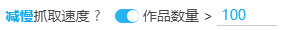
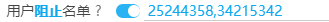
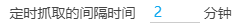

# 设置-更多-抓取

## 减慢抓取速度



```
减慢抓取速度 ?  作品数量 > 100
```

这个设置是默认启用的。

减慢抓取速度可以避免在抓取时被 Pixiv 临时限制。但这会增加抓取时间。

如果用户启用了这个设置，那么下载器在抓取时的并发请求数量会变成 1（原本抓取列表页时是 1，抓取作品数据时是 10），并且会在每个请求完成之后，延迟 1.4 秒再开始下一个请求，以避免用户被限制。

*这个设置只会导致抓取阶段花费更多的时间，不会影响下载阶段。*

`作品数量` 子选项的意思是当要抓取的作品数量超过这个数字时（默认是 `100`），下载器才会使用慢速抓取模式。

当作品数量比较少时，下载器依然会使用传统的快速抓取模式。

## 不抓取多图作品的最后一张图片


默认未启用。

启用该设置后，下载器抓取时会跳过多图作品的最后一张图片。

例如，有些画师的多图作品的最后一张图片是 Fanbox 的宣传图，不需要下载，此时就可以启用这个设置。

## 特定用户的多图作品不下载最后几张图片


这是一个隐藏设置。

这个设置没有开关，它是始终启用的，但是默认并没有添加任何规则，所以不会产生效果。

当你添加规则之后，才会产生效果。

点击“添加”按钮，你可以输入一个用户 ID，并设置不下载他的作品的后几张图片。

如果你想看到这个设置，可以如下操作：

1. 打开下载器的“显示高级设置”，并查看下载器的“更多”选项卡
2. 按 F12 审查元素，在 html 里搜索 `data-no="79"` 找到这个设置的元素，它默认是 `display: none;` 的
3. 取消它的 `display: none;` 样式，它就会显示出来。此时你就可以对它进行操作了。

## 用户阻止名单



默认未启用。

启用这个选项之后，你可以输入想要屏蔽的用户的 id，这样下载器就不会下载这些用户的作品。

**注意：**

!>需要输入**用户 ID**，而不是输入用户名。因为用户名不唯一。

?>如果要屏蔽多个用户，可以输入多个用户 id，中间使用英文逗号 `,` 分割。

## 针对特定用户屏蔽标签


默认未启用。

如果你不喜欢某个用户的某些分类作品，你可以使用此功能。

开启此设置后，输入用户 ID 和不想下载的标签，这样当下载器下载这个用户的作品时，会自动过滤带有这些标签的作品。

## 定时抓取的间隔时间



设置定时抓取的间隔时间。

默认值是 120 分钟（2 小时）执行一次抓取任务。

## 自动导出抓取结果


默认未启用。

启用此设置后，下载器在抓取完成之后会自动导出抓取结果。

你可以选择导出为 CSV 文件或（和）JSON 文件。
