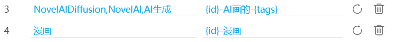

# 隐藏设置

有一些隐藏设置没有在下载器的面板上显示。

## 特定用户的多图作品不下载最后几张图片

    
    特定用户的多图作品不下载最后几张图片
     ? 
    
    <slot data-name="DoNotDownloadLastFewImagesSlot">
    
    0
      <button type="button" class="textButton expand" data-xztext="_展开">展开</button>
      <button type="button" class="textButton showAdd" data-xztext="_添加">添加</button>
    
    

      

        

          用户 ID（数字）
          <input type="text" class="setinput_style1 blue addUidInput" data-xzplaceholder="_必须是数字" placeholder="必须是数字">
        

        

          不下载最后几张图片
          <input type="text" class="has_tip setinput_style1 blue addValueInput" data-xztip="_提示0表示不生效" data-tip="0 表示不生效">
        

      

    

  </slot>
    

这个设置是始终生效的，不管它是否显示。

由于默认情况下它里面没有任何规则，所以实际上不会产生效果。只有当你添加规则之后才会产生效果。

点击“添加”按钮，你可以输入一个用户 ID，并设置不下载他的作品的最后几张图片。

?> 下载器有一个类似的设置：[不抓取多图作品的最后一张图片](/zh-cn/设置-更多-抓取?id=不抓取多图作品的最后一张图片)，它不能只针对特定用户启用，而且固定排除最后 1 张图片。使用这个设置则可以制定更详细的规则。

------------

如果你想看到这个设置，可以这样操作：

1. 启用下载器的“显示高级设置”选项，并切换到下载器的“更多”选项卡。
2. 按 F12 审查元素，在“元素”面板里按 `Ctrl` + `F` 并搜索 `p[data-no="79"]` 就可以定位到这个元素。
3. 它默认具有 `display: none;` 样式，取消这个样式就可以使它显示出来。此时你就可以使用它了。

## 如果作品含有某些特定标签，则对这个作品使用另一种命名规则

    如果作品含有某些特定标签，则对这个作品使用另一种命名规则
    <input type="checkbox" name="UseDifferentNameRuleIfWorkHasTagSwitch" class="need_beautify checkbox_switch">
    
    
    <slot data-name="UseDifferentNameRuleIfWorkHasTagSlot">

    
    0
      <button type="button" class="textButton expand" data-xztext="_收起">收起</button>
      <button type="button" class="textButton showAdd" data-xztext="_添加">添加</button>
    
    

      

        

          Tags
          <input type="text" class="setinput_style1 blue addTagsInput" data-xzplaceholder="_tag用逗号分割" placeholder="多个标签使用英文逗号,分割">
        

        

          命名规则
          <input type="text" class="setinput_style1 blue addRuleInput">
        

      

    

  
</slot>
    
    

你可以添加自定义规则，例如：

如果一个作品含有你设置的特定标签，下载器会使用命名规则里的文件夹部分，再加上这里设置的文件名部分，组合成一个新的命名规则使用。

由于这个设置是为某个用户定制的，所以它有一些特殊的规则：

1. 这个设置里的“命名规则”只应该输入**文件名**的规则。不应该包含文件夹，也就是不应该使用斜线 `/`，否则有时会造成预料之外的结果。
2. 这个设置里的“命名规则”必须以 `{id}` 开头。实际上，不管你是否以 `{id}` 开头，下载器在内部处理时都会把 `{id}` 添加到最前面。

------------

如果你想看到这个设置，可以参考上一个设置里的步骤。不同之处在于这个设置的选择器是 `p[data-no="80"]`。

## 根据 sl 创建文件夹

根据作品元数据里的 `sl` 属性创建文件夹。

这个功能默认是关闭的，而且设置面板里也没有这个设置。

**什么是 `sl`？**

`sl` 是作品数据里的一个字段，可能表示“该作品的色情程度”的评级。

`sl` 的值及其作用：（推测）

- `0` 新发布的普通作品会是这个值，可能是尚未进行测定。在发布后经过一段时间后，会变成其他数值。
- `2` 这种作品基本上没有色情元素；
- `4` 这种作品大部分都有一定的色情元素，比如巨乳、裸露的大腿、衣着暴露，但一般达不到 R - 18 的级别。
- `6` 这种作品大部分都有非常明显的色情元素，可能是 R - 18 作品。即使不是 R - 18 作品，也会有很多擦边球。

这个功能会根据作品的 `sl` 属性来创建文件夹。可能会产生以下几种名称的文件夹：

- sl0
- sl2
- sl4
- sl6

?> 小说作品没有 sl 数据，所以这个功能对小说作品无效。只有插画、漫画、动图可以使用 `sl` 建立文件夹。

------------

开启/关闭这个功能的方法：

在 Pixiv 的网页上输入下列口令之一：（使用键盘依次按下对应的字母即可）

- `ppdss1`
- `switchsl`
- `kaiguansl`

如果口令正确，下载器会在鼠标光标的位置显示一个提示。下面是该功能开启/关闭时的提示：

createFolderBySl On

createFolderBySl Off

## 优先下载动图

这个功能默认是关闭的，而且设置面板里也没有这个设置。

如果你启用了这个功能，那么当下载器抓取完成后，会把抓取结果中的动图排列到最前面，这样就可以优先下载动图。

------------

开启/关闭这个功能的方法：

在 Pixiv 的网页上输入下列口令之一：（使用键盘依次按下对应的字母即可）

- `ppdss2`
- `dlugoirafirst`
- `qw111`

如果口令正确，下载器会在鼠标光标的位置显示一个提示。下面是该功能开启/关闭时的提示：

downloadUgoiraFirst On

downloadUgoiraFirst Off
