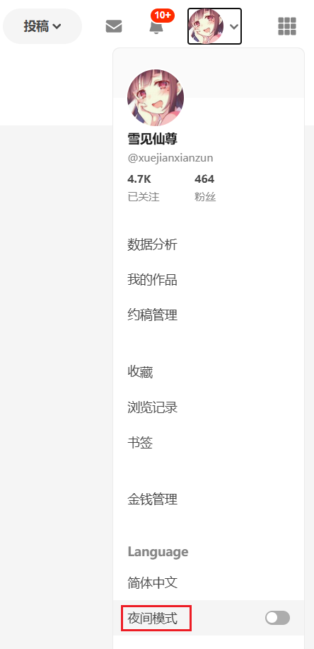
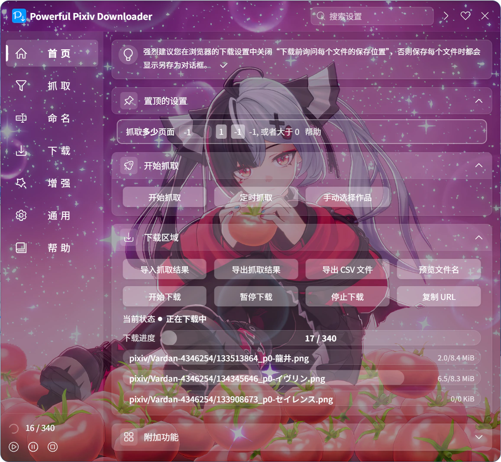

## 颜色主题

  <a href="/#/zh-cn/设置-通用/外观?flag=98" target="_blank" class="settingNameStyle" data-xztext="_颜色主题" data-bind-click="true">颜色主题</a>
  <input type="radio" name="theme" id="theme1" class="need_beautify radio" value="auto" checked="">
  
  <label for="theme1" data-xztext="_自动检测" class="active">自动检测</label>
  <input type="radio" name="theme" id="theme2" class="need_beautify radio" value="white">
  
  <label for="theme2">White</label>
  <input type="radio" name="theme" id="theme3" class="need_beautify radio" value="dark">
  
  <label for="theme3">Dark</label>

你可以选择下载器的颜色主题。

- `自动检测`：默认值，下载器会自动检测网页的背景颜色和 Pixiv 的颜色主题，来决定使用亮色模式还是暗色模式。
- `White`：浅色模式
- `Dark`：夜间模式。

Pixiv 的页面默认是浅色模式。如果你想使用夜间模式，可以点击自己的 Pixiv 头像，并从弹出菜单里选择“夜间模式”，如图：

## 背景图片

  <a href="/#/zh-cn/设置-通用/外观?flag=99" target="_blank" class="has_tip settingNameStyle" data-xztip="_背景图片的说明" data-tip="你可以选择一张本地图片作为下载器的背景图片。" data-bind-click="true">
    背景图片
     ? 
  </a>
  <input type="checkbox" name="bgDisplay" class="need_beautify checkbox_switch">
  
  

    

      <button type="button" class="textButton fireEvent" data-event="selectBG" id="selectBG" data-xztext="_选择文件">选择文件</button>
      <button type="button" class="textButton fireEvent" data-event="clearBG" id="clearBG" data-xztext="_清除">清除</button>
    

    

      对齐方式&nbsp;
      <input type="radio" name="bgPositionY" id="bgPosition1" class="need_beautify radio" value="center" checked="">
      
      <label for="bgPosition1" data-xztext="_居中">居中</label>
      <input type="radio" name="bgPositionY" id="bgPosition2" class="need_beautify radio" value="top">
      
      <label for="bgPosition2" data-xztext="_顶部" class="active">顶部</label>
    

    

      不透明度
      <input name="bgOpacity" type="range">
    

  

你可以把自己喜欢的图片设置成下载器的背景图片，并且可以调节透明度、对齐方式。

效果如下：

?> 下载器没有自带背景图片，所以你需要自行选择一张图片。

这个设置里有一些按钮和选项：

### 选择文件

点击这个按钮就会打开选择文件的对话框，你可以选择一张图片设置为背景图片。

?> 可以选择这些格式的图片：`.jpg,.jpeg,.png,.bmp,.webp`。

### 清除

点击这个按钮可以清除下载器的背景图片，使其恢复到没有背景图片的状态。

### 对齐方式

- `居中`：使背景图片的中间与设置面板的中间对齐。如果图片的高度大于设置面板的高度，这会导致图片的顶部和底部被裁剪。
- `顶部`：默认值。使背景图片的顶部与设置面板的顶部对齐。如果图片的高度大于设置面板的高度，这会导致图片的底部被裁剪。

你可以根据具体的图片来调整对齐方式，以获得更好的显示效果。

### 不透明度

你可以使用这个滑块来调整背景图片的不透明度。默认值是 `75%`。

?> 背景图片下方有一层黑色的背景颜色，并且背景图片默认是半透明的，所以背景图片会变暗。这个设计的目的是为了让设置面板上的文字更易阅读。调整不透明度的本质就是调整背景图片遮挡黑色背景的程度。

如果增加不透明度，图片看起来会更接近原图；如果减少不透明度，图片会变暗。

## 高亮显示关键字

  <a href="/#/zh-cn/设置-通用/外观?flag=100" target="_blank" class="has_tip settingNameStyle" data-xztip="_高亮显示关键字的说明" data-tip="高亮显示每个设置名称里的关键字，以便你可以快速找到需要的设置。" data-bind-click="true">
    高亮显示关键字
     ? 
  </a>
  <input type="checkbox" name="boldKeywords" class="need_beautify checkbox_switch" checked>
  

每个设置项里的关键字会突出显示为蓝色和加粗，以提高用户查找特定设置时的效率。

