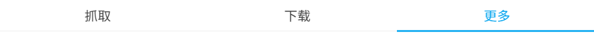

## 选项卡切换方式

  <a href="http://localhost:3000/#/zh-cn/设置-通用/操作方式?flag=95" target="_blank" class="has_tip settingNameStyle" data-xztip="_选项卡切换方式的说明" data-tip="设置如何切换下载器的一级分类导航。" data-bind-click="true">
    选项卡切换方式
     ? 
  </a>
  <input type="radio" name="switchTabBar" id="switchTabBar1" class="need_beautify radio" value="over" checked="">
  
  <label for="switchTabBar1" data-xztext="_鼠标经过" class="active">鼠标经过</label>
  <input type="radio" name="switchTabBar" id="switchTabBar2" class="need_beautify radio" value="click">
  
  <label for="switchTabBar2" data-xztext="_鼠标点击">鼠标点击</label>

“选项卡”指的是下载器顶部的“抓取”、“下载”、“更多”这三个标签页：

- `鼠标经过`：默认值。把鼠标指针移动到标题上就会立即切换标签页，这样很便捷。
- `鼠标点击`：鼠标指针移动到标题上时不会切换标签页，需要点击标题才会切换。这是因为有些用户觉得鼠标经过的方式会导致误操作，所以想使用这种方式。

## 点击设置卡片时切换它的开关状态

  <a href="http://localhost:3000/#/zh-cn/设置-通用/操作方式?flag=96" target="_blank" class="settingNameStyle" data-bind-click="true">
    点击设置卡片时切换它的开关状态
  </a>
  <input type="checkbox" name="clickOptionCardToToggleSwitch" class="need_beautify checkbox_switch" checked="">
  
  <button type="button" class="gray1 textButton showMsgBtn" data-title="_点击设置卡片时切换它的开关状态" data-msg="_点击设置卡片时切换它的开关状态的说明" data-xztext="_帮助">帮助</button>

    <svg class="icon settingsPanel_newBadgeIcon" aria-hidden="true">
      <use xlink:href="#new"></use>
    </svg>
    

## 点击设置名字时打开 Wiki 链接

  <a href="http://localhost:3000/#/zh-cn/设置-通用/操作方式?flag=97" target="_blank" class="settingNameStyle" data-bind-click="true">
    点击设置名字时打开 Wiki 链接
  </a>
  <input type="checkbox" name="clickSettingNameOpenWiki" class="need_beautify checkbox_switch" checked>
  

