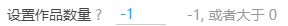
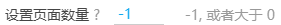
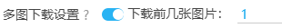
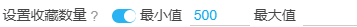
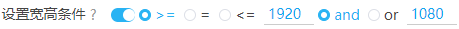
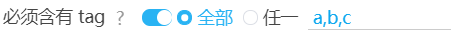
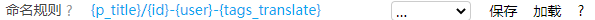
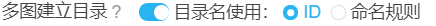
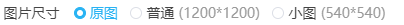
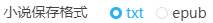

# 设置选项

有一些选项带有一个问号，把鼠标放到这些设置项上会有简单的提示：


?>在不同的页面，显示的选项可能会有所不同。

## 设置作品数量



某些页面的下载以作品为单位，所以会显示这个设置。它可以设置你要**下载多少个作品**。

>默认值的 -1 表示不限制抓取数量

> 一个作品里可能有多张图片

?>设置项右侧的灰色文字，提醒你可以输入的数字的范围。在不同的页面里，这些提示可能不同。

## 设置页面数量



当你处于**列表页**时，会看到这个设置。你可以设置你要**下载多少页**。

>默认值的 -1 表示不限制抓取数量

?>列表页的下载是向下抓取的，例如你处于第 10 页，就会从第 10 页开始下载，而不是从第一页开始下载。

## 下载作品类型

作品类型选项用来设置你想要下载的作品类型。未被勾选的作品类型不会被下载。

----------


?>这些类型是画师为作品选择的分类，分为插画、漫画、动图小说。

----------


单图作品指只有一张图片的作品。多图作品是指包含有多张图片的作品。

----------


设置下载彩色图片和（或）黑白图片 。

如果你设置了过滤彩色或黑白图片，过滤器会检查图片的平均颜色，判断这个图片是彩色的还是黑白的。

下载器在抓取时和下载时都会进行此项检查。

?>有些图片虽然大部分是黑白的，但还是带有一些彩色，这样的图片是彩色图片，不属于黑白图片。

?>如果你过滤了某种颜色的图片，那么在下载过程中，你可能会看到页面顶部有提示：因为颜色设置，没有保存某个文件。这是因为一个作品可能有多张图片，并且第一张图片的颜色可能和其后的图片的颜色不同。在抓取时，下载器只会检查第一张图片，检查通过的话，就会下载这个作品的所有图片。之后在下载文件时，下载器会对后面的所有图片进行检查，如果发现后面的图片不符合要求，就不会下载它。

## 多图下载设置



你可以只下载多图作品的前几张图片。

有多张图片的作品，经常只有第一张是最有价值的。例如，很多作品第一张图是彩色的，后面是未上色的。或者第一张图是很精致的，后面的图不够精致。这时候就可以设置你想要的数字，只下载前面几张。

?>如果设置的数字大于作品的图片数量，将会全部下载。等同于没有限制数量。

## 设置收藏数量



收藏数量，指的是有多少个人收藏了这个作品。收藏的人数越多，说明作品的价值越高。

你可以只设置最小值、或者只设置最大值、或者同时设置两者。

如果你不需要设置某个值，将它留空即可。

?>判断条件里包含等于。例如设置最小收藏数量为 500，那么作品达到 500 收藏就通过，而不是 501。

## 只下载已收藏


如果启用这个设置，那么下载器只会下载被你收藏的作品。

## 设置宽高条件



图片具有宽度（width）和高度（height）。这个选项设置你想要下载的作品的宽高条件，不符合此条件的作品不会下载。

**提示：**

- 要求图片的宽高 `>=` 或者 `=` 或者 `<=` 你设置的值。
- 第一个输入框设置宽度，第二个输入框设置高度。
- 选择 “and”，表示图片的宽高要同时符合设置的宽高。
- 选择 “or”，表示图片的宽高要只需要符合宽高设置中的任意一个。
- 默认值都是 0，表示不限制。

?>例如，我们可以设置 `>= 1920 and 1080` 来筛选适合做电脑壁纸的图片。

## 设置宽高比例


你可以设置下载指定形状的作品。

横图的宽度大于高度。竖图的宽度小于高度。宽度除以高度得到的数字是“宽高比”。

**提示：**

- 宽高比小于 1 时，图片是竖图。宽高比大于 1 时，图片是横图。宽高比越大，图片越显得扁长。
- 如果你想下载宽高相等的图片（正方形），可以设置宽高比为 1.

## 设置 id 范围


你可以设置只下载大于某个 id 的作品，或者小于某个 id 的作品。

?>作品的 id 是递增的，越早投稿的作品 id 越小。

这有助于进行增量更新。例如：

上次下载的文件里，最大的 id 是 65000000，想要下载在它之后投稿的作品，可以设置 id 范围大于 65000000，然后开始抓取。

## 设置投稿时间


你可以设置只下载某个时间范围里投稿的作品。

------

>pixiv 上的第一幅插画是 https://www.pixiv.net/artworks/20 ，发表时间是 `"2007-09-09T13:14:07+00:00"`

### 小技巧

这有助于进行增量更新。例如：

上次下载的文件的截至日期是 2020 年 1 月 1 日，当你在同一页面再次下载时，你可以设置投稿时间的起点为 2020 年 1 月 1 日，终点为现在，就可以只下载这段时间里更新的作品。

------

如果你只想设置一个时间作为起点或者终点，那么另外一个时间应该怎么设置呢？

例如，我要下载 2010 年之前的作品。终点是 2010 年，起点应该怎么设置？可以设置一个早于 pixiv 创建日期的时间。

```
2000 年 1 月 1 日 - 2010 年 1 月 1 日
```

如果我要下载 2020 年之后的作品，起点是 2020 年，终点应该怎么设置？可以设置一个未来的时间。

```
2020 年 1 月 1 日 - 9999 年 1 月 1 日
```

## 必须含有 tag



你可以设置下载的作品里必须包含某些 tag。没有这些 tag 的作品不会被下载。默认为空。

### 全部

如果你输入了多个 tag，“全部”选项需要求每个作品都必须同时含有这些 tag。

### 任一

如果你输入了多个 tag，“任一”选项表示要求每个作品只要含有其中一个 tag 即可。

**提醒：**

- 你可以添加多个 tag，中间用**英文逗号** `,` 分割。
- **不区分大小写**。
- tag 是严格的**全字匹配**。例如你设置了“東方Project”，而某个作品的 tag 里只有“東方”，那么它是不符合条件的。反过来也是如此。
- 如果设置了多个 tag，下载器会根据“全部”或者“任一”设置来判断作品是否符合要求。
- 推荐使用日文（原本的）tag。不推荐使用翻译后的 tag。

--------

举个例子，`东方 Project` 的作品有时候标签不一致，常见的可能有以下三种：

```東方Project,東方,東方プロジェクト```

有的作品可能只有其中一个标签，所以只搜索一个 tag 是不完整的。你可以把这三个 tag 全部填入，然后设置模式为“任一”，这样就不容易漏掉`东方 Project` 的作品了。

## 不能含有 tag


你可以设置下载的作品里不能包含某些 tag。如果作品有某个 tag 符合此条件，那么它不会被下载。默认为空。

**提醒：**

- 你可以添加多个 tag，中间用**英文逗号** `,` 分割。
- **不区分大小写**。
- tag 是严格的**全字匹配**。
- 如果设置了多个 tag，那么作品**只要符合其中任意一个**，就不会被下载。
- 不能含有 tag 的优先级比 必须含有 tag 高。如果一个作品符合“必须含有 tag”的条件，也符合“不能含有 tag”的条件，那么它不会被下载。
- 推荐使用日文（原本的）tag。不推荐使用翻译后的 tag。

图中的 tag 是我自己常用的排除列表，主要排除腐向作品。如下：

```
落描き,講座,BL,腐,ホモ,腐向け,腐向けHQ,Free!,腐ree!,BL松,刀剣乱舞,刀剣乱腐,黒子のバスケ,鬼灯の腐向け,創作BL,◆A【腐】
```

附带群内大佬提供的一个更加全面的列表，主要排除了腐向、讲座、素材的标签：

```
A腐リー,A腐リー1000users入り,BL,BLACKLAGOON,BLEACH,BLEACH1000users入り,BLEACH100users入り,BLEACH500users入り,BL松,BL松10000users入り,BL松1000users入り,BL松100users入り,BL松5000users入り,BL松500users入り,BL松派生,DBH【腐】,FGO(腐),Fate(腐),Fate(腐)1000users入り,Fate(腐)100users入り,Fate(腐)500users入り,Fate/GO(腐),Fate/GO(腐)10000users入り,Fate/GO(腐)1000users入り,Fate/GO(腐)100users入り,Fate/GO(腐)5000users入り,Fate/GO(腐)500users入り,Fate/GrandOrder(腐),Fate/Zero(腐),Fate/Zero(腐)1000users入り,Fate/zero(腐),HUNTER×HUNTER,HUNTER×HUNTER1000users入り,HUNTER×HUNTER100users入り,HUNTER×HUNTER500users入り,H×H【BL】1000users入り,H×H【腐】,JOJO【腐】,JOJO【腐】1000users入り,JOJO【腐】100users入り,JOJO【腐】250users入り,JOJO【腐】3000users入り,JOJO【腐】5000users入り,JOJO【腐】500users入り,K(腐),K(腐)/1000users入り,K(腐)/100users入り,K(腐)/500users入り,NARUTO,NARUTO10000users入り,NARUTO1000users入り,NARUTO100users入り,NARUTO5000users入り,NARUTO500users入り,NARUTO【腐】,NARUTO【腐】,NARUTO【腐】1000users入り,NARUTO【腐】1000users入り,NARUTO【腐】100users入り,NARUTO【腐】100users入り,NARUTO【腐】500users入り,NARUTO【腐】500users入り,ONEPIECE,TF腐向け,TIGER&BUNNY,YOI【腐】,dcst腐向け,futa,futanari,hrak【腐】,hrak【腐】10000users入り,hrak【腐】1000users入り,hrak【腐】100users入り,hrak【腐】3000users入り,hrak【腐】5000users入り,hrak【腐】500users入り,pkmn腐,pkmn腐1000users入り,pkmn腐5000users入り,◆A【腐】,◆A【腐】1000users入り,◆A【腐】100users入り,◆A【腐】500users入り,【玉鋼学園】男子生徒,【腐】A/Z,あんさんぶるスターズ,あんさんぶるスターズ!,あんさん腐るスターズ!,うたの☆プリンスさまっ♪,うた腐り,うた腐リ,おそ松,おそ松(長男),おそ松さん,おそ松さん10000users入り,おそ松さん1000users入り,おそ松さん100users入り,おそ松さん5000users入り,おそ松さん500users入り,おそ松兄さんマジ兄さん,おそ松総受け,なにこれイケメン,なにこれ男の子かわいい,ふた×男,ふたなり,ふたなりっ娘にお尻掘られたい,ふたゆり,まじコナ腐10000users入り,まじコナ腐1000users入り,まじコナ腐100users入り,まじコナ腐3000users入り,まじコナ腐5000users入り,まじコナ腐500users入り,まじコナ腐向け,アイドリッシュセ腐ン,アルミン・アルレルト,イケメン,イズ(仮面ライダーゼロワン),イナイレ[腐],イナギャラ[腐],イナゴ[腐],イナズマイレブン,イナズマイレブンGO,イナズマイレブンGOギャラクシー,イナズマイレブンGOクロノ・ストーン,イメージレスポンス用素材,エムマス【腐】,エムマス【腐】100users入り,オリジナルBL,カゲロウプロジェクト,カゲ腐ロ,ガチホモ,グラ腐ル,グラ腐ル1000users入り,グラ腐ル100users入り,グラ腐ル500users入り,ケモホモ,サ腐マス,シーメール,ジョジョ,ジョジョ10000users入り,ジョジョ1000users入り,ジョジョ100users入り,ジョジョ250users入り,ジョジョ5000users入り,ジョジョ500users入り,ジョジョの奇妙な冒険,ジョジョパロ,ジョジョ立ち,ス腐ラトゥーン,ダイヤのA,ダン戦[腐],ツイ腐テ,ツイ腐テ1000users入り,ツイ腐テ5000users入り,テイルズ【腐向け】1000users入り,テイルズ【腐向け】100users入り,テイルズ【腐向け】500users入り,テニスの王子様,テニ腐リ,テライケメン,ディズニー,ディズニー1000users入り,ディズニー100users入り,ディズニー5000users入り,ディズニー500users入り,デジモンアドベンチャー,ハイキュー,ハイキュー!!,ハイキュー!!10000users入り,ハイキュー!!1000users入り,ハイキュー!!100users入り,ハイキュー!!5000users入り,ハイキュー!!500users入り,ハリー・ポッター,ハンター,ハンターハンター,パンツ男子,ヒプノシスマイク,ヒロアカ【腐】,ヒ腐マイ,ヒ腐マイ10000users入り,ヒ腐マイ1000users入り,ヒ腐マイ100users入り,ヒ腐マイ5000users入り,ヒ腐マイ500users入り,ピカチュウ,ピクファンイケメン,フリー素材,フリー素材10000users入り,フリー素材1000users入り,フリー素材100users入り,フリー素材5000users入り,フリー素材500users入り,ブラシ素材,ヘタリア,ヘタリア10000users入り,ヘタリア1000users入り,ヘタリア100users入り,ヘタリア5000users入り,ヘタリア500users入り,ヘタリアMMD,ヘタリア★ハロウィン,ヘタリア三次創作,ヘタリア杯,ホモ,ホモと野獣,メイド少年,メガネ男子,メス男子,モンスターハンター,モンスターハンターワールド,モンハン,モンハン1000users入り,モンハン100users入り,モンハン500users入り,モンハンどうでしょう,モ腐サイコ100,モ腐サイコ1000users入り,モ腐サイコ100users入り,モ腐サイコ500users入り,ユーリ!!!onICE,リヴァイ班,ワートリ【腐】,ワートリ【腐】1000users入り,ワートリ【腐】100users入り,ワートリ【腐】500users入り,ヴァンガ【腐】,一撃男【腐】,一撃男【腐】1000users入り,一撃男【腐】100users入り,一撃男【腐】500users入り,一方通行,仮面ライダー,仮面ライダー1000users入り,仮面ライダー100users入り,仮面ライダー500users入り,仮面ライダー555,仮面ライダーOOO,仮面ライダーW,仮面ライダーウィザード,仮面ライダーエグゼイド,仮面ライダーオーズ,仮面ライダークウガ,仮面ライダーゴースト,仮面ライダージオウ,仮面ライダーゼロワン,仮面ライダーディケイド,仮面ライダードライブ,仮面ライダービルド,仮面ライダーフォーゼ,仮面ライダー剣,仮面ライダー鎧武,仮面ライダー電王,仮面ライダー龍騎,僕のヒーローアカデミア,僕のヒーローアカデミア10000users入り,僕のヒーローアカデミア1000users入り,僕のヒーローアカデミア100users入り,僕のヒーローアカデミア5000users入り,僕のヒーローアカデミア500users入り,兄貴,冥腐ヘヨゥコソ!,冨岡義勇,刀剣乱腐,刀剣乱腐10000users入り,刀剣乱腐1000users入り,刀剣乱腐100users入り,刀剣乱腐3000users入り,刀剣乱腐5000users入り,刀剣乱腐500users入り,刀剣乱舞,刀剣乱舞10000users入り,刀剣乱舞1000users入り,刀剣乱舞100users入り,刀剣乱舞3000users入り,刀剣乱舞5000users入り,刀剣乱舞500users入り,創作BL,創作BL10000users入り,創作BL1000users入り,創作BL100users入り,創作BL3000users入り,創作BL5000users入り,創作BL500users入り,創作男女,創作男女10000users入り,創作男女1000users入り,創作男女100users入り,創作男女5000users入り,創作男女500users入り,動物,動物の仔,名探偵コナン,商業BL,善炭,土方十四郎,土方歳三,土方歳三(Fate),地獄の仮面ライダー,地縛少年花子くん,夏目友人帳,夏目友人帳1000users入り,奥村燐,女装少年,女装男子,宇善,宇宙兄弟,家庭教師ヒットマンREBORN!,小説用フリー素材,少年,弱虫ペダル,弱虫ペダル10000users入り,弱虫ペダル1000users入り,弱虫ペダル100users入り,弱虫ペダル5000users入り,弱虫ペダル500users入り,弾丸論破【腐】,心象風景,忍玉-腐,忍玉-腐1000users入り,忍玉-腐100users入り,忍玉-腐5000users入り,忍玉-腐500users入り,忍玉‐腐,愛がなきゃ描けない,戦国BASARA,戦国BASARA1000users入り,戦国BASARA100users入り,戦国BASARA3,戦国BASARA500users入り,描き方,文アル【腐】,文スト【腐】,文スト【腐】1000users入り,新弾丸論破V3【腐】,新弾丸論破V3【腐】1000users入り,東京腐種,東京腐種1000users入り,東方旧作,東方耽美郷,東方集合絵,架空動物種,残念なイケメン,殺生丸,江戸川コナン,漫画素材,漫画素材工房,煉炭,牧春,特撮,獄変【腐】,男の娘,男の娘×女の子,男の娘キリト,男の子,男の潮吹き,男の肥満化,男子,男子おっぱい,男子高校生,男子高校生の日常,真選組,眼鏡男子,立ち絵素材,第腐人格,第腐人格1000users入り,素材,美L【腐】,美少年,美男子,義炭,耽美,背景素材,腐,腐ree!,腐ペダ,腐ロメア,腐ロメア1000users入り,腐向,腐向け,腐向けHQ,腐向けJG,腐向けヘタリア,腐向けヘタリア,腐女子,腐川冬子,腐滅の刃,腐滅の刃10000users入り,腐滅の刃1000users入り,腐滅の刃100users入り,腐滅の刃5000users入り,腐滅の刃500users入り,腐界戦線,腐界戦線1000users入り,腐界戦線100users入り,腐界戦線5000users入り,腐界戦線500users入り,腐術廻戦,自称初投稿兄貴,衛宮切嗣,講座,講座10000users入り,講座1000users入り,講座100users入り,講座5000users入り,講座500users入り,超弾丸論破2【腐】,超弾丸論破2【腐】1000users入り,超弾丸論破2【腐】100users入り,逢魔ヶ刻動物園,進撃の腐人,進撃の腐人10000users入り,進撃の腐人1000users入り,進撃の腐人100users入り,進撃の腐人3000users入り,進撃の腐人5000users入り,進撃の腐人500users入り,金カム腐,金カム腐1000users入り,金木研,鉄血のオル腐ェンズ,鉄血のオル腐ェンズ100users入り,長髪男子,雄っぱい,青の祓魔師,風景,風景10000users入り,風景1000users入り,風景100users入り,風景3000users入り,風景5000users入り,風景500users入り,風景画,食戟【腐】,鬼灯の冷徹,鬼灯の冷徹1000users入り,鬼灯の冷徹100users入り,鬼灯の冷徹500users入り,鬼灯の腐向け,鬼灯の腐向け1000users入り,鬼灯の腐向け100users入り,鬼灯の腐向け5000users入り,鬼灯の腐向け500users入り,鶴丸国永(刀剣乱舞),黒バス【腐】,黒子のバスケ
```

## 设置命名规则



这是很重要的功能，你可以在这里设置文件的**命名规则**，也可以**建立文件夹**。

### 标记说明

每一个标记都会在下载时进行替换，比如 `{id}` 会被替换成类似于 `75863159_p0` 的结果。

?>这项设置的右侧有一个帮助按钮（问号 `?`)，可以查看标记的含义。

- `{id}` 默认文件名，如 44920385_p0
- `{user}` 画师名字
- `{user_id}` 画师 id
- `{title}` 作品标题
- `{p_title}` 当前页面的标题
- `{tags}` 作品的 tag 列表
- `{tags_translate}` 作品的 tag 列表，附带翻译后的 tag（如果有）
- `tags_transl_only` 翻译后的 tag 列表
- `{p_tag}` 当前页面的 tag。当前页面没有 tag 时不可用。
- `{type}` 作品类型，分为 illustration、manga、ugoira
- `{bmk}` bookmark-count，作品的收藏数。把它放在最前面可以让文件按收藏数排序。
- `{rank}` 作品在排行榜中的排名。如 #1、#2 …… 只能在排行榜页面使用。
- `{date}` 作品的创建日期，格式为 yyyy-MM-dd。如 2019-08-29
- `{task_date}` 这次任务抓取完成时的时间。如 2020-10-21
- `{px}` 宽度和高度
- `{series_title}` 系列标题（可能为空）
- `{series_order}` 作品在系列中的序号，如 #1 #2
- `{id_num}` 数字 id，如 44920385
- `{p_num}` 图片在作品内的序号，如 0、1、2 …… 每个作品都会重新计数。

**注意：**

- 下载时如果文件已存在，新文件会覆盖旧文件，而不是在后面添加序号。
- 你可以使用多个标记；多个标记之间建议添加分割符号，如 `{id}-{tags}-{user}`，免得各个标记的内容挨在一起，难以分辨。
- 在某些情况下，会有一些标记不可用。不可用的标记不会出现在文件名里。
- 如果生成的文件名里有一些特殊字符，不能在下载时使用，会被替换成近似的字符。
- 如果文件名超长，Chrome 会自动截断超出的部分。
- 除了预设的标记，你也可以自行输入文字。
- 如果你使用了 `{tags_translate}`，就没有必要使用 `{tags}`，因为前者包含它。翻译的内容根据你在 pixiv 的语言设置有所不同。例如，如果你的 pixiv 界面是中文的，那么 tag 的翻译一般也是中文的。你可以在首页底部修改你要是用的语言。
- `tags_transl_only` 只保存翻译后的 tag，不保存原本的日文 tag。但是如果某个 tag 没有翻译，则会保存原本的 tag。
- 文件名里必须要含有 id（`{id_num}`） 和序号（`{p_num}`）部分，或者直接使用 `{id}`。不然多图作品里的图片的文件名相同，会导致下载时互相覆盖。
- 没有后缀名标记，因为后缀名是程序自动添加到文件末尾的。

### 建立文件夹

**使用斜线 `/` 可以建立文件夹**。例如 `{p_title}/{id}-{tags}-{user}` 会把 `{p_title}` 作为文件夹的名字，后续内容作为文件名。就像这样：


如果有需要，你也可以使用多个斜线，这样可以建立多层文件夹。

### 文件名长度限制


设置文件名的长度上限。这个长度不包括文件夹部分，但包括后缀名部分。

**一般不需要开启。**除非当你确定是因为文件名太长导致了问题，才需要启用这个设置。

一般来说，如果文件名太长的话，Chrome 会自动截断超出的部分，不会导致保存失败。

但是在一些特殊情况下，Chrome 可能不会自动截断文件名，有可能导致保存失败。例如：你把下载位置设置到 NAS 或云端硬盘时。

## 添加命名标记前缀


同时使用多个标记时，文件名里储存了多种信息，如果它们之间没有标记，容易分不清楚。所以本程序默认会在一些标记前面加上说明。情况如下：

- {title} 生成结果时，前面加上了 title_ 字符。
- {tags} 和 {tags_translate} 生成结果时，前面加上了 tags_ 字符。
- {user} 生成结果时，前面加上了 user_ 字符。
- {userid} 生成结果时，前面加上了 uid_ 字符。
- {bmk} 生成结果时，前面加上了 bmk_ 字符。

其他标记没有添加说明字符。如果你不想要这些说明字符，可以关闭此选项。

## 第一张图不带序号


如果你使用 `{id}` 命名，每个作品的 id 后面都会带序号，如：

```
80447108_p0
80447108_p1
80447108_p2
```

这个选项会去掉第一张图的序号部分，变成这样：

```
80447108
80447108_p1
80447108_p2
```

如果你使用了 `{p_num}` 这个命名标记，那么第一张图的序号也会被去掉。

## 多图建立目录



如果开启了此设置，下载器会在下载多图作品时，自动建立一个文件夹来存放它的图片。

以作品 [79239641](https://www.pixiv.net/artworks/79239641 ':target=_blank') 为例，它有 3 张图片。若命名规则为 `{user}/{id}`，则未开启此功能时，文件名结果如下：

```
user_河CY/79239641_p0.jpg
user_河CY/79239641_p1.jpg
user_河CY/79239641_p2.jpg
```

开启此功能后，默认会把图片放进作品 id 的文件夹里，如下：

```
user_河CY/79239641/79239641_p0.jpg
user_河CY/79239641/79239641_p1.jpg
user_河CY/79239641/79239641_p2.jpg
```

你也可以选择第二个选项，使用命名规则作为文件夹名字的规则。

**注意：**

- 如果这个多图作品只下载前一张图片，不会建立文件夹。必须是下载多张图片时才会建立文件夹。
- 如果你使用文件命名规则作为文件夹名字，那么文件命名规则不要使用 {p_num}，它会导致每个图片都单独建立一个文件夹。可以考虑使用 {id} 替换 {p_num}。

## 快速下载时，始终创建文件夹


>此选项只对作品页内的快速下载有效。

快速下载时如果只有一张图片，默认是不会建立文件夹的。如果只有一张图片也要建立文件夹，则应该开启此选项。

## 图片尺寸



你可以选择下载的图片尺寸。

- 原图：原图尺寸
- 普通：最大尺寸为 1200*1200 px。如果原图比这个尺寸大，会按比例缩放到这个尺寸。
- 小图：最大尺寸为 540*540 px。如果原图比这个尺寸大，会按比例缩放到这个尺寸。

?>这些尺寸的图片都是 Pixiv 自动生成的，不是下载器自己进行的裁剪。

## 文件体积限制


当一个文件开始下载时，如果它的体积不在指定的范围内，下载器将会跳过下载这个文件。

## 设置下载线程


下载线程是指同时进行几个下载任务，也就是有几个下载进度条。

**提醒：**

- 下载线程设置的多一些，一般有助于提高下载速度，但决定性的因素依然取决于你的网络情况。
- 如果你下载的速度慢，可以适当减少一些下载线程，比如设置为 3。否则可能有一些下载进度超时，导致卡住。
- 如果你的下载速度比较快，可以把下载线程设置的多一些。最大值是 5。

怎样查看下载速度呢？以 Chrome 浏览器为例，按 `Shift` + `Esc` 键打开它的任务管理器，然后找到进行下载的页面，就可以看到它的下载速度。


如果下载速度达到 1 MB/s，一般就不会出现下载问题了。如果速度比较慢，那么我建议你把下载进程设置的小一些。

## 自动开始下载


当抓取作品完成，可以进行下载时，是否自动开始下载。默认开启。

开启之后，从抓取到下载都是自动完成的，中间不需要用户再进行操作。

如果关闭此选项，那么抓取之后会弹出设置面板，需要用户手动点击下载按钮，才会下载。

## 动图保存格式


当下载动图作品时，将其保存为 WebM 视频，或者 GIF 图片，或者 APNG 图片，或者 Zip 压缩包。

**各种格式的特点：**

-  WebM 视频画质高，体积小。在手机上使用可能不太方便。
-  GIF 格式是常用的动态图片格式。但是画质差，体积大。
-  APNG 格式是**无损**画质的动图格式。画质最佳，但是体积最大。
-  把动图保存为 zip 格式，不需要转换，内存占用也小。但是没有动画效果。

**提醒：**

- 把动图转换为视频需要一些时间，如果下载动图时，进度条不动了，这是正常的，此时本程序在把动图转换为视频。
-  把动图转换为视频会占用更多的内存，如果你预料到你要下载很多动图，建议把下载线程设置的小一些，例如设置为 1。
-  动图的源文件的体积越大，转换时的内存占用也越大。

### 保持标签页激活

!>如果要转换动图，请保持该页面处于激活状态，否则转换速度会变慢。

保持该标签页激活的方法：

1. 不要切换到其他页面。但是这样就不能浏览其他网页了；
2. 把这个标签页拖出来形成一个单独的窗口，这样这个标签页始终是激活的。你可以回到之前的窗口浏览其他网页，也不会影响转换。

保持标签页激活，只需要该页面在浏览器里是直接显示的就行，不需要让这个页面一直保持显示在屏幕上（那样就做不了其他事情了）。

## 同时转换多少个动图


默认值是 1，这是因为同时转换多个动图会增加资源占用。

**提醒：**

1. 如果资源占用太多，可能会导致页面崩溃，或者浏览器崩溃。（后果自负哦）
2. 转换动图时，请保持该标签页激活，否则浏览器会降低转换速度。

?>动图的同时转换数量不会超过下载线程数。也就是说同时下载几个，最多也就只能同时转换几个。

## 小说保存格式



你可以选择把小说保存为 txt 格式或者 epub 格式。

txt 格式通用性好，但是内容是纯文本，而且文字没有样式。

epub 可以保存封面图片，保留文字的颜色，使用超链接。（前提是这个小说有这些数据）

epub 的阅读体验比较好，但是需要安装专门的软件才能打开查看。

## 在小说里保存元数据


如果你启用了这个选项，本程序会在小说内容的开头保存以下信息：

- 小说标题
- 作者
- 网址
- 简介
- 标签

如果你关闭了这个选项，那么小说内容里只有小说主体文本。

不管小说是保存成 txt 格式还是 epub ，都会应用这个设置。

## 日期和时间格式


你可以使用以下标记来设置日期和时间格式，**区分大小写**。

这会影响命名规则里的 `{date}` 和 `{task_date}`。

对于时间如 `2021-04-30T06:40:08`，各个标记的结果如下:

```
YYYY 2021
YY 21
MM 04
MMM Apr
MMMM April
DD 30
hh 06
mm 40
ss 08
```

## 不下载重复文件


如果启用了“不下载重复文件”选项，那么下载器会跳过下载重复的文件。

### 原理

当成功下载了一个文件之后，下载器会在 IndexedDB 数据库里保存一条记录，包含 id 和文件名。例如：

```
{
  "id": "85290993_p0",
  "n": "85290993_p0-小日向ほしみ-原创,女孩子,原创,waitress,过膝袜.jpg"
}
```

在下载一个文件之前，下载器会查询记录，判断这个文件是不是重复文件。

!>下载器只会查询自己的下载记录，不会检查硬盘上的文件（因为没有这个权限）。所以这个方法并不完美。

例如你要下载的某个文件在硬盘上已存在，但是下载器没有记录，就仍然会下载它。

相反的，如果你之前下载过某个文件，之后在硬盘上把它删除了，但是在下载器里有记录，那么下载器就不会再次下载它（如果你没有开启此选项，则可以再次下载）。

### 严格策略

当要下载的这个文件的 **id 以及文件名**都和某个记录吻合时，则认为这个文件是重复文件。

### 宽松策略

只判断 id，不判断文件名。如果下载的这个文件的 **id** 和某个记录吻合，就认为这个文件是重复文件。

### 导出

点击导出按钮，可以导出所有下载记录，格式为 json 文件。

>当你要清除 Cookies 数据，或者重装浏览器，你可以先导出下载记录，以便进行恢复。

### 导入

点击导入按钮，你可以选择导出的下载记录文件，导入到下载器的下载记录里。

### 清除下载记录

清空下载器的所有下载记录。

即使你把下载到硬盘上的文件删除掉，但是下载器里依然会存在着它的下载记录。当你再次下载时，下载器会认为这个文件已经下载过了，导致下载器不会再下载它。

如果你遇到了这种情况，可以清除下载记录，或者关闭“不下载重复文件”的选项。

## 用户阻止名单


启用这个选项之后，你可以输入想要屏蔽的用户的 id，这样下载器就不会下载这些用户的作品。

**注意：**

1. 需要输入**用户 ID**，而不是输入用户名。因为用户名不唯一。
2. 如果要屏蔽多个用户，可以输入多个用户 id，中间使用英文逗号 `,` 分割。

## 下载之后收藏作品


启用这个选项之后，每当下载完一个文件，下载器就会自动收藏这个作品。

收藏的进度会显示在下载进度区域。格式如： `已收藏 99/100`

当下载完成之后，看到这里收藏数量是前后相同的如 `已收藏 100/100` 就说明收藏完了。如果不相同就等待一下。

**注意：** 

1. 被跳过下载的文件也视为下载成功，所以也会进行收藏。
2. 一个作品可能有多个文件，但只会进行一次收藏。所以如果你收藏数量比文件数量少，这是正常的。

## 收藏设置


当下载器把作品添加到收藏时，你可以设置：

1. 是否附带 tag
2. 是否为公开收藏

这会影响很多通过下载器添加收藏的操作（pixiv 本身的收藏按钮不受影响）。

**受此设置影响的地方：**

- 作品页面里的快速收藏（☆）按钮
- 搜索页面的快速收藏（☆）按钮
- 收藏本页面所有作品的按钮
- 下载后收藏作品的功能

**不受此设置影响的地方：**

在收藏页面里的“给未分类作品添加 tag”按钮不受影响。因为这个功能必定会附带 tag。并且会根据这个作品之前的收藏状态，自动设置公开或者不公开。

## 预览搜索页面的筛选结果


如果打开“预览搜索页面的筛选结果”选项，下载器会把抓取到的符合要求的作品显示在页面里，方便查看。

这是为了方便用户预览结果，并且便于进行多次筛选，提供所见即所得的下载体验。

**提醒：**

1. 此选项只在部分页面生效。（目前只在图片搜索页面生效。不在小说搜索页面生效。）
2. 当筛选作品的结果过多时（例如数万个结果），页面的资源占用比较多，可能会导致浏览器崩溃。加载封面图也会消耗很多网络流量。如果你预计到你要抓取的结果会很多，可以考虑关闭这个选项。
3. 当打开“预览搜索页面的筛选结果”选项时，会忽略“自动开始下载”选项。也就是说此时即使设置了自动下载，也可能不会自动开始下载。这是为了让用户在下载前有机会多次筛选结果，然后再下载。如果你不想筛选，而是想直接自动下载，请关闭这个选项。

## 颜色主题


设置下载器的颜色主题，默认为自动检测。此时下载器会根据 pixiv 的主题是白色还是黑色，使用与之相同的主题。

你可以通过这个选项单独设置下载器的主题，使其可以不同于 pixiv 的主题。 

下载器的主题目前有白色和黑色。

## Language


你可以设置下载器使用的语言。这不会影响 Pixiv 的语言。

一般无需设置，保持默认的“自动检测”即可。这样下载器会使用和 Pixiv 页面一致的语言。

除非你想让两者不同，比如 Pixiv 使用日语，下载器使用中文，这时才需要修改。

!>下载器目前没有韩语文本。

## 管理设置


你可以点击对应的文字进行操作：

1. 导出设置（导出一个 json 文件）
2. 导入设置（选择你之前导出的 json 文件，进行恢复）
3. 重置设置（将所有设置恢复为默认值）

