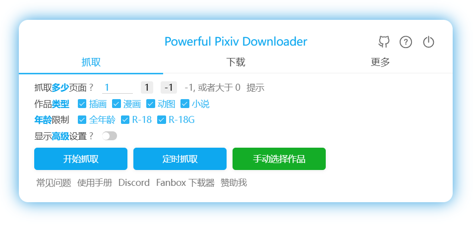
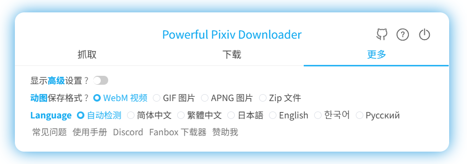
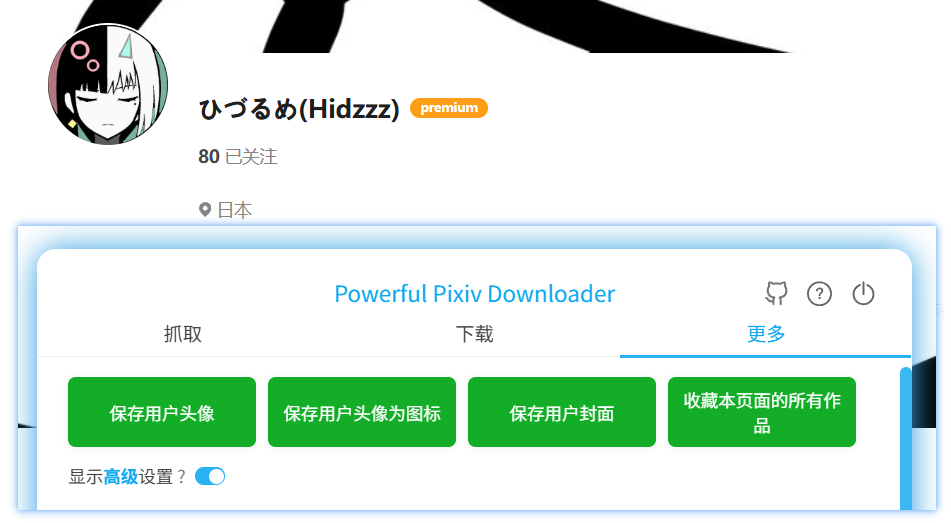
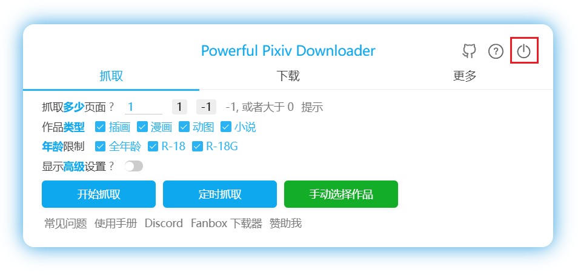

# 了解设置面板

安装本程序后，打开 Pixiv 的网页，可以在右侧看到一个蓝色的按钮：

点击按钮可以打开设置面板，开始抓取和下载。

## 选项卡

设置面板有 3 个选项卡：

### 抓取

可以设置抓取哪些作品，以及设置过滤条件，然后开始抓取。

### 下载

用于设置文件名。当下载就绪时，也可以查看和管理下载状态。

### 更多

这里有许多设置选项，分为：抓取、命名、下载、增强、其他。不过很多选项是默认隐藏的。

另外在有些页面里还会显示一些只能在该页面里使用的按钮，例如在用户主页里有这些按钮：

在收藏（书签）页面、关注的用户页面里也有一些按钮可以使用。

## 开启和关闭设置面板

有多种方法可以开启和关闭设置面板。

1. 点击网页右侧的这个按钮可以打开设置面板。

要关闭设置面板，可以点击它右上角的关闭按钮。

?>当设置面板显示时，点击页面的空白区域也可以关闭它。

2. 点击本扩展的图标可以切换设置面板的打开/关闭状态。

!>如果当前标签页不是 pixiv.net 的网页，那么点击扩展图标是无效的，因为这个扩展只能在 pixiv.net 使用。

3. 键盘快捷键 `Alt` + `x` 可以切换设置面板的打开/关闭状态。
