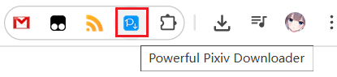

# 了解设置面板

安装本程序后，打开 Pixiv 的网页，可以在右侧看到一个蓝色的按钮：

点击按钮可以打开设置面板，开始抓取和下载。

## 选项卡

设置面板有 3 个选项卡：

### 抓取

你可以设置抓取范围和过滤条件，然后开始抓取。

如果你想查看这个选项卡里的设置项和按钮的说明，可以点击下面的链接：
- [设置-抓取](/zh-cn/设置-抓取)
- [按钮-抓取](/zh-cn/按钮-抓取)

### 下载

你可以在这里设置文件名。当下载就绪时，你也可以查看下载状态。

如果你想查看这个选项卡里的设置项和按钮的说明，可以点击下面的链接：
- [设置-下载](/zh-cn/设置-下载)
- [按钮-下载](/zh-cn/按钮-下载)

### 更多

这里有许多设置选项，分为：抓取、命名、下载、增强、其他。

因为下载器的设置项太多了，所以我在前面两个最常用的标签页里只放了一些必要的设置项，其余的设置项则都放到了这里。

另外当你处于某些页面里时，这个选项卡里还会显示一些功能按钮。

如果你想查看这个选项卡里的设置项和按钮的说明，可以点击下面的链接：
- [设置-更多](/zh-cn/设置-更多)
- [按钮-更多](/zh-cn/按钮-更多)

## 开启和关闭设置面板

有多种方法可以开启和关闭设置面板。

1. 点击网页右侧的这个按钮可以打开设置面板：

点击右上角的关闭按钮则可以关闭设置面板：

另外，当设置面板显示时，你也可以点击页面的空白区域来关闭它。

2. 点击本扩展的图标可以切换设置面板的打开/关闭状态。

!>如果当前标签页不是 pixiv.net 的网页，那么点击扩展图标是无效的，因为这个扩展只能在 pixiv.net 使用。

3. 快捷键 `Alt` + `x` 可以切换设置面板的打开/关闭状态。
