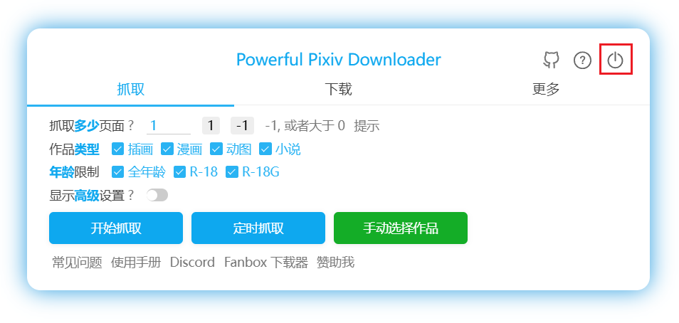
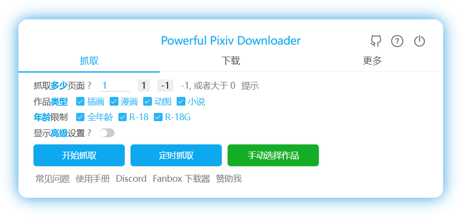
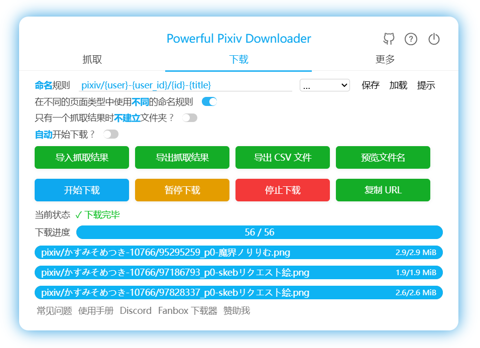
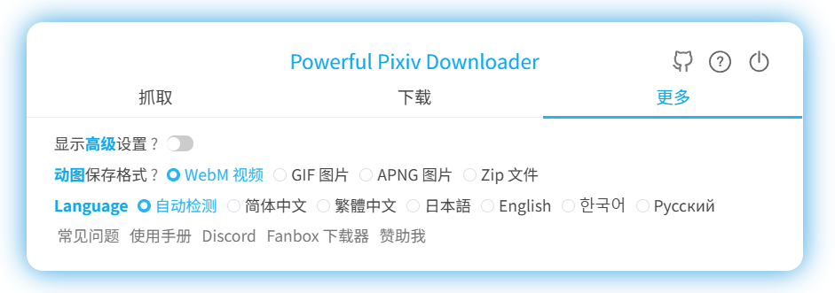
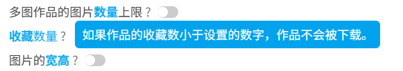

# 了解设置面板

安装本程序后，打开 Pixiv 的网页，可以在右侧看到一个蓝色的按钮：

点击按钮可以打开设置面板，开始抓取和下载。

## 开启和关闭设置面板

有多种方法可以开启和关闭设置面板。

1. 点击网页右侧的这个按钮可以打开设置面板：

点击右上角的关闭按钮则可以关闭设置面板：

另外，当设置面板显示时，你也可以点击页面的空白区域来关闭它。

2. 点击本扩展的图标可以切换设置面板的打开/关闭状态。

!>如果当前标签页不是 pixiv.net 的网页，那么点击扩展图标是无效的，因为这个扩展只能在 pixiv.net 使用。

3. 快捷键 `Alt` + `x` 可以切换设置面板的打开/关闭状态。

## 选项卡

设置面板有 3 个选项卡：

### 抓取

你可以设置抓取范围和过滤条件，然后开始抓取。

如果你想查看这个选项卡里的设置项和按钮的说明，可以点击下面的链接：
- [设置-抓取](/zh-cn/设置-抓取)
- [按钮-抓取](/zh-cn/按钮-抓取)

### 下载

你可以在这里设置文件名。当下载就绪时，你也可以查看下载状态。

如果你想查看这个选项卡里的设置项和按钮的说明，可以点击下面的链接：
- [设置-下载](/zh-cn/设置-下载)
- [按钮-下载](/zh-cn/按钮-下载)

### 更多

这里有许多设置选项，分为：抓取、命名、下载、增强、其他。

因为下载器的设置项太多了，所以我在前面两个最常用的标签页里只放了一些必要的设置项，其余的设置项则都放到了这里。

另外当你处于某些页面里时，这个选项卡里还会显示一些功能按钮。

如果你想查看这个选项卡里的设置项和按钮的说明，可以点击下面的链接：
- [设置-更多](/zh-cn/设置-更多)
- [按钮-更多](/zh-cn/按钮-更多)

## 获取帮助

有些设置的名称后面有一个问号，把鼠标放到名称上就会显示简单的提示，例如：

如果你想查看更详细的说明，可以点击设置项的名字，或者在纯色按钮上长按，下载器就会打开对应的 Wiki 页面。

## 设置的工作原理

**打开标签页时加载设置：**

每当你打开一个 Pixiv.net 的标签页时，下载器都会读取最后一次保存的设置来使用。

**每个标签页里的设置互不影响：**

如果你在标签页 A 里做了一些修改，不会使标签页 B 里的设置发生变化。同样，如果你在 B 里做了修改，也不会使 A 里的设置发生变化。

有时这很有用，例如：
- 有时用户可能希望在不同标签页里使用不同的抓取条件或下载选项，所以每个标签页里的设置不会互相影响。
- 有些标签页里可能已经开始抓取或下载了，它们不该被其他标签页里的修改影响。

**只保存一份设置：**

下载器只会保存一份持久化的设置数据。

虽然你可以打开多个标签页并分别修改成不同的设置，但下载器不会为每个标签页分别保存一份设置。下载器只会储存一份设置。

PS：持久化的设置保存在浏览器扩展专用的本地存储区域里（`browser.storage.local`）。当你移除这个扩展时，浏览器会删除它保存的数据。

**保存最后一次修改的标签页里的设置：**

每当你在一个标签页里修改了设置，下载器就会保存这个标签页里的设置作为最新的设置数据。

如果你打开了多个标签页，并且分别修改了设置，那么最后一次修改是在哪个标签页里发生的，下载器就会保存哪个标签页里的设置。

需要注意的是：下载器保存设置时是以标签页为单位的。前面说过“每个标签页里的设置互不影响”，所以保存设置时也只会保存当前标签页里的设置，不会考虑其他标签页里的设置。

**旧的设置会被覆盖：**

下载器每次保存持久化设置时，都会覆盖之前的设置。有时这可能会让用户困惑。例如：

现在有两个已打开的标签页 A、B，它们使用相同的初始设置。然后你在标签页 A 里修改了选项 A，之后在标签页 B 里修改了选项 B。下载器会先保存标签页 A 的设置，然后保存标签页 B 的设置。

在最新的设置里，没有保存选项 A 的修改，只保存了选项 B 的修改。这是因为最新的设置就是标签页 B 的设置；标签页 A 里所做的修改已经被覆盖了。

**新的设置何时生效：**

当你在一个标签页里修改设置后，其他标签页不会受到影响。之后在之后打开或刷新的标签页才会使用新的设置：
- 打开新的标签页时，下载器会使用最新的设置
- 刷新已打开的标签页时，也会使用最新的设置

**导出设置：**

下载器在“更多”-其他分类里提供了导出和导入设置的功能：[管理设置](/zh-cn/设置-更多-其他?id=管理设置)。

你可以导出设置作为备份，也可以为不同的使用场景导出各自的配置文件，在需要时导入。

导出的设置会保存到一个 JSON 文件里。你可以修改它的文件名。

注意：当你导出设置时，导出的是当前标签页里的设置，而不是下载器储存的唯一一份持久化设置。这意味着，不管最新的设置是否已经发生了变化，你导出时的设置都是当前标签页里所看到的设置。

**导入设置：**

你可以选择下载器导出的设置文件进行导入。导入之后：
- 当前标签页里的设置会变成导入的设置，其他标签页不变。
- 下载器会立即保存导入的设置作为最新的持久化设置数据。之后打开或刷新的标签页会使用这份新的设置数据。
