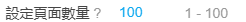

# 使用技巧

## 命名標記

合理使用命名標記或許會對你有幫助。

- 把 `{bmk}` 標記放到檔名的最前面，可以讓下載後的檔案按收藏數排序。 
- 在作品列表頁，推薦使用 `{user}` 做資料夾名字。
- 在 tag 列表頁和搜尋頁，推薦使用 `{p_tag}` 做資料夾名字。
- 在排行榜頁面，可以把 `{rank}` 標記放到檔名的最前面，可以讓下載的檔案的檔案裡裡附帶排名。
- `{p_title}` 是萬能的，所有頁面都可以用。

## 建立資料夾

在命名規則裡使用斜線 `/` ，斜線前面的部分會作為資料夾的名字。如：

`{user}/id`

`{p_title}/{id}-{user}-{tags}`

## 增量更新

所謂增量更新，是指以前下載過畫師/或者某些頁面裡的作品，一段時間後，有了新的作品，想要只下載新的，不再重複下載以前下載過的作品。

### 使用“不下載重複檔案”的功能

現在最新版本已經添加了“不下載重複檔案”的功能，算是某種程度上實現了增量更新。從 6.6.0 版本開始，下載器會儲存下載記錄，如果這個檔案有過下載記錄，以後就可以識別出它是重複檔案，從而避免重複下載。

----------

如果以前你下載過一些檔案，但是沒有下載記錄，那麼可以考慮使用“設定 id 範圍” 或 “設定投稿時間” 的選項。

下面我來舉一些詳細例子。

### 1. 以前下載過某個畫師的圖片，想下載後來新投稿的作品

開啟畫師的作品列表頁面，找到上次下載到的最後一個作品，進入這個作品的頁面，使用按鈕“從本頁開始抓取新作品”，這樣也會只下載新的作品。

你也可以使用 “設定 id 範圍” 或 “設定投稿時間” 選項。

### 2. 以前下載過自己收藏裡的圖片，想下載後來收藏的作品

收藏頁面不太好處理，因為裡面的作品不是按 id 大小排序的，而是按收藏時間排序的。

從第 1 頁往後翻，看看上次下載到了第幾頁。比如上次下載到了第 5 頁，那麼從第 1 頁到第 5 頁裡是後來收藏的作品。

這時候回到第 1 頁，在設定面板裡設定“設定頁面數量”為 5，也就是要下載的頁面範圍。這樣可以只下載新收藏的作品。

### 其他情況

對於有頁碼的頁面，並且作品是按照 id 順序排列的（這表示作品也是按照投稿時間排列的）情況，你既可以使用 “設定 id 範圍” 或 “設定投稿時間” 選項，也可以參考收藏頁面，確定要下載的頁數，設定頁數下載。

- 舉例 設定 id 範圍：

檢查你上次下載的檔案的 id，比如最大的 id 是 65000000，想要下載在它之後投稿的作品，設定 “設定 id 範圍” 大於 65000000，然後開始抓取即可。

- 舉例 設定投稿時間：

如果你下載的檔名裡包含投稿時間，比如上次下載時，最新的投稿日期是 2020 年 1 月 1 日，你可以設定 “設定投稿時間” 的起點為 2020 年 1 月 1 日，終點設定為現在，就可以只下載這段時間裡更新的作品。

## 檔案下載順序

有些頁面裡，下載檔案是有一定的順序的。

- 在搜尋頁面裡，下載器會先下載收藏數高的作品，後下載收藏數低的作品。這樣如果下載中斷，保留下來的是收藏數高的作品。你也可以中途停止下載，只保留收藏數高的作品。
- 在畫師作品列表頁面，會先下載新發布的作品，後下載舊釋出的作品。
- 在收藏頁面，會先下載較早收藏的作品，後下載最近收藏的作品。這樣，下載後把檔案按照下載的時間排序，可以大致和收藏順序保持一致。

## 分批下載

如果你預料到要下載的圖片很多，擔心下載中途會卡住，那麼你可以考慮分批下載。

?>現在有了**斷點續傳**功能，不用擔心這個問題了。

舉個例子，如果你收藏的作品多，那麼在 [收藏頁面](https://www.pixiv.net/bookmark.php) 進行下載時，可能下載幾萬張圖片。為了避免任務卡住，你可以先設定下載一部分，比如每次下載 100 頁：

當你下載完之後，進入書籤第 101 頁，再次向下下載 100 頁。

**提醒：**

你可以在位址列輸入頁碼地址，快速進入指定頁面。形式如：

`https://www.pixiv.net/bookmark.php?rest=show&p=101`

在其他一些列表頁，你也可以同樣嘗試分批下載。

## 注意瀏覽器的資源限制

轉換動圖時，該頁面會佔用較多記憶體和 cpu 資源。如果切換到了其他頁面，導致下載的頁面未啟用，那麼瀏覽器就會限制下載頁面的資源使用，導致轉換和下載變得緩慢。

參考： [保持標籤頁啟用](zh-tw/設定選項?id=保持標籤頁啟用)