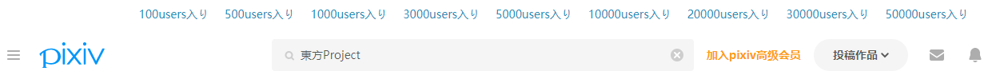
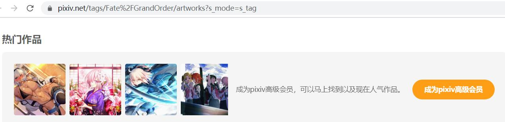
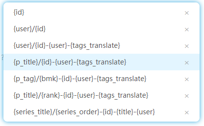

# 便捷功能

## 快速下載

快速下載按鈕可以一鍵下載當前作品。

我們進入一個作品頁面：示例頁面：[小悪魔さん](https://www.pixiv.net/artworks/71475882 ':target=_blank')


因為作品頁面是經常需要進行下載的地方，所以我在右側添加了快速下載按鈕，也就是位於下方的那個按鈕。點選它試試吧。

很快，你會看到瀏覽器開始下載圖片了。

>你可以使用快捷鍵 `Alt` + `Q` 啟動快速下載。

## 快速收藏

作品下方多出了一個五角星：


這個五角星就是**快速收藏**按鈕，它和原來的收藏按鈕有兩個不同：

1. 快速收藏會自動點贊


有時候收藏了一個作品，卻又嫌每次都點贊很麻煩，快速收藏幫您解決這個問題。

?>有時候收藏了卻沒點贊，還會感到愧疚呢！自動感謝太太們，心裡再也沒有壓力。

2. 快速收藏可以幫你新增 tag 列表


tag 指作品下方的這些標籤，它是很有用的，我們可以透過搜尋標籤來尋找自己想要的內容。

Pixiv 的心形收藏按鈕不會幫你新增 tag，但是快速收藏按鈕會自動新增所有的 tag。

你還可以在下載器的設定裡，設定快速收藏功能是否新增 tag、是否公開收藏。

## 圖片檢視器

如果一個作品包含多張圖片，那麼在圖片區域下面會出現一排縮圖，點選它們可以開啟圖片檢視器：


像瀏覽相簿一樣檢視圖片很舒服。

中間顯示的圖片是原圖，下面有個“1:1”按鈕，點選它可以使用全屏模式檢視圖片。

現在還可以在檢視圖片時點選下載按鈕進行下載。

圖片檢視器可以使用的鍵盤操作：

* `ESC` 退出全屏模式；退出檢視器
* `F` 進入全屏模式；退出全屏模式
* `D` 下載當前檢視的作品
* `←` 切換到上一張圖片
* `→` 切換到下一張圖片
* `↑` 放大圖片
* `↓` 縮小圖片

## 在作品縮圖上顯示放大圖示

滑鼠經過作品縮圖時，會在縮圖右上角顯示一個放大圖示，點選可以開啟圖片檢視器，檢視作品的大圖。

你可以在下載期的設定中關閉和調整此功能。

## 快速篩選

在 tag 搜尋頁，如[『東方Project』](https://www.pixiv.net/search.php?s_mode=s_tag&word=%E6%9D%B1%E6%96%B9Project)，



下載器會在頁面頂部新增一些收藏數量的標籤，如下：

```
100users入り 500users入り 1000users入り 3000users入り 5000users入り 10000users入り 20000users入り 30000users入り 50000users入り
```

點選任意一個，就會在當前搜尋的 tag 後面加上收藏數量，檢視收藏數量達到指定要求的作品。例如點選“10000users入り”，會自動搜尋“東方Project 10000users入り”的結果，基本上都是收藏數大於 10000 的作品。

?>用這種方法來查詢作品並不是百分之百準確，可能會有少數不符合要求的作品也被添加了這樣的 tag。儘管如此，這個功能也確實很方便。

## 點選熱門作品



在一些 tag 的搜尋頁面裡會顯示熱門作品。如果你沒有購買 Pixiv 會員，那麼點選這個區域不會進入作品頁面，而是進入了購買會員的頁面。下載器讓你可以直接點選這些作品。

## 給未分類作品新增 tag


在收藏頁面，有一個按鈕“給未分類作品新增 tag”。

如果有一些作品你收藏時沒有新增 tag，此功能可以把作品的 tag 自動新增到收藏裡。

## 批次收藏

在搜尋頁面和畫師頁面裡，下載面板的“其他”選項卡里有一個按鈕，可以批次收藏作品。

## 斷點續傳

下載時如果頁面崩潰或者關閉了頁面，之後可以開啟這個頁面繼續下載。

在首頁，下載面板的“其他”選項卡有一個按鈕，可以清空儲存的斷點續傳的資料。

當你在下載時點選“停止下載”按鈕時，也會清除這個任務的資料，這個任務不會續傳。

## 儲存和載入命名規則


在命名規則設定的區域，你可以看到“儲存”和“載入”兩個按鈕。

- 儲存：儲存當前使用的命名規則。
- 載入：顯示已儲存的命名規則列表。

儲存的命名規則列表如下：



點選已儲存的任意一個命名規則，就可以把它設定為當前使用的命名規則。

你也可以對儲存的命名規則進行刪除。（點選右側的刪除按鈕 `×`）

## 重置設定

在下載面板的底部，有一個“重置設定”按鈕。你可以使用它來重置下載器的所有設定。

## 適應夜間模式

Pixiv 可以使用夜間模式（背景變成黑色）。下載器會自動適應顯示模式的切換。 