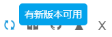

# 如何更新

本程式會從 Github 上檢查新版本。如果有新版本可用，設定面板的右上角會顯示藍色的更新按鈕：

?>由於瀏覽器的應用商店需要稽核，所以當提示有新版本時，應用商店裡可能還是當前版本。在這種情況下，如果你想要使用最新版本的話，請離線安裝新版本。

## 自動更新

從瀏覽器的擴充套件商店裡安裝的擴充套件程式會自動更新。

## 手動更新

手動更新需要下載新版本的安裝包，手動更新。其實就是離線安裝。

1. 開啟本程式的 [GitHub releases 頁面](https://github.com/xuejianxianzun/PixivBatchDownloader/releases ':target=_blank') 。
2. 下載最新版本的第一個 zip 檔案，解壓得到 powerfulpixivdownloader 資料夾。
3. 把 powerfulpixivdownloader 資料夾放到和舊版本相同的位置，覆蓋舊版本的檔案。
4. 重啟瀏覽器。

當你重新開啟瀏覽器時，就可以使用新版本了。