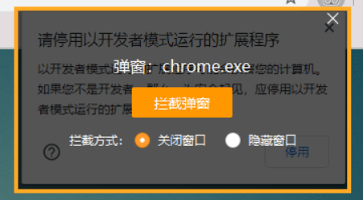

# 常見問題

?>你可以使用瀏覽器的搜尋功能 `F3`，輸入關鍵詞在本頁面上進行查詢。

## 檢查以下資訊

當你遇到問題時，請首先檢查下面的原因：

1. 如果瀏覽器不是 Chrome，請使用 Chrome 瀏覽器。
2. 如果 Chrome 瀏覽器不是最新版本，請更新瀏覽器。
3. 如果本擴充套件程式不是最新版本，請更新到最新版本。最新版本號：
4. 可能是網路連線不暢，請檢查網路連線。國內使用者建議使用梯子，並且使用全域性代理模式。

## 檢查其他原因

1. 如果你不清楚某些功能怎麼使用，請參考本 wiki 裡的相關內容。
2. 檢視 [安裝之後的設定](zh-tw/安裝之後) 頁面，檢查一些原因。
3. 檢視本頁面上的幫助資訊。
4. 如果問題仍然不能解決，請檢視 [聯絡我](zh-tw/聯絡我) 頁面。

-------------

## 怎麼建立資料夾

在命名規則裡使用斜線 `/` ，斜線前面的部分會作為資料夾的名字。

如 `{p_title}/{id}-{tags}-{user}` 會使用頁面標題建立一個資料夾。

## 檔案下載到了哪裡

檔案/圖片儲存位置：下載的檔案儲存在瀏覽器的下載目錄裡。

## 能不能把儲存位置設定到瀏覽器下載目錄之外

不能，這是瀏覽器的限制。

## 下載後的檔名不對

有些使用者可能看到下載後的檔名是一串不知道什麼意思的字元，類似這樣：

```
7dc64752-0616-448d-99ce-4676c501b503.png
e3852d43-4a9f-4156-abda-544eff38ce3f.jpg
```

這是因為有其他擴充套件程式造成了干擾，如果有某些擴充套件程式會管理瀏覽器的下載，請在下載時禁用這些擴充套件。

如果你不確定是哪個擴充套件程式導致的這個問題，可以依次禁用，嘗試找到它。

一般這些擴充套件程式是有下載檔案功能的、或者截圖的、或者是下載軟體的擴充套件程式。

## 是否支援斷點續傳

支援斷點續傳。下載時如果頁面崩潰或者關閉了頁面，之後可以開啟這個頁面繼續下載。

## 怎麼不下載重複檔案

怎麼不下載以前已經下載過的作品？

啟用選項“不下載重複檔案”。可檢視  [不下載重複檔案](/zh-tw/設定選項?id=不下載重複檔案) 部分。

在某些情況下，你也可以考慮使用增量更新，避免下載以前下載過的檔案。可檢視“使用技巧”頁面的“增量更新”部分。

## 下載很慢

下載慢、下載沒速度怎麼辦？

這主要是國內使用者會遇到的問題，推薦使用靠譜的代理/翻牆軟體，比如 ssr、v2ray、clash 等，使用穩定的路線。並且代理規則選擇**全域性代理**。（**開啟全域性代理可以提高下載速度**）

還有另一個辦法，就是用“複製 url”功能複製圖片網址，使用迅雷、IDM 等軟體下載。但是這些軟體下載時無法對檔案重新命名。

## 動圖下載很慢

動圖下載慢首先請參考上一條。另外動圖下載慢有時候也是正常的。

1. 動圖的體積本身就很大，下載會慢一些、
2. pixiv 動圖的本質是 zip 檔案。如果選擇了動圖儲存格式為“webm”或者“APNG”或者“gif”，那麼下載器還會對 zip 檔案進行轉碼，這也會花費一些時間。

## 任務卡住怎麼辦

這一般是網路問題，網路情況越差，越容易遇到這個問題。

如果你在擷取任務時就卡住，可以嘗試等待一段時間，看過一段時間之後是否能夠繼續擷取。如果不能，建議重新整理頁面重新擷取。

如果在下載時卡住，可以先暫停任務然後點選開始下載；或者關閉頁面，之後再開啟進行下載，因為本程式支援斷點續傳。

?>如果你的網路情況比較差，可以把下載執行緒設定的小一些，減小卡住的機率。

## 下載卡住時會自動重試嗎

會。

當網路狀況較差時，下載可能會因為超時或者網路斷開而卡住。本程式會自動重試下載出錯的檔案。

## 一直卡住，無法下載到任何圖片

首先檢查網路問題，如果網路沒問題（可以正常訪問 Pixiv，網速也很快），那麼你可以檢查一下系統盤（一般是 C 盤）剩餘空間。

如果系統盤剩餘空間比較小，Chrome 可能會阻止一些較大的 xhr 請求，導致下載一直失敗。請清理一下空間再嘗試下載。這個原因是由 Reinford 找出來的。

*備註：在這種情況下，Chrome 不會阻止 fetch 請求*

## 下載進度條變成紅色是怎麼回事

這表示這個進度條上的檔案下載出現了錯誤，下載器會嘗試重新下載它。

你不需要做出處理。

## 下載失敗：USER_CANCELED

如果出現這樣的錯誤提示，注意有沒有出現另存為對話方塊。如果有，參考下一條。如果沒有，請檢視“聯絡我”頁面，報告問題。

## 下載時彈出另存為對話方塊

請確認你在瀏覽器設定裡**關閉**了“下載前詢問每個檔案的儲存位置”。

如果關閉了這個選項，仍然會出現另存為對話方塊，原因是下載的檔案裡有重複的檔名。如果帶 `{id}` 標記應該不會重名，其他時候記得帶序號。比如作品 id 78279423，有三張圖片，`{id}` 標記會帶序號，這樣就不會重名：

```
78279423_p0.jpg
78279423_p1.jpg
78279423_p2.jpg
```

如果不帶序號，就會重名：

```
78279423.jpg
78279423.jpg
78279423.jpg
```

當命名規則裡沒有 `{id}` 或者 `{p_num}`，則要留意是否會出現重名問題。

## 為什麼在搜尋頁面不會自動開始下載

你可以關閉“預覽搜尋頁面的篩選結果”，並且啟用“自動開始下載”，這樣就可以自動開始下載了。

為什麼啟用了“預覽搜尋頁面的篩選結果”就不會自動開始下載了呢？請檢視這個選項的說明。

[預覽搜尋頁面的篩選結果](zh-tw/設定選項?id=預覽搜尋頁面的篩選結果)

## 離線安裝之後，瀏覽器啟動時會出現提示

如果你離線安裝了本程式，當瀏覽器啟動時，可能會在右上角提示：請停止以開發者模式執行的擴充套件程式。


>Chrome 84 版本之後沒有這個彈窗了。但是 Edge 瀏覽器目前還有。

如果你想消除這個提示，以下提供一些辦法：

1. 如果你安裝有火絨防毒軟體，你可以使用它的遮蔽彈窗功能，遮蔽這個彈窗。



注意只選擇這個彈窗，不要把整個 chrome 都遮蔽了。

來源：[一屆書生](https://www.cnblogs.com/52dxer/p/11067617.html ':target=_blank')

*線上安裝本擴充套件不會出現彈窗警告。*

## Date format error!

如果啟用了選項“設定投稿時間”，需要輸入起始時間和結束時間。

如果輸入的時間不能被解析為有效的時間，就會出現警告資訊：`Date format error!`

## 無權訪問某個作品

這是因為在獲取某個作品時出現了無法處理的錯誤，附帶作品 id。

這是一個網路請求的錯誤，可能這個作品是私密的作品，或者只是單純的網路問題。

你可以開啟這個 id 的作品頁面，如果它是正常的，你可以在這個頁面直接下載它。

## 下載（抓取）按鈕不顯示

這可能是某些設定項的值有誤，導致下載器出錯。

你可以嘗試開啟下載面板-“其他”選項卡-管理設定-重置設定，然後重新整理頁面。

## 如何下載 ID 列表

如果你有作品的 id 列表，想根據 id 列表進行下載，需要開啟 Pixiv 主頁，然後開啟下載器面板，可以看到這個按鈕：

*輸入id進行抓取*

點選這個按鈕會出現一個輸入框，把 id 列表複製進去就可以開始抓取了。