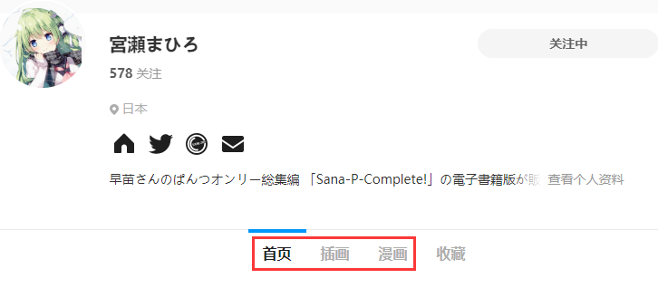
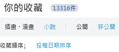
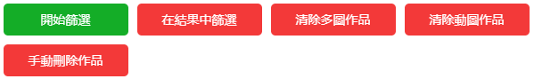

# 擷取按鈕

啟動擷取或篩選的按鈕。不同的頁面可能有不同的按鈕。

## 手動選擇作品

在大多數頁面裡都有這個按鈕。你可以手動選擇頁面上的任意作品進行下載。（這個按鈕對應的快捷鍵是 `Alt + S`）。

進入選擇模式之後，會出現一個指示圖示，跟隨你的滑鼠指標。在作品上點選滑鼠，就可以選擇這個作品。被選擇的作品上會被新增一個標記。

進入選擇模式之後，還會顯示一些新的控制按鈕。

你可以暫停選擇、繼續選擇。

當你選擇完畢之後，點選“抓取選擇的作品”按鈕進行擷取。

你可以點選“清空選擇的作品”以開始一次新的選擇。

**提示：**

- 你可以透過“暫停選擇”、“繼續選擇”來進行多次選擇，也可以在進入其他頁面後繼續選擇。
- “擷取選擇的作品”按鈕會顯示選擇的作品數量。
- 下載器的過濾條件對手動選擇的作品也會生效。所以你選擇的某些作品可能不會被下載。
- 為防止誤操作（因為點選作品連結會進入作品頁面），進入選擇模式之後，滑鼠點選作品是不會進入作品頁面的。如果你想進入作品頁面，可以選擇：1. 開啟滑鼠右鍵選單，選擇“在新標籤頁開啟連結”；2. 點選“暫停選擇”按鈕（或按 `Esc` 鍵），停止選擇作品。
- 當你進入其他頁面時，**可能**會丟失選擇的作品列表(*)。這時下載器會讓瀏覽器提示你是否要離開此頁面。如果你選擇離開，就會丟失擷取的作品列表。

(*) 有時候進入某些頁面是不需要重新載入網頁的（瀏覽器的重新整理按鈕不會變化），這種情況下不會丟失已選擇的作品。如果需要重新載入網頁（瀏覽器的重新整理按鈕會發生變化），則會丟失已選擇的作品。

## 首頁

### 輸入id進行擷取

Pixiv 的首頁內容繁雜，因此本程式不能直接下載主頁上的內容。在首頁裡只有一個擷取按鈕：輸入id進行擷取。

點選它之後，會出現一個輸入框，可以輸入或者貼上作品的 id：

如果有多個作品 id，用換行（回車鍵）分割，每行一個 id。

輸入之後，再次開啟設定面板，就可以對輸入的 id 進行下載。

>?此功能並不常用，但有時候很有用，因為它不需要先進入作品頁面就可以進行下載。如果你有一些 id 列表，這樣下載會更便捷。

**注意：**

當你在小說的首頁 [https://www.pixiv.net/novel/](https://www.pixiv.net/novel/) 輸入 id 時，本程式會把 id 當作小說的 id。

在圖片的首頁，本程式會把 id 當作圖片的 id。

### 抓取 id 範圍

在 Pixiv 首頁可以看到這個抓取按鈕。

你可以設定一個作品 id 範圍，抓取此範圍內的所有作品（包含開始和結束的 id）。

建議一次不要抓取超過 100,000 個 id。（雖然你可以設定更多，但是不推薦那樣做）。

**注意：**

1. 如果一次任務中產生的抓取結果數量太多，可能會因為記憶體使用量太多而導致頁面崩潰。如果你設定了很多 id，請考慮使用過濾條件進行過濾，以減少抓取結果的數量。
2. 當抓取數量太多時，瀏覽器對網路請求的處理會逐漸變慢。即使網路請求的耗時沒有變，但是隨著抓取數量的增加，瀏覽器對網路請求的處理速度會越來越慢，所以不要一次任務中抓取太多 id。
3. 如果一次任務中抓取了太多 id，在抓取完成之後，下載器**可能**不會自動進入下載流程。你可以匯出抓取結果，然後重新整理頁面，匯入抓取結果，然後開始下載。

>這個功能是對“輸入id進行抓取”的補充。在你需要抓取許多 id 的時候（如 5,000,000 個），使用“輸入id進行抓取”需要使用者先生成 id 列表，然後貼上到 id 列表輸入框裡。這樣很不方便，所以我添加了抓取 id 範圍的功能。

## 作品頁面

### 從本頁開始擷取新作品

可以下載本頁作品，以及比本作品更新的作品。

新作品指的是投稿時間比當前作品更晚的作品。在作品頁面裡，它們位於當前作品的左邊。

你可以透過“設定作品數量”的選項，設定下載多少個作品（含本頁作品）。預設值的 -1 可以下載本頁和更新的所有作品。

### 從本頁開始擷取舊作品

可以下載本頁作品，比本作品更早期的作品。

舊作品指的是投稿時間比當前作品更早的作品。在作品頁面裡，它們位於當前作品的右邊。

你可以透過“設定作品數量”的選項，設定下載多少個作品（含本頁作品）。預設值的 -1 可以下載本頁和更早期的所有作品。

### 擷取相關作品

相關作品指的是作品頁面底部的“相關作品”部分。

你可以透過“設定作品數量”的選項，設定下載多少個相關作品。預設值 -1 可以下載所有的相關作品。

?>相關作品最多有 180 個。

## 作品列表頁

示例頁面：[宮瀬まひろ](https://www.pixiv.net/member.php?id=544479)

畫師的首頁、插畫作品列表、漫畫作品列表、小說作品列表都是“作品列表頁”。

### 開始擷取

在這些頁面裡，可以透過“開始擷取”按鈕啟動任務。

本程式從目前頁面一直向下一頁擷取。擷取頁數可以透過“設定頁面數量”選項進行設定。預設值 -1 會向下擷取所有頁面。

?>在作品列表頁，本程式會按照作品 id 從大到小下載，也就是先下載近期作品，後下載早期作品。

## 收藏頁面

你可以下載其他人收藏的公開作品，以及自己收藏的所有作品。

### 開始擷取

本程式從目前頁面一直向下一頁擷取。擷取頁數可以透過“設定頁面數量”選項進行設定。預設值 -1 會向下擷取所有頁面。

!>在下載頁面裡，本程式的擷取不受排序方式的影響。

在自己的收藏頁面裡可以修改排序方式：

**但這對本程式無效。** 本程式擷取收藏作品時，始終按照預設的順序（即 收藏順序↓，按收藏時間倒序排列）。

?>在收藏頁面，本程式下載作品時，會按照收藏順序下載作品。也就是先下載最早收藏的，後下載最晚收藏的。這是因為有使用者提出，想讓下載順序和收藏順序一致，這樣，下載後，在資源管理器裡以時間排序，就可以以收藏順序來檢視圖片。

### 擷取推薦作品

擷取收藏頁面底部的推薦作品。

?>因為推薦作品是滾動載入的，不會一次全部載入，所以本程式只下載已經加載出來的作品。

## 系列小說頁面

示例頁面：[https://www.pixiv.net/novel/series/1090654](https://www.pixiv.net/novel/series/1090654)

### 擷取系列小說

自動擷取該系列內的所有小說。

## 搜尋頁

搜尋頁是指搜尋某個 tag 的頁面。

示例頁面：[Fate/GrandOrder](https://www.pixiv.net/search.php?s_mode=s_tag&word=Fate%2FGrandOrder)

**提醒：**

1. 搜尋頁裡有“快速篩選”功能，詳情請參考前面的“便捷功能”條目。
2. 如果啟用“預覽搜尋頁面的篩選結果”選項，下載器會把擷取到的符合要求的作品顯示在頁面裡，方便檢視。
3. 在搜尋頁，本程式會按照作品的收藏數，從高到低下載。也就是優先下載收藏數高的作品。
4. 搜尋頁最多有 1000 頁。
5. 搜尋頁推薦使用 `{p_tag}` 作為資料夾名字。

### 開始篩選

本程式從目前頁面開始擷取作品（含目前頁面）。擷取的頁數可以透過“設定頁面數量”選項進行設定。預設值 -1 會向下擷取所有頁面。

擷取完成後，下載器會把作品按照收藏數量從高到低排序。

### 在結果中篩選

當第一次擷取完成之後，你可以改變設定選項，然後點選此按鈕，從之前的擷取結果中刪除不符合條件的作品。

### 其他按鈕

請參考本頁面的“刪除作品的按鈕”部分。

## 地區排行榜

示例頁面：[北海道 排行榜](https://www.pixiv.net/ranking_area.php?type=state&no=0)

地區排行榜是時代的眼淚，曾經它在首頁右側的排行榜佔有一席之地，後來被移除了，只能透過網址進入。

### 下載本頁作品

此頁面只有 50 個作品，也只有一個按鈕——“下載本頁作品”。

## 排行榜

示例頁面：[綜合今日排行榜](https://www.pixiv.net/ranking.php)

### 擷取本排行榜作品

下載本排行榜作品。

你可以設定下載的作品數量，這會根據排名順序下載指定數量的作品。

?>你可以使用 `{rank}` 標記儲存作品的排名。

### 擷取首次登場作品

只下載本排行榜裡“首次登場”的作品。（初登場、Debut）

>有一些頁面沒有“首次登場”的標誌，此時這個按鈕應該不會顯示。

?>如果某一天你下載了今天排行榜的全部作品，之後每天都只需要再下載“首次登場”的作品就行了。

## pixivision

pixivision 是一個單獨的網站。本程式可以下載 pixivision 網站上的插畫、漫畫、cosplay 頁面。

示例頁面：[衣服下襬打結的插畫特輯](https://www.pixivision.net/zh/a/4537)

?>因為這是單獨的網站，獲取作品資訊不方便，所以這個頁面上少了很多的設定項。

### 擷取該頁面的圖片

下載該頁面的所有圖片。

!>pixivision 裡，檔名標記只有 `{p_title}` 和 `{id}` 會生效。

## 新增收藏後的頁面

示例地址：[✿❀✿❀](https://www.pixiv.net/bookmark_detail.php?illust_id=63148723)

當你收藏作品時，在編輯了它的 tag 之後會看到這個頁面。不過這個也是時代的眼淚了，現在正常使用 Pixiv 應該很難看到這個頁面了。

這個頁面可以下載一些相似作品。相似作品和作品頁面下方的相關作品類似，但它們有一些區別：

- 相似作品可以獲取很多個，比如 1000 個，相關作品只有 180 個。
- 相似作品的功能出現得很早，相關作品的功能出現的晚。

### 擷取相似圖片

擷取此頁面下方的相似圖片。

## 大家/關注的新作品

示例頁面：

[大家的最新作品](https://www.pixiv.net/new_illust.php)

[關注的新作品](https://www.pixiv.net/bookmark_new_illust.php)

### 開始擷取

從本頁開始下載作品。

## 發現頁面

[進入發現頁面](https://www.pixiv.net/discovery) 

發現頁面也是時間的眼淚了，現在沒有入口，只能透過網址進入。

在發現頁面裡， Pixiv 會根據你的收藏，推薦一些你可能會喜歡的作品。

### 擷取目前作品

下載目前頁面上的已有作品

?>因為每次獲取的資料都是不同的，所以為了保持使用者下載到的作品和看到的作品一致，本程式只會下載發現頁面的已有作品，不會自動擷取新的作品。

### 其他按鈕

請參考本頁面的“刪除作品的按鈕”部分。

## 關注 頁面

關注頁面也就是 following 頁面，這個頁面裡顯示的是你關注的所有使用者。

從這個頁面裡，你還可以進入好友頁面、粉絲頁面。這些頁面都可以進行擷取。

### 開始擷取

點選“開始擷取”按鈕，即可一鍵擷取所有使用者的所有作品。

下載器會根據你所在的頁面，擷取對應的使用者。

- 在關注頁面裡，會擷取你關注的使用者。
- 在好友頁面裡，會擷取你的好友。
- 在粉絲頁面裡，會擷取你的粉絲。

?>如果要擷取的使用者很多，擷取可能需要花費很久的時間。

### 下載使用者列表

這會擷取當前頁面型別裡的使用者列表，並且儲存到一個 CSV 檔案裡。（擷取數量取決於你設定的頁數；每一頁最多有 24 個使用者）。

?>使用這個模式，下載器會擷取使用者列表，輸出 CSV 檔案。不會擷取作品詳情。

-----------

## 刪除作品的按鈕

### 清除多圖作品

清除頁面上的多圖作品

### 清除動圖作品

清除頁面上的動圖作品

### 手動刪除作品

你可以手動刪除你不喜歡的作品，這樣就不會下載它。

按下此按鈕就會進入手動刪除模式，點選作品就可以把它從作品列表裡刪除。

再次點選此按鈕，可以退出手動刪除模式。