# 設定選項

有一些選項帶有一個問號，把滑鼠放到這些設定項上會有簡單的提示：


?>在不同的頁面，顯示的選項可能會有所不同。

## 設定作品數量

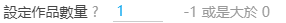

某些頁面的下載以作品為單位，所以會顯示這個設定。它可以設定你要**下載多少個作品**。

>預設值的 -1 表示不限制抓取數量

> 一個作品裡可能有多張圖片

?>設定項右側的灰色文字，提醒你可以輸入的數字的範圍。在不同的頁面裡，這些提示可能不同。

## 設定頁面數量

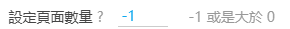

當你處於**列表頁**時，會看到這個設定。你可以設定你要**下載多少頁**。

>預設值的 -1 表示不限制抓取數量

?>列表頁的下載是向下抓取的，例如你處於第 10 頁，就會從第 10 頁開始下載，而不是從第一頁開始下載。

## 下載作品類型

作品類型選項用來設定你想要下載的作品類型。未被勾選的作品類型不會被下載。

----------


?>這些類型是畫師為作品選擇的分類，分為插畫、漫畫、動圖小說。

----------


單圖作品指只有一張圖片的作品。多圖作品是指包含有多張圖片的作品。

----------


設定下載彩色圖片和（或）黑白圖片 。

如果你設定了過濾彩色或黑白圖片，過濾器會檢查圖片的平均顏色，判斷這個圖片是彩色的還是黑白的。

下載器在抓取時和下載時都會進行此項檢查。

?>有些圖片雖然大部分是黑白的，但還是帶有一些彩色，這樣的圖片是彩色圖片，不屬於黑白圖片。

?>如果你過濾了某種顏色的圖片，那麼在下載過程中，你可能會看到頁面頂部有提示：因為顏色設定，沒有儲存某個檔案。這是因為一個作品可能有多張圖片，並且第一張圖片的顏色可能和其後的圖片的顏色不同。在抓取時，下載器只會檢查第一張圖片，檢查透過的話，就會下載這個作品的所有圖片。之後在下載檔案時，下載器會對後面的所有圖片進行檢查，如果發現後面的圖片不符合要求，就不會下載它。

## 多圖下載設定


你可以只下載多圖作品的前幾張圖片。

有多張圖片的作品，經常只有第一張是最有價值的。例如，很多作品第一張圖是彩色的，後面是未上色的。或者第一張圖是很精緻的，後面的圖不夠精緻。這時候就可以設定你想要的數字，只下載前面幾張。

?>如果設定的數字大於作品的圖片數量，將會全部下載。等同於沒有限制數量。

## 設定收藏數量

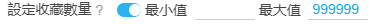

收藏數量，指的是有多少個人收藏了這個作品。收藏的人數越多，說明作品的價值越高。

你可以只設置最小值、或者只設置最大值、或者同時設定兩者。

如果你不需要設定某個值，將它留空即可。

?>判斷條件裡包含等於。例如設定最小收藏數量為 500，那麼作品達到 500 收藏就透過，而不是 501。

## 只下載已收藏


如果啟用這個設定，那麼下載器只會下載被你收藏的作品。

## 設定寬高條件


圖片具有寬度（width）和高度（height）。這個選項設定你想要下載的作品的寬高條件，不符合此條件的作品不會下載。

**提示：**

- 要求圖片的寬高 `>=` 或者 `=` 或者 `<=` 你設定的值。
- 第一個輸入框設定寬度，第二個輸入框設定高度。
- 選擇 “and”，表示圖片的寬高要同時符合設定的寬高。
- 選擇 “or”，表示圖片的寬高要只需要符合寬高設定中的任意一個。
- 預設值都是 0，表示不限制。

?>例如，我們可以設定 `>= 1920 and 1080` 來篩選適合做電腦桌布的圖片。

## 設定寬高比例


你可以設定下載指定形狀的作品。

橫圖的寬度大於高度。豎圖的寬度小於高度。寬度除以高度得到的數字是“寬高比”。

**提示：**

- 寬高比小於 1 時，圖片是豎圖。寬高比大於 1 時，圖片是橫圖。寬高比越大，圖片越顯得扁長。
- 如果你想下載寬高相等的圖片（正方形），可以設定寬高比為 1.

## 設定 id 範圍

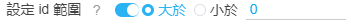

你可以設定只下載大於某個 id 的作品，或者小於某個 id 的作品。

?>作品的 id 是遞增的，越早投稿的作品 id 越小。

這有助於進行增量更新。例如：

上次下載的檔案裡，最大的 id 是 65000000，想要下載在它之後投稿的作品，可以設定 id 範圍大於 65000000，然後開始抓取。

## 設定投稿時間


你可以設定只下載某個時間範圍裡投稿的作品。

這有助於進行增量更新。例如：

上次下載的檔案的截至日期是 2020 年 1 月 1 日，當你在同一頁面再次下載時，你可以設定投稿時間的起點為 2020 年 1 月 1 日，終點為現在，就可以只下載這段時間裡更新的作品。

## 必須含有 tag

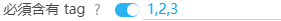

你可以設定下載的作品裡必須包含某些 tag。沒有這些 tag 的作品不會被下載。預設為空。

**提醒：**

- 你可以新增多個 tag，中間用**英文逗號**分割。結尾處不用加逗號。
- **不區分大小寫**。
- tag 是嚴格的**全字匹配**。例如你設定了“東方Project”，而某個作品的 tag 裡只有“東方”，那麼它是不符合條件的。反過來也是如此。
- 如果設定了多個 tag，那麼作品必須**全部包含**這些 tag，才會被下載。如果作品只符合其中的部分 tag，那麼它不會被下載。
- 推薦使用日文（原本的）tag。不推薦使用翻譯後的 tag。

## 不能含有 tag


你可以設定下載的作品裡不能包含某些 tag。如果作品有某個 tag 符合此條件，那麼它不會被下載。預設為空。

**提醒：**

- 你可以新增多個 tag，中間用**英文逗號**分割。結尾處不用加逗號。
- **不區分大小寫**。
- tag 是嚴格的**全字匹配**。
- 如果設定了多個 tag，那麼作品**只要符合其中任意一個**，就不會被下載。
- 不能含有 tag 的優先順序比 必須含有 tag 高。如果一個作品符合“必須含有 tag”的條件，也符合“不能含有 tag”的條件，那麼它不會被下載。
- 推薦使用日文（原本的）tag。不推薦使用翻譯後的 tag。

圖中的 tag 是我自己常用的排除列表，主要排除腐向作品。如下：

```
落描き,講座,BL,腐,ホモ,腐向け,腐向けHQ,Free!,腐ree!,BL松,刀剣亂舞,刀剣亂腐,黒子のバスケ,鬼燈の腐向け,創作BL,◆A【腐】
```

附帶群內大佬提供的一個更加全面的列表，主要排除了腐向、講座、素材的標籤：

```
A腐リー,A腐リー1000users入り,BL,BLACKLAGOON,BLEACH,BLEACH1000users入り,BLEACH100users入り,BLEACH500users入り,BL松,BL松10000users入り,BL松1000users入り,BL松100users入り,BL松5000users入り,BL松500users入り,BL松派生,DBH【腐】,FGO(腐),Fate(腐),Fate(腐)1000users入り,Fate(腐)100users入り,Fate(腐)500users入り,Fate/GO(腐),Fate/GO(腐)10000users入り,Fate/GO(腐)1000users入り,Fate/GO(腐)100users入り,Fate/GO(腐)5000users入り,Fate/GO(腐)500users入り,Fate/GrandOrder(腐),Fate/Zero(腐),Fate/Zero(腐)1000users入り,Fate/zero(腐),HUNTER×HUNTER,HUNTER×HUNTER1000users入り,HUNTER×HUNTER100users入り,HUNTER×HUNTER500users入り,H×H【BL】1000users入り,H×H【腐】,JOJO【腐】,JOJO【腐】1000users入り,JOJO【腐】100users入り,JOJO【腐】250users入り,JOJO【腐】3000users入り,JOJO【腐】5000users入り,JOJO【腐】500users入り,K(腐),K(腐)/1000users入り,K(腐)/100users入り,K(腐)/500users入り,NARUTO,NARUTO10000users入り,NARUTO1000users入り,NARUTO100users入り,NARUTO5000users入り,NARUTO500users入り,NARUTO【腐】,NARUTO【腐】,NARUTO【腐】1000users入り,NARUTO【腐】1000users入り,NARUTO【腐】100users入り,NARUTO【腐】100users入り,NARUTO【腐】500users入り,NARUTO【腐】500users入り,ONEPIECE,TF腐向け,TIGER&BUNNY,YOI【腐】,dcst腐向け,futa,futanari,hrak【腐】,hrak【腐】10000users入り,hrak【腐】1000users入り,hrak【腐】100users入り,hrak【腐】3000users入り,hrak【腐】5000users入り,hrak【腐】500users入り,pkmn腐,pkmn腐1000users入り,pkmn腐5000users入り,◆A【腐】,◆A【腐】1000users入り,◆A【腐】100users入り,◆A【腐】500users入り,【玉鋼學園】男子生徒,【腐】A/Z,あんさんぶるスターズ,あんさんぶるスターズ!,あんさん腐るスターズ!,うたの☆プリンスさまっ♪,うた腐り,うた腐リ,おそ松,おそ松(長男),おそ松さん,おそ松さん10000users入り,おそ松さん1000users入り,おそ松さん100users入り,おそ松さん5000users入り,おそ松さん500users入り,おそ松兄さんマジ兄さん,おそ松総受け,なにこれイケメン,なにこれ男の子かわいい,ふた×男,ふたなり,ふたなりっ娘にお尻掘られたい,ふたゆり,まじコナ腐10000users入り,まじコナ腐1000users入り,まじコナ腐100users入り,まじコナ腐3000users入り,まじコナ腐5000users入り,まじコナ腐500users入り,まじコナ腐向け,アイドリッシュセ腐ン,アルミン・アルレルト,イケメン,イズ(仮面ライダーゼロワン),イナイレ[腐],イナギャラ[腐],イナゴ[腐],イナズマイレブン,イナズマイレブンGO,イナズマイレブンGOギャラクシー,イナズマイレブンGOクロノ・ストーン,イメージレスポンス用素材,エムマス【腐】,エムマス【腐】100users入り,オリジナルBL,カゲロウプロジェクト,カゲ腐ロ,ガチホモ,グラ腐ル,グラ腐ル1000users入り,グラ腐ル100users入り,グラ腐ル500users入り,ケモホモ,サ腐マス,シーメール,ジョジョ,ジョジョ10000users入り,ジョジョ1000users入り,ジョジョ100users入り,ジョジョ250users入り,ジョジョ5000users入り,ジョジョ500users入り,ジョジョの奇妙な冒険,ジョジョパロ,ジョジョ立ち,ス腐ラトゥーン,ダイヤのA,ダン戦[腐],ツイ腐テ,ツイ腐テ1000users入り,ツイ腐テ5000users入り,テイルズ【腐向け】1000users入り,テイルズ【腐向け】100users入り,テイルズ【腐向け】500users入り,テニスの王子様,テニ腐リ,テライケメン,ディズニー,ディズニー1000users入り,ディズニー100users入り,ディズニー5000users入り,ディズニー500users入り,デジモンアドベンチャー,ハイキュー,ハイキュー!!,ハイキュー!!10000users入り,ハイキュー!!1000users入り,ハイキュー!!100users入り,ハイキュー!!5000users入り,ハイキュー!!500users入り,ハリー・ポッター,ハンター,ハンターハンター,パンツ男子,ヒプノシスマイク,ヒロアカ【腐】,ヒ腐マイ,ヒ腐マイ10000users入り,ヒ腐マイ1000users入り,ヒ腐マイ100users入り,ヒ腐マイ5000users入り,ヒ腐マイ500users入り,ピカチュウ,ピクファンイケメン,フリー素材,フリー素材10000users入り,フリー素材1000users入り,フリー素材100users入り,フリー素材5000users入り,フリー素材500users入り,ブラシ素材,ヘタリア,ヘタリア10000users入り,ヘタリア1000users入り,ヘタリア100users入り,ヘタリア5000users入り,ヘタリア500users入り,ヘタリアMMD,ヘタリア★ハロウィン,ヘタリア三次創作,ヘタリア杯,ホモ,ホモと野獣,メイド少年,メガネ男子,メス男子,モンスターハンター,モンスターハンターワールド,モンハン,モンハン1000users入り,モンハン100users入り,モンハン500users入り,モンハンどうでしょう,モ腐サイコ100,モ腐サイコ1000users入り,モ腐サイコ100users入り,モ腐サイコ500users入り,ユーリ!!!onICE,リヴァイ班,ワートリ【腐】,ワートリ【腐】1000users入り,ワートリ【腐】100users入り,ワートリ【腐】500users入り,ヴァンガ【腐】,一撃男【腐】,一撃男【腐】1000users入り,一撃男【腐】100users入り,一撃男【腐】500users入り,一方通行,仮面ライダー,仮面ライダー1000users入り,仮面ライダー100users入り,仮面ライダー500users入り,仮面ライダー555,仮面ライダーOOO,仮面ライダーW,仮面ライダーウィザード,仮面ライダーエグゼイド,仮面ライダーオーズ,仮面ライダークウガ,仮面ライダーゴースト,仮面ライダージオウ,仮面ライダーゼロワン,仮面ライダーディケイド,仮面ライダードライブ,仮面ライダービルド,仮面ライダーフォーゼ,仮面ライダー剣,仮面ライダー鎧武,仮面ライダー電王,仮面ライダー龍騎,僕のヒーローアカデミア,僕のヒーローアカデミア10000users入り,僕のヒーローアカデミア1000users入り,僕のヒーローアカデミア100users入り,僕のヒーローアカデミア5000users入り,僕のヒーローアカデミア500users入り,兄貴,冥腐ヘヨゥコソ!,冨岡義勇,刀剣亂腐,刀剣亂腐10000users入り,刀剣亂腐1000users入り,刀剣亂腐100users入り,刀剣亂腐3000users入り,刀剣亂腐5000users入り,刀剣亂腐500users入り,刀剣亂舞,刀剣亂舞10000users入り,刀剣亂舞1000users入り,刀剣亂舞100users入り,刀剣亂舞3000users入り,刀剣亂舞5000users入り,刀剣亂舞500users入り,創作BL,創作BL10000users入り,創作BL1000users入り,創作BL100users入り,創作BL3000users入り,創作BL5000users入り,創作BL500users入り,創作男女,創作男女10000users入り,創作男女1000users入り,創作男女100users入り,創作男女5000users入り,創作男女500users入り,動物,動物の仔,名探偵コナン,商業BL,善炭,土方十四郎,土方歳三,土方歳三(Fate),地獄の仮面ライダー,地縛少年花子くん,夏目友人帳,夏目友人帳1000users入り,奧村燐,女裝少年,女裝男子,宇善,宇宙兄弟,家庭教師ヒットマンREBORN!,小説用フリー素材,少年,弱蟲ペダル,弱蟲ペダル10000users入り,弱蟲ペダル1000users入り,弱蟲ペダル100users入り,弱蟲ペダル5000users入り,弱蟲ペダル500users入り,弾丸論破【腐】,心象風景,忍玉-腐,忍玉-腐1000users入り,忍玉-腐100users入り,忍玉-腐5000users入り,忍玉-腐500users入り,忍玉‐腐,愛がなきゃ描けない,戦國BASARA,戦國BASARA1000users入り,戦國BASARA100users入り,戦國BASARA3,戦國BASARA500users入り,描き方,文アル【腐】,文スト【腐】,文スト【腐】1000users入り,新弾丸論破V3【腐】,新弾丸論破V3【腐】1000users入り,東京腐種,東京腐種1000users入り,東方舊作,東方耽美郷,東方集合絵,架空動物種,殘念なイケメン,殺生丸,江戸川コナン,漫畫素材,漫畫素材工房,煉炭,牧春,特撮,獄変【腐】,男の娘,男の娘×女の子,男の娘キリト,男の子,男の潮吹き,男の肥満化,男子,男子おっぱい,男子高校生,男子高校生の日常,真選組,眼鏡男子,立ち絵素材,第腐人格,第腐人格1000users入り,素材,美L【腐】,美少年,美男子,義炭,耽美,背景素材,腐,腐ree!,腐ペダ,腐ロメア,腐ロメア1000users入り,腐向,腐向け,腐向けHQ,腐向けJG,腐向けヘタリア,腐向けヘタリア,腐女子,腐川冬子,腐滅の刃,腐滅の刃10000users入り,腐滅の刃1000users入り,腐滅の刃100users入り,腐滅の刃5000users入り,腐滅の刃500users入り,腐界戦線,腐界戦線1000users入り,腐界戦線100users入り,腐界戦線5000users入り,腐界戦線500users入り,腐術廻戦,自稱初投稿兄貴,衛宮切嗣,講座,講座10000users入り,講座1000users入り,講座100users入り,講座5000users入り,講座500users入り,超弾丸論破2【腐】,超弾丸論破2【腐】1000users入り,超弾丸論破2【腐】100users入り,逢魔ヶ刻動物園,進撃の腐人,進撃の腐人10000users入り,進撃の腐人1000users入り,進撃の腐人100users入り,進撃の腐人3000users入り,進撃の腐人5000users入り,進撃の腐人500users入り,金カム腐,金カム腐1000users入り,金木研,鉄血のオル腐ェンズ,鉄血のオル腐ェンズ100users入り,長髪男子,雄っぱい,青の祓魔師,風景,風景10000users入り,風景1000users入り,風景100users入り,風景3000users入り,風景5000users入り,風景500users入り,風景畫,食戟【腐】,鬼燈の冷徹,鬼燈の冷徹1000users入り,鬼燈の冷徹100users入り,鬼燈の冷徹500users入り,鬼燈の腐向け,鬼燈の腐向け1000users入り,鬼燈の腐向け100users入り,鬼燈の腐向け5000users入り,鬼燈の腐向け500users入り,鶴丸國永(刀剣亂舞),黒バス【腐】,黒子のバスケ
```

## 設定命名規則

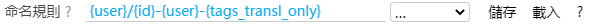

這是很重要的功能，你可以在這裡設定檔案的**命名規則**，也可以**建立資料夾**。

### 標記說明

每一個標記都會在下載時進行替換，比如 `{id}` 會被替換成類似於 `75863159_p0` 的結果。

?>這項設定的右側有一個幫助按鈕（問號 `?`)，可以檢視標記的含義。

- `{id}` 預設檔名，如 44920385_p0
- `{user}` 畫師名字
- `{user_id}` 畫師 id
- `{title}` 作品標題
- `{p_title}` 當前頁面的標題
- `{tags}` 作品的 tag 列表
- `{tags_translate}` 作品的 tag 列表，附帶翻譯後的 tag（如果有）
- `tags_transl_only` 翻譯後的 tag 列表
- `{p_tag}` 當前頁面的 tag。當前頁面沒有 tag 時不可用。
- `{type}` 作品類型，分為 illustration、manga、ugoira
- `{bmk}` bookmark-count，作品的收藏數。把它放在最前面可以讓檔案按收藏數排序。
- `{rank}` 作品在排行榜中的排名。如 #1、#2 …… 只能在排行榜頁面使用。
- `{date}` 作品的建立日期，格式為 yyyy-MM-dd。如 2019-08-29
- `{task_date}` 這次任務抓取完成時的時間。如 2020-10-21
- `{px}` 寬度和高度
- `{series_title}` 系列標題（可能為空）
- `{series_order}` 作品在系列中的序號，如 #1 #2
- `{id_num}` 數字 id，如 44920385
- `{p_num}` 圖片在作品內的序號，如 0、1、2 …… 每個作品都會重新計數。

**注意：**

- 下載時如果檔案已存在，新檔案會覆蓋舊檔案，而不是在後面新增序號。
- 你可以使用多個標記；多個標記之間建議新增分割符號，如 `{id}-{tags}-{user}`，免得各個標記的內容挨在一起，難以分辨。
- 在某些情況下，會有一些標記不可用。不可用的標記不會出現在檔名裡。
- 如果生成的檔名裡有一些特殊字元，不能在下載時使用，會被替換成近似的字元。
- 如果檔名超長，Chrome 會自動截斷超出的部分。
- 除了預設的標記，你也可以自行輸入文字。
- 如果你使用了 `{tags_translate}`，就沒有必要使用 `{tags}`，因為前者包含它。翻譯的內容根據你在 pixiv 的語言設定有所不同。例如，如果你的 pixiv 介面是中文的，那麼 tag 的翻譯一般也是中文的。你可以在首頁底部修改你要是用的語言。
- `tags_transl_only` 只儲存翻譯後的 tag，不儲存原本的日文 tag。但是如果某個 tag 沒有翻譯，則會儲存原本的 tag。
- 檔名裡必須要含有 id（`{id_num}`） 和序號（`{p_num}`）部分，或者直接使用 `{id}`。不然多圖作品裡的圖片的檔名相同，會導致下載時互相覆蓋。
- 沒有後綴名標記，因為字尾名是程式自動新增到檔案末尾的。

### 建立資料夾

**使用斜線 `/` 可以建立資料夾**。例如 `{p_title}/{id}-{tags}-{user}` 會把 `{p_title}` 作為資料夾的名字，後續內容作為檔名。就像這樣：

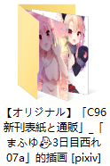

如果有需要，你也可以使用多個斜線，這樣可以建立多層資料夾。

### 檔案名稱長度限制

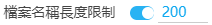

設定檔名的長度上限。這個長度不包括資料夾部分，但包括字尾名部分。

**一般不需要開啟。**除非當你確定是因為檔名太長導致了問題，才需要啟用這個設定。

一般來說，如果檔名太長的話，Chrome 會自動截斷超出的部分，不會導致儲存失敗。

但是在一些特殊情況下，Chrome 可能不會自動截斷檔名，有可能導致儲存失敗。例如：你把下載位置設定到 NAS 或雲端硬碟時。

## 加入命名標記前綴


同時使用多個標記時，檔名裡儲存了多種資訊，如果它們之間沒有標記，容易分不清楚。所以本程式預設會在一些標記前面加上說明。情況如下：

- {title} 生成結果時，前面加上了 title_ 字元。
- {tags} 和 {tags_translate} 生成結果時，前面加上了 tags_ 字元。
- {user} 生成結果時，前面加上了 user_ 字元。
- {userid} 生成結果時，前面加上了 uid_ 字元。
- {bmk} 生成結果時，前面加上了 bmk_ 字元。

其他標記沒有新增說明字元。如果你不想要這些說明字元，可以關閉此選項。

## 第一張圖片不包含序號


如果你使用 `{id}` 命名，每個作品的 id 後面都會帶序號，如：

```
80447108_p0
80447108_p1
80447108_p2
```

這個選項會去掉第一張圖的序號部分，變成這樣：

```
80447108
80447108_p1
80447108_p2
```

如果你使用了 `{p_num}` 這個命名標記，那麼第一張圖的序號也會被去掉。

## 多圖建立目錄

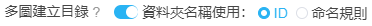

如果開啟了此設定，下載器會在下載多圖作品時，自動建立一個資料夾來存放它的圖片。

以作品 [79239641](https://www.pixiv.net/artworks/79239641 ':target=_blank') 為例，它有 3 張圖片。若命名規則為 `{user}/{id}`，則未開啟此功能時，檔名結果如下：

```
user_河CY/79239641_p0.jpg
user_河CY/79239641_p1.jpg
user_河CY/79239641_p2.jpg
```

開啟此功能後，預設會把圖片放進作品 id 的資料夾裡，如下：

```
user_河CY/79239641/79239641_p0.jpg
user_河CY/79239641/79239641_p1.jpg
user_河CY/79239641/79239641_p2.jpg
```

你也可以選擇第二個選項，使用命名規則作為資料夾名字的規則。

**注意：**

- 如果這個多圖作品只下載前一張圖片，不會建立資料夾。必須是下載多張圖片時才會建立資料夾。
- 如果你使用檔案命名規則作為資料夾名字，那麼檔案命名規則不要使用 {p_num}，它會導致每個圖片都單獨建立一個資料夾。可以考慮使用 {id} 替換 {p_num}。

## 快速下載時，始終建立資料夾


>此選項只對作品頁內的快速下載有效。

快速下載時如果只有一張圖片，預設是不會建立資料夾的。如果只有一張圖片也要建立資料夾，則應該開啟此選項。

## 圖片尺寸

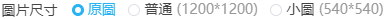

你可以選擇下載的圖片尺寸。

- 原圖：原圖尺寸
- 普通：最大尺寸為 1200*1200 px。如果原圖比這個尺寸大，會按比例縮放到這個尺寸。
- 小圖：最大尺寸為 540*540 px。如果原圖比這個尺寸大，會按比例縮放到這個尺寸。

?>這些尺寸的圖片都是 Pixiv 自動生成的，不是下載器自己進行的裁剪。

## 檔案體積限制

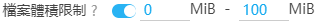

當一個檔案開始下載時，如果它的體積不在指定的範圍內，下載器將會跳過下載這個檔案。

## 設定下載執行緒


下載執行緒是指同時進行幾個下載任務，也就是有幾個下載進度條。

**提醒：**

- 下載執行緒設定的多一7些，一般有助於提高下載速度，但決定性的因素依然取決於你的網路情況。
- 如果你下載的速度慢，可以適當減少一些下載執行緒，比如設定為 3。否則可能有一些下載進度超時，導致卡住。
- 如果你的下載速度比較快，可以把下載執行緒設定的多一些。最大值是 5。

怎樣檢視下載速度呢？以 Chrome 瀏覽器為例，按 `Shift` + `Esc` 鍵開啟它的任務管理器，然後找到進行下載的頁面，就可以看到它的下載速度。


如果下載速度達到 1 MB/s，一般就不會出現下載問題了。如果速度比較慢，那麼我建議你把下載程序設定的小一些。

## 自動開始下載


當抓取作品完成，可以進行下載時，是否自動開始下載。預設開啟。

開啟之後，從抓取到下載都是自動完成的，中間不需要使用者再進行操作。

如果關閉此選項，那麼抓取之後會彈出設定面板，需要使用者手動點選下載按鈕，才會下載。

## 動圖儲存格式

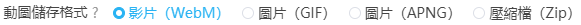

當下載動圖作品時，將其儲存為 WebM 影片，或者 GIF 圖片，或者 APNG 圖片，或者 Zip 壓縮包。

**各種格式的特點：**

-  WebM 影片畫質高，體積小。在手機上使用可能不太方便。
-  GIF 格式是常用的動態圖片格式。但是畫質差，體積大。
-  APNG 格式是**無損**畫質的動圖格式。畫質最佳，但是體積最大。
-  把動圖儲存為 zip 格式，不需要轉換，記憶體佔用也小。但是沒有動畫效果。

**提醒：**

- 把動圖轉換為影片需要一些時間，如果下載動圖時，進度條不動了，這是正常的，此時本程式在把動圖轉換為影片。
-  把動圖轉換為影片會佔用更多的記憶體，如果你預料到你要下載很多動圖，建議把下載執行緒設定的小一些，例如設定為 1。
-  動圖的原始檔的體積越大，轉換時的記憶體佔用也越大。

### 保持標籤頁啟用

!>如果要轉換動圖，請保持該頁面處於啟用狀態，否則轉換速度會變慢。

保持該標籤頁啟用的方法：

1. 不要切換到其他頁面。但是這樣就不能瀏覽其他網頁了；
2. 把這個標籤頁拖出來形成一個單獨的視窗，這樣這個標籤頁始終是啟用的。你可以回到之前的視窗瀏覽其他網頁，也不會影響轉換。

保持標籤頁啟用，只需要該頁面在瀏覽器裡是直接顯示的就行，不需要讓這個頁面一直保持顯示在螢幕上（那樣就做不了其他事情了）。

## 同時轉換多少個動圖

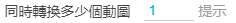

預設值是 1，這是因為同時轉換多個動圖會增加資源佔用。

**提醒：**

1. 如果資源佔用太多，可能會導致頁面崩潰，或者瀏覽器崩潰。（後果自負哦）
2. 轉換動圖時，請保持該標籤頁啟用，否則瀏覽器會降低轉換速度。

?>動圖的同時轉換數量不會超過下載執行緒數。也就是說同時下載幾個，最多也就只能同時轉換幾個。

## 小說儲存格式

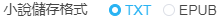

你可以選擇把小說儲存為 txt 格式或者 epub 格式。

txt 格式通用性好，但是內容是純文字，而且文字沒有樣式。

epub 可以儲存封面圖片，保留文字的顏色，使用超連結。（前提是這個小說有這些資料）

epub 的閱讀體驗比較好，但是需要安裝專門的軟體才能開啟檢視。

## 在小說裡儲存元資料


如果你啟用了這個選項，本程式會在小說內容的開頭儲存以下資訊：

- 小說標題
- 作者
- 網址
- 簡介
- 標籤

如果你關閉了這個選項，那麼小說內容裡只有小說主體文字。

不管小說是儲存成 txt 格式還是 epub ，都會應用這個設定。

## 啟用快速收藏


當你啟用這個選項後，在作品頁面內，pixiv 原本的收藏圖示（心形）將被替換成本程式的收藏圖示（五角星）。

這個選項除了影響快速收藏按鈕，也會在影響下載器的批次收藏作品功能，它可以決定收藏作品時是否附帶 tag 。

?>pixiv 原本的收藏按鈕不會自動新增 tag。本程式的收藏按鈕可以讓你在收藏作品時，自動新增這個作品的所有 tag。

## 日期和時間格式


你可以使用以下標記來設定日期和時間格式，**區分大小寫**。

這會影響命名規則裡的 `{date}` 和 `{task_date}`。

對於時間如 `2021-04-30T06:40:08`，各個標記的結果如下:

```
YYYY 2021
YY 21
MM 04
MMM Apr
MMMM April
DD 30
hh 06
mm 40
ss 08
```

## 不下載重複檔案

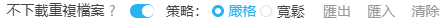

如果啟用了“不下載重複檔案”選項，那麼下載器會跳過下載重複的檔案。

### 原理

當成功下載了一個檔案之後，下載器會在 IndexedDB 資料庫裡儲存一條記錄，包含 id 和檔名。例如：

```
{
  "id": "85290993_p0",
  "n": "85290993_p0-小日向ほしみ-原創,女孩子,原創,waitress,過膝襪.jpg"
}
```

在下載一個檔案之前，下載器會查詢記錄，判斷這個檔案是不是重複檔案。

!>下載器只會查詢自己的下載記錄，不會檢查硬碟上的檔案（因為沒有這個許可權）。所以這個方法並不完美。

例如你要下載的某個檔案在硬碟上已存在，但是下載器沒有記錄，就仍然會下載它。

相反的，如果你之前下載過某個檔案，之後在硬碟上把它刪除了，但是在下載器裡有記錄，那麼下載器就不會再次下載它（如果你沒有開啟此選項，則可以再次下載）。

### 嚴格策略

當要下載的這個檔案的 **id 以及檔名**都和某個記錄吻合時，則認為這個檔案是重複檔案。

### 寬鬆策略

只判斷 id，不判斷檔名。如果下載的這個檔案的 **id** 和某個記錄吻合，就認為這個檔案是重複檔案。

### 匯出

點選匯出按鈕，可以匯出所有下載記錄，格式為 json 檔案。

>當你要清除 Cookies 資料，或者重灌瀏覽器，你可以先匯出下載記錄，以便進行恢復。

### 匯入

點選匯入按鈕，你可以選擇匯出的下載記錄檔案，匯入到下載器的下載記錄裡。

### 清除下載記錄

清空下載器的所有下載記錄。

即使你把下載到硬碟上的檔案刪除掉，但是下載器裡依然會存在著它的下載記錄。當你再次下載時，下載器會認為這個檔案已經下載過了，導致下載器不會再下載它。

如果你遇到了這種情況，可以清除下載記錄，或者關閉“不下載重複檔案”的選項。

## 預覽搜尋頁面的篩選結果


如果開啟“預覽搜尋頁面的篩選結果”選項，下載器會把抓取到的符合要求的作品顯示在頁面裡，方便檢視。

這是為了方便使用者預覽結果，並且便於進行多次篩選，提供所見即所得的下載體驗。

**提醒：**

1. 此選項只在部分頁面生效。（目前只在圖片搜尋頁面生效。不在小說搜尋頁面生效。）
2. 當篩選作品的結果過多時（例如數萬個結果），頁面的資源佔用比較多，可能會導致瀏覽器崩潰。載入封面圖也會消耗很多網路流量。如果你預計到你要抓取的結果會很多，可以考慮關閉這個選項。
3. 當開啟“預覽搜尋頁面的篩選結果”選項時，會忽略“自動開始下載”選項。也就是說此時即使設定了自動下載，也可能不會自動開始下載。這是為了讓使用者在下載前有機會多次篩選結果，然後再下載。如果你不想篩選，而是想直接自動下載，請關閉這個選項。

## Language


你可以設定下載器使用的語言。這不會影響 Pixiv 的語言。

一般無需設定，保持預設的“自動檢測”即可。這樣下載器會使用和 Pixiv 頁面一致的語言。

除非你想讓兩者不同，比如 Pixiv 使用日語，下載器使用中文，這時才需要修改。

!>下載器目前沒有韓語文字。
