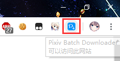

# 瞭解設定面板

安裝本程式後，開啟 Pixiv 頁面，可以在網頁右側看到藍色的下載按鈕：

點選下載按鈕可以開啟設定面板：

設定面板分為 3 個功能區：

1. 抓取區域，可以設定抓取時的篩選條件，以及可用的抓取按鈕。
2. 下載區域，負責檔案的命名規則、下載控制。需要先完成抓取才可以進行下載。
3. 其他設定區域，這裡顯示的是不能歸類到前兩者裡面的設定項、按鈕。

使用時，按照順序，先設定下載條件，然後開始抓取。抓取完畢後，再進行下載。

## 開啟和關閉設定面板

有 3 種方法開關設定面板。

1. 點選網頁右側顯示的下載按鈕開啟設定面板。

點選設定面板右上角的關閉按鈕，可以關閉設定面板。

2. 點選本擴充套件的圖示。

可以切換設定面板的開啟/關閉狀態。

3. 鍵盤快捷鍵 `Alt` + `x`。

可以切換設定面板的開啟/關閉狀態。

?>如果設定面板處於顯示狀態，點選頁面空白區域可以關閉設定面板。
