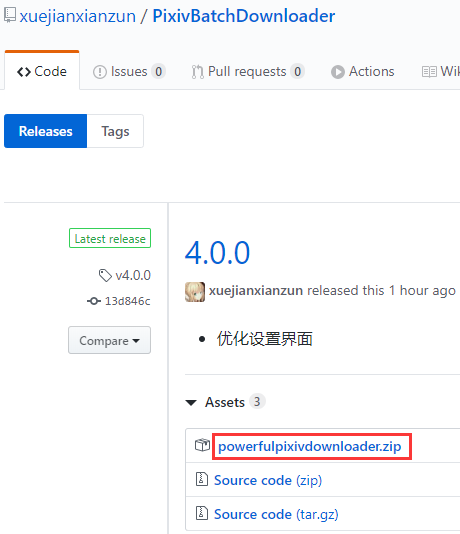
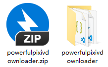
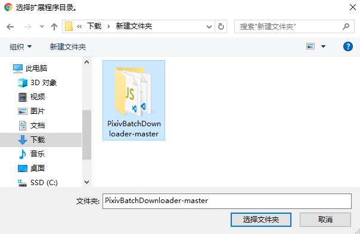

# 離線安裝

如果您不能從瀏覽器的擴充套件商店安裝，或者擴充套件商店上的不是最新版本，您可以進行離線安裝。

?>離線安裝的擴充套件程式不會自動更新，需要手動更新。

?>只有 PC 上的瀏覽器可以離線安裝，Android 上的 Yandex 瀏覽器不能離線安裝。

!>不要同時執行本程式的多個版本。如果你同時安裝了多個版本，請刪除比較舊的那個。

## 下載檔案

開啟本程式的 [ GitHub releases 頁面](https://github.com/xuejianxianzun/PixivBatchDownloader/releases ':target=_blank')，可以看到本程式的釋出版本：

排在第一位的就是最新版本，點選紅框處，下載本程式的 zip 壓縮包。

## 解壓檔案

解壓下載的檔案，得到 powerfulpixivdownloader 資料夾：

你可以把這個資料夾移動到其他地方。

## 載入擴充套件
  
你可以輸入網址進入（chrome://extensions/），或者從選單開啟：

擴充套件管理頁面：

首先我們需要啟用右上角的 **開發者模式**，預設情況下它沒有啟用，需要點選開關來啟用它。

之後點選 **載入已解壓的擴充套件程式**，選擇 powerfulpixivdownloader 資料夾：

## 完成

現在，擴充套件程式裡已經出現這個擴充套件了：

它的圖示旁有一個橘紅色的硬碟圖示，表示這是本地擴充套件。它在使用體驗上與線上安裝版本沒有區別，但不能自動更新。